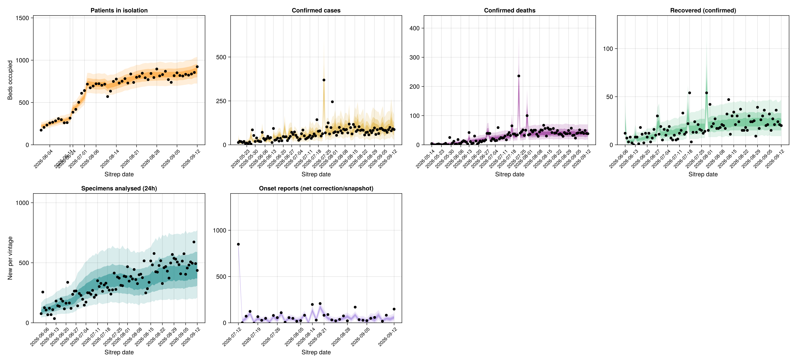
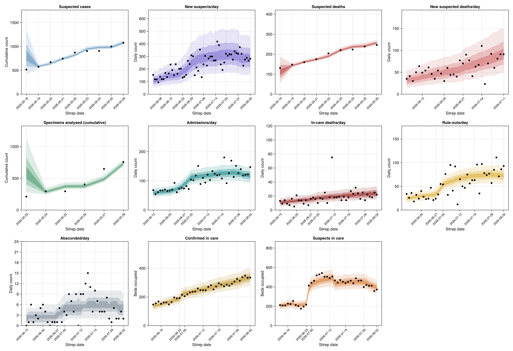
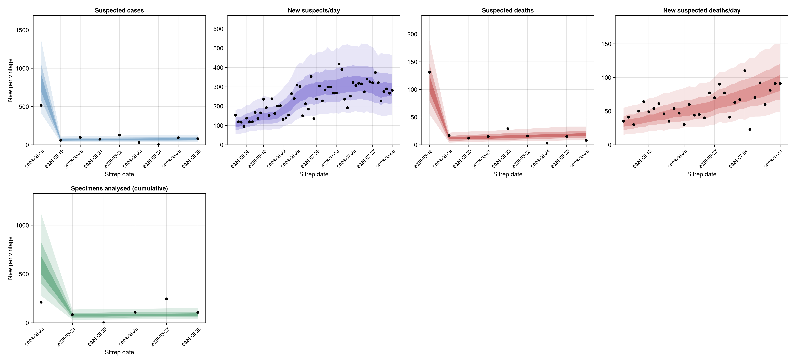
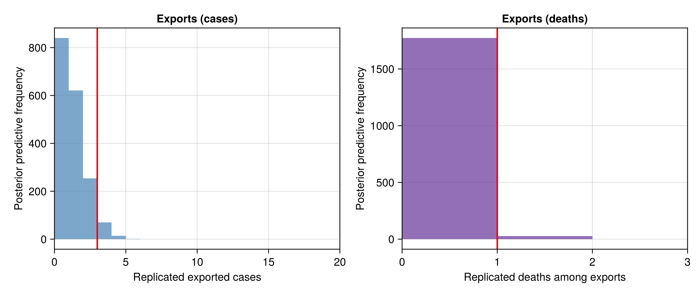

```@meta
EditURL = "../examples/analysis.jl"
```

```@eval
using BVDOutbreakSize, Markdown, Dates
readme = read(joinpath(pkgdir(BVDOutbreakSize), "README.md"), String)
body = strip(match(r"^(.*?)<!-- SHARED:END -->"s, readme).captures[1])
# Keep the dates current automatically: "Last updated" is the build
# date and "Data as of" is the loaded cut-off, so a rebuild always
# refreshes them without a manual edit to README.md.
built = Dates.format(Dates.today(), "d U yyyy")
asof = Dates.format(load_observations().cutoff, "d U yyyy")
body = replace(body,
    r"\*\*Last updated:\*\* [^.]*\." => "**Last updated:** $built.",
    r"\*\*Data as of:\*\* [^.]*\." => "**Data as of:** $asof.",
    r"https://epiforecasts\.io/BVDOutbreakSize/stable/analysis" => "",
    "https://epiforecasts.io/BVDOutbreakSize/stable/contributing" => "contributing.md")
Markdown.parse(body)
```

This page is generated from
[`docs/examples/analysis.jl`](https://github.com/epiforecasts/BVDOutbreakSize/blob/main/docs/examples/analysis.jl).
The model code it calls is in
[`src/`](https://github.com/epiforecasts/BVDOutbreakSize/tree/main/src).
See [aim and origins](@ref "Aim and origins") and [limitations](@ref "Limitations").

**Offline copy.** A self-contained single-file HTML version of this page, built from the same run, is attached to each results release: [download the latest](https://github.com/epiforecasts/BVDOutbreakSize/releases/latest/download/analysis.html).
It carries the methods and results on this page only.
Links to the other pages resolve against the hosted site.

```@raw html
<details><summary>Load packages, data and fitted chains</summary>
```

````julia
# Shared setup: packages, observations, the fit registry and every model fit
# (loaded from the content-addressed cache). See `docs/examples/_setup.jl`.
using BVDOutbreakSize
include(joinpath(pkgdir(BVDOutbreakSize), "docs", "examples", "_setup.jl"))
````

````
_release_data (generic function with 1 method)
````

```@raw html
</details>
```

## Methods

### [Data](@id methods-data)

The DRC data come from the situation reports of the Institut National de Santé Publique [insp_sitrep_2026](@cite).
Each report gives the national cumulative suspected cases and deaths, laboratory-confirmed cases and deaths, and the specimens received and analysed by the laboratory, at the report date.
From SitRep 013 (27 May) INSP began reclassifying suspects, so the cumulative suspected count falls.
We freeze it at its last stable vintage (26 May) and instead read the daily new-suspect count ("nouveaux cas suspects du jour") that the confirmed-based reports publish from 4 June.
We fit it as a daily incidence where the cumulative series stops.
The same reports print a daily new suspected-death count alongside it ("cas suspects du jour N (M deces)", from 7 June).
We fit it the same way, where the cumulative suspected-death series stops.
The confirmed-based reports also publish a daily "Patients en isolement" count, the number of patients (confirmed plus suspected) in an isolation/treatment bed at the end of the day.
We fit it as the suspect inflow carried through a length-of-stay survival into a daily bed count.
The fitted series runs from 1 June (SitRep 018), where the column is relabelled to the all-patients "Patients en isolement - hospitalisation".
The narrower suspects-only count in SitReps 016-017 is a different quantity and is left out.
The reports also print a cumulative "cumul guéris" total of confirmed cases recorded as recovered, from 6 June.
We fit it as survivors among the modelled confirmed cases (a scaled confirmation-to-recovery convolution, the incidence analogue of the isolation prevalence stream).
From 13 June the reports add a Tableau 6 patient-movement table for the treatment centres.
We read its daily admissions, in-care deaths, rule-outs and absconded flows as four count streams feeding the same treatment-centre model.
The same table breaks the occupancy into "dont confirmés (NC+AC)" and "dont suspects" sub-rows, two prevalence sub-stocks that sum to the total each day.
We read these as two further census streams splitting the occupancy.
We extracted these figures from the written situation-report PDFs (archived by INRB-UMIE [inrb_umie_2026](@cite)) using a language model, with a second pass to re-read them, rather than the published per-zone CSVs.
The zone sums in the CSVs are inconsistent with the national headline totals because they drop counts not yet attributed to a zone, so they understate the national totals.
The Uganda data are the cases and the one death exported across the border, taken from the WHO situation reports and Disease Outbreak News [who_don_2026_602](@cite).
The cross-border traveller volume and source population come from [mccabe2026](@citet).
The source population is fixed, and the traveller volume is given a Normal prior around the McCabe et al. figure.
Province populations are 2019 figures from the DRC's Institut National de la Statistique, *Annuaire statistique RDC 2020*, one source for all seven provinces rather than the best figure for each, since only the relative sizes enter the model.
Provincial capital coordinates, which set the distances in the importation kernel, come from GeoNames.

From SitRep 059 (12 July) the analytique-format situation reports also carry a raster figure of confirmed cases by symptom-onset date, split alive/deceased ("courbe épidémique par date de début des symptômes").
It has no accompanying data table, so we digitise it directly from the figure.
Digitisation introduces error into the resulting counts.
See the [symptom-onset reporting delay](@ref "Symptom-onset reporting delay") submodel below for how the model accounts for that error.

The first table lists each figure at the cut-off, or at the date reporting stopped for that stream.
The second table gives the per-date history of each situation-report stream.
The model fits the between-report increments of these series, so a single date reduces to the cut-off total.

```@raw html
<details><summary>Loading observations and building the data table</summary>
```

````julia
observations_table = DataFrame(
    field = [
        "exported_cases",
        "exports_deaths",
        "suspected_deaths",
        "suspected_cases",
        "confirmed_cases",
        "confirmed_deaths",
        "onset_curve_reported",
        "specimens_analysed",
        "treatment_admissions",
        "treatment_deaths",
        "treatment_ruleouts",
        "treatment_absconded",
        "genetic_tmrca_bound",
        "daily_outbound_travellers (prior mean)",
        "daily_outbound_travellers_sd (prior SD)",
        "source_population",
    ],
    date = [
        isempty(obs.export_case_days) ? missing :
            grid_date(maximum(obs.export_case_days)),
        isempty(obs.export_death_days) ? missing :
            grid_date(maximum(obs.export_death_days)),
        hist_last_date(obs.deaths_history),
        hist_last_date(obs.reported_history),
        hist_last_date(obs.confirmed_history),
        hist_last_date(obs.confirmed_deaths_history),
        isempty(obs.onset_curve_history.report_days) ? missing :
            grid_date(maximum(obs.onset_curve_history.report_days)),
        hist_last_date(obs.lab_history),
        hist_last_date(obs.treatment_admissions_history),
        hist_last_date(obs.treatment_deaths_history),
        hist_last_date(obs.treatment_ruleout_history),
        hist_last_date(obs.treatment_absconded_history),
        grid_date(obs.n - obs.tmrca_days),
        missing,
        missing,
        missing,
    ],
    value = [
        obs.exported_cases,
        obs.exports_deaths,
        obs.total_deaths,
        obs.reported_cases,
        obs.confirmed_cases,
        obs.confirmed_deaths,
        obs.onset_curve_history.last_total,
        obs.tests_analysed,
        isempty(obs.treatment_admissions_history.counts) ? missing :
            obs.treatment_admissions_history.counts[end],
        isempty(obs.treatment_deaths_history.counts) ? missing :
            obs.treatment_deaths_history.counts[end],
        isempty(obs.treatment_ruleout_history.counts) ? missing :
            obs.treatment_ruleout_history.counts[end],
        isempty(obs.treatment_absconded_history.counts) ? missing :
            obs.treatment_absconded_history.counts[end],
        obs.tmrca_days,
        ITURI_DAILY_TRAVEL,
        ITURI_DAILY_TRAVEL_SD,
        ITURI_POPULATION,
    ]
);
````

```@raw html
</details>
```


| field | date | value |
| --- | --- | ---: |
| exported_cases | 2026-05-23 | 3 |
| exports_deaths | 2026-05-14 | 1 |
| suspected_deaths | 2026-05-26 | 246 |
| suspected_cases | 2026-05-26 | 1077 |
| confirmed_cases | 2026-09-16 | 7475 |
| confirmed_deaths | 2026-09-16 | 3605 |
| onset_curve_reported | 2026-09-16 | 4756 |
| specimens_analysed | 2026-05-28 | 755 |
| treatment_admissions | 2026-08-02 | 147 |
| treatment_deaths | 2026-08-02 | 22 |
| treatment_ruleouts | 2026-08-02 | 93 |
| treatment_absconded | 2026-08-02 | 2 |
| genetic_tmrca_bound | 2026-03-15 | 185 |
| daily_outbound_travellers (prior mean) | missing | 1871 |
| daily_outbound_travellers_sd (prior SD) | missing | 200 |
| source_population | missing | 4392200 |


The per-date cumulative history of the DRC situation-report streams, the national totals at each report date.
Each stream's source is recorded alongside the observation data itself.
Two columns are the exception.
The new-suspect column is a per-day count, not a cumulative total, fitted directly as a daily incidence.
It picks up where the cumulative suspected-case column freezes on 26 May.
The isolated-patients column is a daily count of patients in an isolation/treatment bed, fitted as the suspect inflow carried through a length-of-stay survival.

```@raw html
<details><summary>Building the per-date time-series table</summary>
```

````julia
vintage_table = let
    # Each history carries grid day-indices and counts; key the counts
    # by calendar date so every stream lines up in one table.
    bydate(h) = Dict(grid_date(d) => c for (d, c) in zip(h.days, h.counts))
    streams = (
        suspected_cases = bydate(obs.reported_history),
        suspected_new_daily = bydate(obs.suspected_daily_history),
        patients_isolated = bydate(obs.isolation_history),
        suspected_deaths = bydate(obs.deaths_history),
        suspected_new_daily_deaths = bydate(obs.suspected_daily_deaths_history),
        confirmed_cases = bydate(obs.confirmed_history),
        confirmed_deaths = bydate(obs.confirmed_deaths_history),
        recovered_confirmed = bydate(obs.recovered_history),
        specimens_received = bydate(obs.tests_received_history),
        specimens_analysed = bydate(obs.lab_history),
    )
    dates = sort(collect(union((keys(s) for s in streams)...)))
    at(s) = [haskey(s, d) ? s[d] : missing for d in dates]
    DataFrame(
        date = dates,
        suspected_cases = at(streams.suspected_cases),
        suspected_new_daily = at(streams.suspected_new_daily),
        patients_isolated = at(streams.patients_isolated),
        suspected_deaths = at(streams.suspected_deaths),
        confirmed_cases = at(streams.confirmed_cases),
        confirmed_deaths = at(streams.confirmed_deaths),
        recovered_confirmed = at(streams.recovered_confirmed),
        specimens_received = at(streams.specimens_received),
        specimens_analysed = at(streams.specimens_analysed)
    )
end;
````

```@raw html
</details>
```

```@raw html
<details><summary>Per-date situation-report data table</summary>
```


| date | suspected_cases | suspected_new_daily | patients_isolated | suspected_deaths | confirmed_cases | confirmed_deaths | recovered_confirmed | specimens_received | specimens_analysed |
| --- | ---: | ---: | ---: | ---: | ---: | ---: | ---: | ---: | ---: |
| 2026-05-14 | missing | missing | missing | missing | 8 | 4 | missing | missing | missing |
| 2026-05-17 | missing | missing | missing | missing | 13 | 4 | missing | missing | missing |
| 2026-05-18 | 516 | missing | missing | 131 | 33 | 4 | missing | missing | missing |
| 2026-05-19 | 575 | missing | missing | 148 | 51 | 4 | missing | missing | missing |
| 2026-05-20 | 672 | missing | missing | 160 | 64 | 6 | missing | missing | missing |
| 2026-05-21 | 745 | missing | missing | 175 | 83 | 9 | missing | missing | missing |
| 2026-05-22 | 872 | missing | missing | 204 | 91 | 10 | missing | missing | missing |
| 2026-05-23 | 904 | missing | missing | 220 | 101 | 10 | missing | 418 | 211 |
| 2026-05-24 | 906 | missing | missing | 223 | 105 | 10 | missing | 431 | 295 |
| 2026-05-25 | 998 | missing | missing | 238 | 106 | 12 | missing | 431 | 295 |
| 2026-05-26 | 1077 | missing | missing | 246 | 121 | 17 | missing | 662 | 403 |
| 2026-05-27 | missing | missing | missing | missing | 125 | 17 | missing | 774 | 648 |
| 2026-05-28 | missing | missing | missing | missing | 210 | 17 | missing | 883 | 755 |
| 2026-05-29 | missing | missing | missing | missing | 263 | 42 | missing | missing | missing |
| 2026-05-30 | missing | missing | missing | missing | 282 | 42 | missing | missing | missing |
| 2026-05-31 | missing | missing | missing | missing | 321 | 48 | missing | missing | missing |
| 2026-06-01 | missing | missing | 173 | missing | 344 | 60 | missing | missing | missing |
| 2026-06-02 | missing | missing | 206 | missing | 363 | 62 | missing | missing | missing |
| 2026-06-03 | missing | missing | 233 | missing | 381 | 64 | missing | missing | missing |
| 2026-06-04 | missing | 153 | 258 | missing | 452 | 82 | missing | missing | missing |
| 2026-06-05 | missing | 119 | 267 | missing | 488 | 86 | missing | missing | missing |
| 2026-06-06 | missing | 117 | 283 | missing | 515 | 91 | 12 | missing | missing |
| 2026-06-07 | missing | 94 | 309 | missing | 550 | 101 | 19 | missing | missing |
| 2026-06-08 | missing | 138 | 297 | missing | 598 | 115 | 22 | missing | missing |
| 2026-06-09 | missing | 119 | 260 | missing | 635 | 127 | 30 | missing | missing |
| 2026-06-10 | missing | 119 | 262 | missing | 676 | 136 | 32 | missing | missing |
| 2026-06-11 | missing | 168 | 315 | missing | 689 | 139 | 32 | missing | missing |
| 2026-06-13 | missing | 136 | 359 | missing | 782 | 181 | 40 | missing | missing |
| 2026-06-14 | missing | 165 | 363 | missing | 808 | 192 | 48 | missing | missing |
| 2026-06-15 | missing | 235 | 376 | missing | 837 | 196 | 49 | missing | missing |
| 2026-06-16 | missing | 192 | 379 | missing | 875 | 202 | 67 | missing | missing |
| 2026-06-17 | missing | 151 | 383 | missing | 896 | 232 | 78 | missing | missing |
| 2026-06-18 | missing | 238 | 416 | missing | 933 | 245 | 80 | missing | missing |
| 2026-06-19 | missing | 162 | 361 | missing | 956 | 247 | 92 | missing | missing |
| 2026-06-20 | missing | 201 | 365 | missing | 1003 | 254 | 100 | missing | missing |
| 2026-06-21 | missing | 202 | 371 | missing | 1048 | 267 | 112 | missing | missing |
| 2026-06-22 | missing | 131 | 387 | missing | 1094 | 277 | 115 | missing | missing |
| 2026-06-23 | missing | 138 | 408 | missing | 1118 | 291 | 122 | missing | missing |
| 2026-06-24 | missing | 154 | 385 | missing | 1155 | 304 | 138 | missing | missing |
| 2026-06-25 | missing | 265 | 419 | missing | 1203 | 321 | 148 | missing | missing |
| 2026-06-27 | missing | 239 | 502 | missing | 1274 | 360 | 178 | missing | missing |
| 2026-06-29 | missing | 309 | 609 | missing | 1333 | 399 | 189 | missing | missing |
| 2026-06-30 | missing | 301 | missing | missing | 1406 | 438 | 208 | missing | missing |
| 2026-07-01 | missing | 150 | 641 | missing | 1460 | 452 | 213 | missing | missing |
| 2026-07-02 | missing | 213 | 628 | missing | 1502 | 473 | 229 | missing | missing |
| 2026-07-03 | missing | 185 | missing | missing | 1528 | 492 | 239 | missing | missing |
| 2026-07-04 | missing | 354 | missing | missing | 1561 | 506 | 254 | missing | missing |
| 2026-07-05 | missing | 135 | 646 | missing | 1624 | 521 | 273 | missing | missing |
| 2026-07-06 | missing | 237 | 680 | missing | 1708 | 580 | 280 | missing | missing |
| 2026-07-07 | missing | 304 | 750 | missing | 1759 | 600 | 285 | missing | missing |
| 2026-07-08 | missing | 227 | 764 | missing | 1792 | 625 | 295 | missing | missing |
| 2026-07-09 | missing | 284 | 780 | missing | 1830 | 648 | 300 | missing | missing |
| 2026-07-10 | missing | 299 | 763 | missing | 1873 | 672 | 306 | missing | missing |
| 2026-07-11 | missing | 299 | 753 | missing | 1926 | 702 | 318 | missing | missing |
| 2026-07-12 | missing | 268 | 736 | missing | 1963 | 719 | 333 | missing | missing |
| 2026-07-13 | missing | 268 | 753 | missing | 2011 | 754 | 366 | missing | missing |
| 2026-07-14 | missing | 418 | 736 | missing | 2073 | 796 | 377 | missing | missing |
| 2026-07-15 | missing | 389 | 725 | missing | 2124 | 828 | 390 | missing | missing |
| 2026-07-17 | missing | 236 | 722 | missing | 2267 | 893 | 412 | missing | missing |
| 2026-07-18 | missing | 192 | 724 | missing | 2344 | 930 | 466 | missing | missing |
| 2026-07-19 | missing | 252 | 734 | missing | 2423 | 967 | 469 | missing | missing |
| 2026-07-20 | missing | 322 | 737 | missing | 2473 | 999 | 482 | missing | missing |
| 2026-07-21 | missing | 306 | 738 | missing | 2536 | 1033 | 506 | missing | missing |
| 2026-07-22 | missing | 318 | 722 | missing | 2905 | 1269 | 519 | missing | missing |
| 2026-07-23 | missing | 315 | 766 | missing | 2973 | 1309 | 540 | missing | missing |
| 2026-07-24 | missing | 274 | 755 | missing | 3075 | 1354 | 556 | missing | missing |
| 2026-07-25 | missing | 340 | 773 | missing | 3200 | 1405 | 571 | missing | missing |
| 2026-07-26 | missing | 326 | 723 | missing | 3262 | 1437 | 583 | missing | missing |
| 2026-07-27 | missing | 321 | 733 | missing | 3360 | 1487 | 597 | missing | missing |
| 2026-07-30 | missing | 374 | 748 | missing | 3605 | 1587 | 651 | missing | missing |
| 2026-07-31 | missing | 321 | 760 | missing | 3674 | 1621 | 666 | missing | missing |
| 2026-08-01 | missing | 227 | 690 | missing | 3748 | 1657 | 708 | missing | missing |
| 2026-08-02 | missing | 275 | 707 | missing | 3802 | 1707 | 727 | missing | missing |
| 2026-08-03 | missing | 289 | 717 | missing | 3874 | 1751 | 749 | missing | missing |
| 2026-08-04 | missing | 267 | 674 | missing | 3973 | 1801 | 776 | missing | missing |
| 2026-08-05 | missing | 282 | 694 | missing | 4053 | 1851 | 793 | missing | missing |
| 2026-08-06 | missing | missing | 721 | missing | 4120 | 1887 | 810 | missing | missing |
| 2026-08-07 | missing | 443 | missing | missing | 4209 | 1916 | 828 | missing | missing |
| 2026-08-08 | missing | 258 | 722 | missing | 4294 | 1960 | 849 | missing | missing |
| 2026-08-09 | missing | 242 | 704 | missing | 4381 | 2011 | 869 | missing | missing |
| 2026-08-10 | missing | 389 | 716 | missing | 4449 | 2061 | 886 | missing | missing |
| 2026-08-11 | missing | 325 | 570 | missing | 4567 | 2128 | 918 | missing | missing |
| 2026-08-12 | missing | 328 | 634 | missing | 4665 | 2184 | 965 | missing | missing |
| 2026-08-13 | missing | 330 | 749 | missing | 4727 | 2214 | 976 | missing | missing |
| 2026-08-14 | missing | 403 | 777 | missing | 4843 | 2272 | 1006 | missing | missing |
| 2026-08-15 | missing | 380 | 730 | missing | 4945 | 2325 | 1040 | missing | missing |
| 2026-08-16 | missing | 272 | 751 | missing | 5021 | 2378 | 1061 | missing | missing |
| 2026-08-17 | missing | 394 | 782 | missing | 5105 | 2420 | 1091 | missing | missing |
| 2026-08-18 | missing | 389 | 730 | missing | 5208 | 2476 | 1115 | missing | missing |
| 2026-08-19 | missing | 366 | 837 | missing | 5290 | 2516 | 1152 | missing | missing |
| 2026-08-20 | missing | 301 | 737 | missing | 5375 | 2557 | 1167 | missing | missing |
| 2026-08-21 | missing | 345 | 798 | missing | 5458 | 2606 | 1182 | missing | missing |
| 2026-08-22 | missing | 212 | 808 | missing | 5514 | 2642 | 1200 | missing | missing |
| 2026-08-23 | missing | 277 | 846 | missing | 5584 | 2680 | 1215 | missing | missing |
| 2026-08-24 | missing | 311 | 792 | missing | 5656 | 2715 | 1245 | missing | missing |
| 2026-08-25 | missing | 390 | 770 | missing | 5713 | 2744 | 1269 | missing | missing |
| 2026-08-26 | missing | 431 | 843 | missing | 5794 | 2786 | 1293 | missing | missing |
| 2026-08-27 | missing | 400 | 795 | missing | 5863 | 2824 | 1318 | missing | missing |
| 2026-08-28 | missing | 395 | 896 | missing | 5945 | 2862 | 1327 | missing | missing |
| 2026-08-29 | missing | 320 | missing | missing | 6041 | 2911 | 1366 | missing | missing |
| 2026-08-30 | missing | 258 | 814 | missing | 6100 | 2950 | 1383 | missing | missing |
| 2026-08-31 | missing | 454 | 830 | missing | 6186 | 3007 | 1409 | missing | missing |
| 2026-09-01 | missing | 348 | 869 | missing | 6250 | 3039 | 1439 | missing | missing |
| 2026-09-02 | missing | 433 | 770 | missing | 6342 | 3072 | 1475 | missing | missing |
| 2026-09-03 | missing | 345 | 738 | missing | 6436 | 3095 | 1495 | missing | missing |
| 2026-09-04 | missing | 399 | 817 | missing | 6522 | 3134 | 1516 | missing | missing |
| 2026-09-05 | missing | 286 | 851 | missing | 6604 | 3175 | 1548 | missing | missing |
| 2026-09-06 | missing | 215 | 819 | missing | 6686 | 3226 | 1563 | missing | missing |
| 2026-09-07 | missing | 329 | 813 | missing | 6757 | 3267 | 1590 | missing | missing |
| 2026-09-08 | missing | 408 | 833 | missing | 6843 | 3310 | 1611 | missing | missing |
| 2026-09-09 | missing | 386 | 823 | missing | 6942 | 3349 | 1647 | missing | missing |
| 2026-09-10 | missing | 429 | 837 | missing | 7022 | 3398 | 1671 | missing | missing |
| 2026-09-11 | missing | 372 | 855 | missing | 7113 | 3437 | 1692 | missing | missing |
| 2026-09-12 | missing | 445 | 923 | missing | 7200 | 3475 | 1712 | missing | missing |
| 2026-09-13 | missing | 351 | 905 | missing | 7258 | 3510 | 1726 | missing | missing |
| 2026-09-14 | missing | 413 | 938 | missing | 7345 | 3545 | 1753 | missing | missing |
| 2026-09-15 | missing | 423 | 930 | missing | 7404 | 3577 | 1776 | missing | missing |
| 2026-09-16 | missing | 417 | 905 | missing | 7475 | 3605 | 1798 | missing | missing |


```@raw html
</details>
```

### Model

#### Model overview

We model a single outbreak seeded by a zoonotic introduction on a daily grid from a seeding date to the cut-off (day $n$).
The country is split into four patches, one each for Ituri, Nord-Kivu and Haut-Uele and a fourth pooling Sud-Kivu, Tshopo, Bas-Uele and Sud Ubangi.
Each patch runs its own discrete renewal equation at its own reproduction number, and the patches are coupled by importation.
National infection incidence is the sum over the patches.
Every national stream is fitted against that sum.
The patch reproduction numbers share one weekly trend and deviate from it, so a province with little data stays near the trend and one with data can separate from it.
The situation reports' per-province tables are exact partitions of the national totals, so they enter as composition likelihoods carrying the spatial split alone.
Setting the patch count to one collapses the model onto a single well-mixed population.

We never observe infections directly.
Each data stream observes a thinned, delayed or transformed view of the same latent incidence.
This is the class of time-varying renewal model used in EpiNow2 [epinow2](@cite), with the streams fitted jointly here rather than in a pipeline.

The model is assembled from modular Turing [ge2018turing](@cite) submodels, each holding the maths and priors for one part of the generative process.
We describe them in generative order, from the infection process through the epidemiological delays to the observation streams.
The implementation uses Mooncake [mooncake_jl](@cite) reverse-mode automatic differentiation, CensoredDistributions for delay discretisation, FlexiChains for chain handling, and PairPlots [pairplots_jl](@cite) with AlgebraOfGraphics [danisch2021makie](@cite) for the figures.
Each submodel's source is shown in the collapsible block beneath its prose.

The table below shows which parameters inform each observation submodel.
The *analysed* column is the analysed-specimen volume, the single laboratory stream fitted as a count.
The *confirmed* positives are scored as a Binomial of the observed analysed denominator with a positivity linked to the composition of the suspected pool, so the laboratory data help identify the non-BVD background.
The *conf. deaths* column mirrors the laboratory pipeline on the death side, with a death testing fraction and a death-pool composition positivity built from the same assay:

| Parameter | Exports | Deaths | Cases | Analysed | Confirmed | Conf. deaths | Export deaths |
|---|:---:|:---:|:---:|:---:|:---:|:---:|:---:|
| Reproduction number $R_{p,t}$ | ● | ● | ● | ● | ● | ● | ● |
| Generation interval | ● | ● | ● | ● | ● | ● | ● |
| Incubation period | ● | ● | ● | ● | ● | ● | ● |
| Seed $I_0$ | ● | ● | ● | ● | ● | ● | ● |
| Onset-to-death delay |  | ● |  |  |  | ● | ● |
| Case-fatality ratio |  | ● |  |  |  | ● | ● |
| Death ascertainment $p_{\text{death}}$ |  | ● |  |  |  | ● |  |
| Background CFR $\mathrm{cfr}_{\text{bg}}$ |  | ● |  |  |  | ● |  |
| Onset-to-report delay |  |  | ● | ● | ● |  |  |
| Receipt delay |  |  |  | ● | ● | ● |  |
| Onset-to-hospitalisation delay | ● |  |  |  |  |  |  |
| Assay sensitivity / specificity |  |  |  |  | ● | ● |  |
| Severity enrichment $\delta_0$ |  |  |  |  | ● |  |  |
| Death testing fraction $\tau_{\text{death}}$ |  |  |  |  |  | ● |  |
| Testing fraction $\tau_{\text{test}}$ |  |  |  | ● | ● |  |  |
| Background rate $\lambda_{\text{bg}}$ |  | ● | ● | ● | ● | ● |  |
| Surveillance dispersion |  | ● | ● | ● |  |  |  |
| Ascertainment | ● |  | ● | ● | ● |  | ● |
| Traveller volume | ● |  |  |  |  |  | ● |

```@setup main
using BVDOutbreakSize, CodeTracking, Revise
```

#### Infections

##### Reproduction number

Each patch has its own daily reproduction number.
It is a shared trend $R^{\text{trend}}_t$ plus a patch deviation $\delta_{p,t}$, with the deviations summing to zero across patches on every day:

```math
\log R_{p,t} = \log R^{\text{trend}}_t + \delta_{p,t}, \qquad
\sum_p \delta_{p,t} = 0. \tag{1}
```

The country's reproduction number is read off the summed infections in the
infection process below.

The trend is held flat at the established reproduction number $R_0$ until a month before the first WHO situation report.
It then follows a non-centred Gaussian random walk on the log scale with weekly knots to the cut-off.
The walk start is floored at the renewal start.
The walk starts from $R_0$ at its first knot:

```math
\log R^{\text{trend}}_k = \log R_0 + \sigma_{\text{rw}}
           \sum_{j=1}^{k} z_j, \quad
z_j \sim \mathrm{Normal}(0, 1), \qquad
\sigma_{\text{rw}} \sim \mathrm{Normal}^{+}(0,\ 0.1). \tag{2}
```

We do not place a prior on $R_0$ directly.
We put the prior on the initial growth rate $r$ instead, given in the seeding and growth subsection below, and derive the established reproduction number forward from it through the Euler–Lotka relation under our generation interval $g$:

```math
R_0 = \left( \sum_{s \ge 1} g_s\, e^{-r s} \right)^{-1}. \tag{3}
```

We set the half-normal on $\sigma_{\text{rw}}$ so that the trend is unlikely to change by more than about 20% from one week to the next: two standard deviations of the weekly log-step is around $0.20$.

Daily $\log R^{\text{trend}}_t$ is the linear interpolation between the weekly knots.
Before the first knot it is held flat at $R_0$ (the interpolation clamps below the first knot rather than extrapolating):

```math
\log R^{\text{trend}}_t = \log R^{\text{trend}}_k +
    \frac{t - d_k}{d_{k+1} - d_k}\,
    (\log R^{\text{trend}}_{k+1} - \log R^{\text{trend}}_k),
\qquad d_k \le t \le d_{k+1}, \tag{4}
```

with $d_k$ the day of knot $k$.
The outbreak response adds a sampled effect shaped by a logistic ramp at the first WHO situation report on 18 May 2026.
We assume the response takes about three weeks (21 days) to take effect, and that it can only reduce transmission.
The effect is therefore constrained to be non-positive:

```math
\log R^{\text{trend}}_t \mathrel{+}= \beta_R\, S(t), \qquad
S(t) = \mathrm{logistic}\!\left(\frac{t - t_{\text{bp}}}{21}\right),
\qquad
\beta_R \sim \mathrm{Normal}^{-}(0,\ 0.4). \tag{5}
```

The deviations live on the trend's weekly knots $k = 1, \dots, K$.
They are correlated across patches, they revert toward zero, and they are centred at every knot so that no patch is privileged:

```math
\delta_{p,1} = \sigma_{\text{lvl}} (Lz)_p
    - \overline{\sigma_{\text{lvl}} (Lz)},
\qquad
\delta_{p,k} = \phi\, \delta_{p,k-1}
  + \bigl(\sigma_{\delta,p} (Lz_k)_p
    - \overline{\sigma_{\delta}(Lz_k)}\bigr), \tag{6}
```

```math
\sigma_{\text{lvl}} \sim \mathrm{Normal}^{+}(0,\ 0.15), \qquad
\sigma_{\delta,p} \sim \mathrm{Normal}^{+}(0,\ 0.05), \qquad
h \sim \mathrm{LogNormal}(\log 42,\ 0.6), \qquad
\Omega \sim \mathrm{LKJ}(2), \tag{7}
```

with $z, z_k \sim \mathrm{Normal}(0, 1)$ per patch, $\Omega = LL^{\top}$ the cross-patch correlation and $\phi = 2^{-7/h}$ the per-knot retention set by $h$, the half-life in days of a patch's divergence from the trend.
Daily $\delta_{p,t}$ is the interpolation of the knot series, as for the trend.

```@raw html
<details><summary>Submodel: patch_rt_model</summary>
```

```@eval
using BVDOutbreakSize, CodeTracking, Markdown
Markdown.parse(string("```julia\n",
    (@code_string BVDOutbreakSize.patch_rt_model(7, 4, 0.0)), "\n```"))
```

```@raw html
</details>
```

```@raw html
<details><summary>Submodel: rt_walk_model</summary>
```

```@eval
using BVDOutbreakSize, CodeTracking, Markdown
Markdown.parse(string("```julia\n",
    (@code_string BVDOutbreakSize.rt_walk_model(7, 0.0)), "\n```"))
```

```@raw html
</details>
```

##### Generation interval

We assume the generation interval $g$ is a Gamma distribution with a sampled shape $\alpha$ and scale $\theta$.
These are taken from the Ebola virus disease serial interval used as a generation-time proxy (mean 15.3 d, SD 9.3 d; WHO Ebola Response Team 2014).
That distribution maps once to a Gamma shape near $2.71$ and scale near $5.65$.
The priors are centred on those values, with spreads that carry the source's reported uncertainty on the mean rather than a spread we assign ourselves:

```math
\alpha \sim \mathrm{Normal}^{+}(2.71,\ 0.70), \qquad
\theta \sim \mathrm{Normal}^{+}(5.65,\ 1.50). \tag{8}
```

The Gamma is discretised through the same double-interval-censoring route as every delay, described with the first epidemiological process model below.
That gives a probability mass function (PMF) $g_s$, the probability assigned to each whole-day lag.
The lag-0 bin is dropped and the remainder renormalised, so the generation interval starts at one day and an infectee is infected strictly after its infector.

```@raw html
<details><summary>Submodel: generation_interval_model</summary>
```

```@eval
using BVDOutbreakSize, CodeTracking, Markdown
Markdown.parse(string("```julia\n",
    (@code_string BVDOutbreakSize.generation_interval_model(40)), "\n```"))
```

```@raw html
</details>
```

##### Seeding and growth

We assume the outbreak started from a single seed case introduced by a zoonotic spillover.
The initial infection count $I_0$ on the last day of the seeding window has a prior centred on a single seed:

```math
I_0 \sim \mathrm{Normal}^{+}(0.1,\ 0.1). \tag{9}
```

From that seed we assume the outbreak grew deterministically through an unobserved cryptic exponential phase lasting $m$ transmission generations before sustained transmission was established.
The origin therefore sits $T_{\text{cryptic}} = m\,G$ days before the renewal start, with $G$ the mean generation interval, and the cryptic phase grows one infection per day at the origin to $C_T = e^{r T_{\text{cryptic}}}$ per day at the renewal start, the day the renewal takes over.
Field epidemiology in Mongbwalu traced a sustained transmission chain back to a death on 25 January 2026, and identified more than 500 suspected cases between mid-January and mid-May [kupferschmidt2026](@cite).
The genetic TMRCA [mbalaplacide2026](@cite) is a lower bound on the outbreak age that is consistent with, but does not by itself fix, an origin that early.
We place a prior on $m$ centred so that the implied origin sits in mid-February, with 90% of its mass between mid-January and mid-March.
The traced 25 January death then sits near the 87th percentile: it is the earliest chain the field work reached, which bounds the origin rather than dating it.

```math
m \sim \mathrm{Normal}^{+}(2.75,\ 1.2), \qquad
T_{\text{cryptic}} = m\,G, \qquad
C_T = e^{r T_{\text{cryptic}}}. \tag{10}
```

The growth rate $r$ carries the prior the genetic source informs.
The BEAST X reanalysis of 139 BDBV genomes [mbalaplacide2026](@cite) reports an Exponential-growth doubling time of 11.7 d (95% HPD 6.8--17.5).
We put a log-normal prior on $r$ equivalent to a log-normal prior on the doubling time centred on 11.7 d.
Its log spread is wider than that HPD implies.
The HPD is conditional on a single-rate coalescent, the assumption the field epidemiology above contradicts [kupferschmidt2026](@cite).
An independent reanalysis of the earlier genomes puts the doubling time at 15.2--24.5 d [cuomodannenburg2026](@cite).
Our 95% interval on the doubling time is 5.3--25.6 d, which contains both ranges:

```math
r \sim \mathrm{LogNormal}\!\left(\log\tfrac{\log 2}{11.7},\ 0.40\right). \tag{11}
```

This single growth rate fills the cryptic phase and, through the forward Euler–Lotka derivation above, sets the established reproduction number.
The genetic report's own established reproduction number of about $1.31$ to $1.55$ uses its own generation interval.

The outbreak is assumed to have begun in Ituri, so the primary patch carries the whole cryptic seed and the others start empty:

```math
I_{1,j} = C_T\, e^{r (j - L)}, \qquad
I_{p,j} = 0 \;\; (p \ge 2), \qquad j \le L, \tag{12}
```

with $L$ the renewal start.
When a secondary patch first carries infections then follows from the kernel and the coupling intensity of the mixing subsection below.

```@raw html
<details><summary>Submodel: exponential_growth_model</summary>
```

```@eval
using BVDOutbreakSize, CodeTracking, Markdown
Markdown.parse(string("```julia\n",
    (@code_string BVDOutbreakSize.exponential_growth_model(Float64[])),
    "\n```"))
```

```@raw html
</details>
```

##### Genetic bound on outbreak age

A BEAST time tree of the first ten sequenced genomes [virological2026](@cite) places the TMRCA, the age of the oldest internal node of the tree, at a mean of 25 March 2026.
The temporal sampling range is too short to estimate the molecular clock, so we fix it to the $1.2\times10^{-3}$ substitutions/site/year rate of the 2013-2016 West African Ebola epidemic [holmes2016](@cite).
The TMRCA is a lower bound on the outbreak age.
Adding sequences, or more geographically representative ones, can only push the TMRCA earlier, never later.
This is because the sampled tree is almost entirely from Bunia.
Using the genetic TMRCA as a one-sided seeding bound rather than a point estimate follows a suggestion of [ferguson2026](@citet).

We treat the TMRCA day as a right-censored, noisy reading of the total outbreak age $T$ (the cryptic duration plus the observed window, defined in the infection process below):

```math
\text{tmrca}_{\text{days}} \sim
  \mathrm{censored}\!\bigl(\mathrm{Normal}(T,\ \sigma);\
  \text{upper} = \text{tmrca}_{\text{days}}\bigr),
\qquad \sigma = 16\ \text{d}. \tag{13}
```

The renewal starts on the grid day on which the renewal recursion begins and sustained transmission is treated as established.
We place it 14 days after the genetic TMRCA day, past the molecular-clock uncertainty, so the observed window from the renewal start to the cut-off is shorter than the TMRCA age.
The bound therefore stays informative on the cryptic duration, pulling the origin to sit at or before the most recent common ancestor and bounding the cryptic phase from below.
It is one-sided, leaving the age free above the TMRCA.
We fix the clock and do not propagate cross-outbreak or clock uncertainty.

```@raw html
<details><summary>Submodel: genetic_seeding_model</summary>
```

```@eval
using BVDOutbreakSize, CodeTracking, Markdown
Markdown.parse(string("```julia\n",
    (@code_string BVDOutbreakSize.genetic_seeding_model(100.0, 50.0)), "\n```"))
```

```@raw html
</details>
```

##### Mixing and importation

We model connectivity between provinces as a gravity kernel, proportional to destination population and inverse to the distance between provincial capitals.
A pooled province takes the population-weighted mean of its members' capitals.
Each origin column is scaled so that the share of its transmission that leaves is the population share of the rest of the country, $1 - N_q / N$:

```math
K_{p,q} = \Bigl(1 - \frac{N_q}{N}\Bigr)
          \frac{N_p\, d_{pq}^{-1}}{\sum_{r \ne q} N_r\, d_{rq}^{-1}},
\qquad K_{q,q} = 0. \tag{14}
```

The intensity is one level per origin, partially pooled, and it changes at detection on the logistic ramp $S(t)$ the reproduction number uses:

```math
\varepsilon_{q,t} = \min\!\Bigl(
    \bar\varepsilon\, \exp\bigl(\sigma_\varepsilon (z_q - \bar z)\bigr)\,
    \exp\bigl(\beta_\varepsilon S(t)\bigr),\ 1 \Bigr), \tag{15}
```

```math
\bar\varepsilon \sim \mathrm{Beta}(1,\ 100), \qquad
\sigma_\varepsilon \sim \mathrm{Normal}^{+}(0,\ 0.5), \qquad
\beta_\varepsilon \sim \mathrm{Normal}(0,\ 0.5), \qquad
z_q \sim \mathrm{Normal}(0, 1). \tag{16}
```

```@raw html
<details><summary>Submodel: province_importation_kernel</summary>
```

```@eval
using BVDOutbreakSize, CodeTracking, Markdown
Markdown.parse(string("```julia\n",
    (@code_string BVDOutbreakSize.province_importation_kernel(
        [4.0e6, 7.6e6])), "\n```"))
```

```@raw html
</details>
```

##### Infection process

The renewal start and observed window from the genetic bound above are

```math
\text{renewal start} = n - \text{tmrca}_{\text{days}} + 14, \qquad
\tau_{\text{obs}} = n - \text{renewal start}. \tag{17}
```

The grid days before the renewal start are filled by the cryptic exponential seeds above.
This gives the recursion a full generation interval of history.
Each patch then runs its own renewal forward at its own reproduction number, and importation relocates a share of each day's new infections:

```math
G_{p,t} = R_{p,t} \sum_{s \ge 1} I_{p,t-s}\, g_s, \qquad
I_{p,t} = \Bigl(1 - \varepsilon_{p,t} \sum_{q \ne p} K_{q,p}\Bigr) G_{p,t}
          + \sum_{q \ne p} \varepsilon_{q,t} K_{p,q}\, G_{q,t}. \tag{18}
```

National infections are the patch sum, and the national reproduction number is read off that sum by inverting the renewal equation:

```math
I_t = \sum_p I_{p,t}, \qquad
R^{\text{nat}}_t = \frac{I_t}{\sum_{s \ge 1} I_{t-s}\, g_s}. \tag{19}
```

$R^{\text{nat}}_t$ is what the headline $R_T$ reports.
It sits above the trend $R^{\text{trend}}_t$, because the deviations are centred unweighted while the sum weights each patch by its share of the force, and the faster patch keeps gaining share.

Cumulative infections are the running sum of the daily national series.
The cumulative infection count at the cut-off is the headline outbreak size.
The total outbreak age is the cryptic duration plus the observed window:

```math
T = m\,G + \tau_{\text{obs}}. \tag{20}
```

The current growth rate is the exponential growth implied by the cut-off reproduction number and the generation interval through forward Euler–Lotka.
The current doubling time is $\log 2$ divided by that rate.

```@raw html
<details><summary>Submodel: patch_infection_model</summary>
```

```@eval
using BVDOutbreakSize, CodeTracking, Markdown
Markdown.parse(string("```julia\n",
    (@code_string BVDOutbreakSize.patch_infection_model(40, 4)), "\n```"))
```

```@raw html
</details>
```

```@raw html
<details><summary>Submodel: infection_model</summary>
```

```@eval
using BVDOutbreakSize, CodeTracking, Markdown
Markdown.parse(string("```julia\n",
    (@code_string BVDOutbreakSize.infection_model(40)), "\n```"))
```

```@raw html
</details>
```

#### Epidemiological process models

We model each observed stream as a delayed and thinned view of the daily onset incidence.

##### Incubation period

Each patch's infections are convolved with the incubation-period PMF to give its daily symptom-onset incidence.
We use the Bundibugyo virus incubation-period estimate from the 2007 Uganda outbreak (mean 6.3 d, 95% CI 5.2-7.3, $n = 24$; [macneil2010](@cite)).
The mean prior reproduces that 95% CI.
The source reports no interval on the spread, so the SD prior is our own choice:

```math
\mu_{\text{inc}} \sim \mathrm{Normal}^{+}(6.3,\ 0.54), \qquad
\sigma_{\text{inc}} \sim \mathrm{Normal}^{+}(3.5,\ 0.8). \tag{21}
```

Every delay is discretised to a daily PMF over lags $0,\dots,n_{\max}$ by double interval censoring [charniga2024](@cite).
The delays the companion line-list reanalysis reports are the onset-to-admission delay (used for both suspected-case reporting and export detection) and the two onset-to-death components.
These are carried through on their natural Gamma shape and scale, with the reanalysis's reported uncertainty, like the generation interval above.
The incubation period and the laboratory receipt delay are not in the line list, so they keep a mean-and-SD prior moment-matched to a LogNormal.
The LogNormal and Gamma CDFs both differentiate cleanly under the reverse-mode automatic differentiation.
The maximum lag $n_{\max}$ is not hand-set.
For each delay it is the 98th percentile of the prior-centre distribution, computed once outside the model.

Both the primary event (the onset, say) and the secondary event (the report) are observed only to the day, so the discretisation censors both.
The primary event is taken uniform over its day and the secondary event is interval-censored to its day, giving the daily PMF

```math
f_s = \int_0^1 \big[\, F(s + 1 - u) - F(s - u) \,\big]\, \mathrm{d}u,
\qquad F = \text{the delay CDF}, \tag{22}
```

which is then renormalised over lags $0,\dots,n_{\max}$.

The incubation period also enters the infection-to-detection and infection-to-death delays for the export streams, where the survival clock runs from infection rather than onset.

```@raw html
<details><summary>Submodel: onset_incidence_model</summary>
```

```@eval
using BVDOutbreakSize, CodeTracking, Markdown
Markdown.parse(string("```julia\n",
    (@code_string BVDOutbreakSize.onset_incidence_model(Float64[])), "\n```"))
```

```@raw html
</details>
```

```@raw html
<details><summary>Submodel: censored_delay_model</summary>
```

```@eval
using BVDOutbreakSize, CodeTracking, Markdown, Distributions
Markdown.parse(string("```julia\n",
    (@code_string BVDOutbreakSize.censored_delay_model(30;
        mean_prior = truncated(Normal(5, 1); lower = 1),
        sd_prior = truncated(Normal(3, 1); lower = 1))), "\n```"))
```

```@raw html
</details>
```

##### Onset-to-report delay

The delay from symptom onset to a suspected case being detected and reported into surveillance.
We use a Bayesian reanalysis [bdbv_linelist_analysis_2026](@cite) of the 2012 Isiro Bundibugyo virus outbreak line list [rosello2015](@cite).
We take its onset-to-admission delay as a Gamma sampled on its natural shape and scale, with priors centred on the reanalysis posterior (implied mean about 4 d) and carrying its reported uncertainty:

```math
\alpha_{\text{rep}} \sim \mathrm{Normal}^{+}(1.18,\ 0.28), \qquad
\theta_{\text{rep}} \sim \mathrm{Normal}^{+}(3.69,\ 1.20). \tag{23}
```

We do not use the reanalysis onset-to-notification delay, a near-exponential Gamma with mean about 20 d.
We assume that delay reflects a longer notification pathway, likely including laboratory confirmation and administrative processing, rather than the rapid surveillance report we model.
This delay drives the suspected-case, laboratory and confirmed-death streams, and the export model uses the same onset-to-admission delay for detection abroad.

##### Onset-to-death delay

McCabe et al. take the onset-to-death delay from the same line list as a point estimate [rosello2015](@cite).
They fit a $t$-distributed delay.
The reanalysis instead fits it as two atomic Gamma components, onset-to-admission and admission-to-death, and convolves them.
We do the same: each component is a Gamma sampled on its natural shape and scale, with priors centred on the reanalysis posteriors:

```math
\alpha_{\text{oa}} \sim \mathrm{Normal}^{+}(1.18,\ 0.28), \quad
\theta_{\text{oa}} \sim \mathrm{Normal}^{+}(3.69,\ 1.20), \\
\alpha_{\text{ad}} \sim \mathrm{Normal}^{+}(2.15,\ 0.60), \quad
\theta_{\text{ad}} \sim \mathrm{Normal}^{+}(3.91,\ 1.38). \tag{24}
```

and the onset-to-death PMF is the convolution of the two discretised components (implied mean about 13 d).
The source is shown with the deaths submodel below, where the delay is injected.

##### Onset-to-hospitalisation delay (exports)

An exported case is detected at a point of entry abroad when it first enters surveillance, the same event as a domestic suspected-case report.
The export model therefore uses the same line-list onset-to-admission delay [bdbv_linelist_analysis_2026](@cite) as the onset-to-report delay above, with the same natural shape and scale priors:

```math
\alpha_{\text{det}} \sim \mathrm{Normal}^{+}(1.18,\ 0.28), \qquad
\theta_{\text{det}} \sim \mathrm{Normal}^{+}(3.69,\ 1.20). \tag{25}
```

It drives the exports streams.
Its source is shown with the exports submodel below.

##### Report-to-analysed delay

The delay from a suspected case being reported to its specimen being analysed by the laboratory, centred on a short turnaround with a heavy right tail allowing for specimen shipment to a confirmatory laboratory and the analysis queue.
No per-sample outbreak data grounds this, so the prior is our own choice:

```math
\mu_{\text{rec}} \sim \mathrm{Normal}^{+}(4.5,\ 1.0), \qquad
\sigma_{\text{rec}} \sim \mathrm{Normal}^{+}(4.0,\ 0.75). \tag{26}
```

It drives the laboratory analysed-specimen volume.
Its source is shown with the laboratory submodel below.

##### Case-fatality ratio

The US Centers for Disease Control and Prevention (CDC) summary for the two previous BVD outbreaks is $55$ deaths in $169$ cases ($\approx 33\%$; [CDC outbreak history](https://www.cdc.gov/ebola/outbreaks/index.html)), with confidence bands spanning roughly $26$-$40\%$.
The companion Bundibugyo virus (BDBV) reanalysis reports a baseline of $0.47$ ($95\%$ CrI $0.31$-$0.65$) for non-healthcare-worker (non-HCW) confirmed cases.
Based on this we use a prior of

```math
\mathrm{CFR} \sim \mathrm{Beta}(6.6,\ 13.4), \tag{27}
```

with mean $0.33$ and $95\%$ interval roughly $0.15$-$0.54$.
The mean matches the CDC $55/169 \approx 33\%$ figure and the corrected central CFR in the 20 May report [mccabe2026update](@cite).

```@raw html
<details><summary>Submodel: cfr_model</summary>
```

```@eval
using BVDOutbreakSize, CodeTracking, Markdown
Markdown.parse(string("```julia\n",
    (@code_string BVDOutbreakSize.cfr_model()), "\n```"))
```

```@raw html
</details>
```

The prior density, with the CDC $0.33$ figure marked.


#### Observation models

Each observation submodel takes the shared daily onset incidence, convolves it with a sampled onset-to-event delay, and scales it by the relevant ascertainment, case-fatality ratio or positivity factor.
It then reads the modelled count off the daily series at each vintage day.
Likelihoods score the between-vintage increments.

##### Shared observation submodels

Several parameters are assumed shared across the streams: the surveillance dispersion, the ascertainment fractions, the laboratory testing priors and the traveller volume.
We assume the passive-surveillance count datasets are overdispersed and share a common dispersion.

###### Surveillance dispersion

Each passive-surveillance count stream has its own negative-binomial dispersion, partially pooled across the streams so the sparse ones borrow strength.
Following Stan prior-choice recommendations [stan_prior_choice](@cite), the dispersion is sampled on the $1/\sqrt{k}$ scale in non-centred log form:

```math
\log\!\bigl(1/\sqrt{k_s}\bigr) = \mu + \tau\, z_s, \quad
z_s \sim \mathrm{Normal}(0, 1), \qquad
\mu \sim \mathrm{Normal}(\log 0.6,\ 0.33), \quad
\tau \sim \mathrm{Normal}^{+}(0,\ 0.6), \tag{28}
```

so $k_s = 1/\exp(\mu + \tau z_s)^2$ per stream, with $\tau$ setting the pooling ($\tau = 0$ collapses to one shared dispersion).
The population value $k = 1/\exp(\mu)^2$ is the headline dispersion.

```@raw html
<details><summary>Submodel: pooled_dispersion_model</summary>
```

```@eval
using BVDOutbreakSize, CodeTracking, Markdown
Markdown.parse(string("```julia\n",
    (@code_string BVDOutbreakSize.pooled_dispersion_model(6)), "\n```"))
```

```@raw html
</details>
```

###### Ascertainment

Two surveillance systems detect cases: DRC passive community surveillance (the reported suspected-case count) and Uganda's point-of-entry / hospital surveillance (the exported-case count).
Each captures a fraction of the true cases passing through it.
The two ascertainment fractions $p_{\text{DRC}}$ and $p_{\text{Uganda}}$ share a logit-scale hyperprior with mean $\mu$ and pooling strength $\tau$, centred on a reporting fraction of $75\%$.
This reflects the active case-finding of a declared Ebola response rather than baseline passive surveillance:

```math
\mu \sim \mathrm{Normal}(\mathrm{logit}(0.75),\ 1),
\qquad
\tau \sim \mathrm{Normal}^{+}(0,\ 0.5), \tag{29}
```

```math
\mathrm{logit}(p_{\text{DRC}}) \sim \mathrm{Normal}(\mu,\ \tau),
\qquad
\mathrm{logit}(p_{\text{Uganda}}) \sim \mathrm{Normal}(\mu,\ \tau). \tag{30}
```

```@raw html
<details><summary>Submodel: pooled_ascertainment_model</summary>
```

```@eval
using BVDOutbreakSize, CodeTracking, Markdown
Markdown.parse(string("```julia\n",
    (@code_string BVDOutbreakSize.pooled_ascertainment_model()), "\n```"))
```

```@raw html
</details>
```

###### Laboratory priors

We model the process of confirming cases via laboratory testing.
The testing fraction $\tau_{\text{test}}$ is the share of suspected cases routed to the laboratory.
A truly BVD specimen tests positive with the assay sensitivity $s$, and a non-BVD specimen tests positive with the false-positive rate $1 - \mathrm{spec}$ from the assay specificity.
We assume that more severe cases, more likely to be Ebola, are preferentially tested.
This is captured by an enrichment factor $\delta_0$ that raises the tested BVD share above the suspect-pool composition early on and relaxes towards it as testing broadens.
The confirmed deaths mirror this laboratory pipeline rather than enriching the case composition.
A fraction $\tau_{\text{death}}$ of suspected deaths reach the laboratory, and they confirm at the assay positivity $p = s\,q_{\text{death}} + (1-\mathrm{spec})(1-q_{\text{death}})$.
This positivity is built from the same assay sensitivity and specificity as the confirmed cases, but uses the death-pool BVD share $q_{\text{death}}$.
Confirmation runs on the altona RealStar Filovirus Screen RT-PCR [rieger2016](@cite) rather than the Zaire-specific GeneXpert Ebola assay.
The GeneXpert assay does not reliably detect Bundibugyo virus [cepheid_xpert_ebola_ifu, pinsky2015, semper2016](@cite).
A single assay draw is sensitive to about 85%, but a suspect is confirmed or ruled out through repeat control tests rather than one draw.
The effective process sensitivity is therefore higher, about 98% with two controls, so we centre the sensitivity prior there and give it a tight spread.
The specificity is high but imperfect.
The severity enrichment is moderate and one-sided (triage upsamples BVD, never down).
The death testing-intensity scaling is a tight log-normal centred on one, since no death-testing data grounds it:

```math
\tau_{\text{test}} \sim \mathrm{Beta}(5,\ 2), \qquad
s \sim \mathrm{Beta}(38,\ 2), \qquad
\mathrm{spec} \sim \mathrm{Beta}(60,\ 2),
```

```math
\delta_0 \sim \mathrm{Normal}^{+}(1.5,\ 0.75), \qquad
\text{scaling} \sim \mathrm{LogNormal}(0,\ 0.25). \tag{31}
```

The non-BVD background rate $\lambda_{\text{bg}}$ enters the suspected-case stream and is described with it below.
The suspected deaths carry a death ascertainment $p_{\text{death}} \sim \mathrm{logit}^{-1}\mathrm{Normal}(\mathrm{logit}\,0.9,\ 0.5)$ and a non-BVD death background tied to the case background by a background CFR $\mathrm{cfr}_{\text{bg}} \sim \mathrm{Beta}(2,\ 6)$.

```@raw html
<details><summary>Submodel: test_positivity_model</summary>
```

```@eval
using BVDOutbreakSize, CodeTracking, Markdown
Markdown.parse(string("```julia\n",
    (@code_string BVDOutbreakSize.test_positivity_model()), "\n```"))
```

```@raw html
</details>
```

```@raw html
<details><summary>Submodel: confirmed_positivity_model</summary>
```

```@eval
using BVDOutbreakSize, CodeTracking, Markdown
Markdown.parse(string("```julia\n",
    (@code_string BVDOutbreakSize.confirmed_positivity_model(5)), "\n```"))
```

```@raw html
</details>
```

```@raw html
<details><summary>Submodel: test_sensitivity_model</summary>
```

```@eval
using BVDOutbreakSize, CodeTracking, Markdown
Markdown.parse(string("```julia\n",
    (@code_string BVDOutbreakSize.test_sensitivity_model()), "\n```"))
```

```@raw html
</details>
```

```@raw html
<details><summary>Submodel: test_specificity_model</summary>
```

```@eval
using BVDOutbreakSize, CodeTracking, Markdown
Markdown.parse(string("```julia\n",
    (@code_string BVDOutbreakSize.test_specificity_model()), "\n```"))
```

```@raw html
</details>
```

```@raw html
<details><summary>Submodel: severity_enrichment_model</summary>
```

```@eval
using BVDOutbreakSize, CodeTracking, Markdown
Markdown.parse(string("```julia\n",
    (@code_string BVDOutbreakSize.severity_enrichment_model()), "\n```"))
```

```@raw html
</details>
```

```@raw html
<details><summary>Submodel: death_testing_fraction_model</summary>
```

```@eval
using BVDOutbreakSize, CodeTracking, Markdown
Markdown.parse(string("```julia\n",
    (@code_string BVDOutbreakSize.death_testing_fraction_model()),
    "\n```"))
```

```@raw html
</details>
```

```@raw html
<details><summary>Submodel: death_ascertainment_model</summary>
```

```@eval
using BVDOutbreakSize, CodeTracking, Markdown
Markdown.parse(string("```julia\n",
    (@code_string BVDOutbreakSize.death_ascertainment_model()),
    "\n```"))
```

```@raw html
</details>
```

```@raw html
<details><summary>Submodel: background_cfr_model</summary>
```

```@eval
using BVDOutbreakSize, CodeTracking, Markdown
Markdown.parse(string("```julia\n",
    (@code_string BVDOutbreakSize.background_cfr_model()),
    "\n```"))
```

```@raw html
</details>
```

###### Traveller volume

The number of people crossing from the source area to Uganda each day sets the travel rate in the exports likelihood.
We treat it as an estimated quantity rather than a fixed input.
McCabe et al. Table 3 records mean weekly passenger counts across seven points of entry.
The Ituri-side daily total of $1871$ is a sample mean across roughly $15$-$21$ point-of-entry-weeks.
We use a Normal prior centred on $1871$ with SD $200$ ($\approx 10\%$ CV), truncated at zero, covering point-of-entry variation and the sitrep sampling uncertainty.
The source population is kept fixed (census):

```math
N_{\text{travel}} \sim \mathrm{Normal}^{+}(1871,\ 200). \tag{32}
```

```@raw html
<details><summary>Submodel: traveller_volume_model</summary>
```

```@eval
using BVDOutbreakSize, CodeTracking, Markdown
Markdown.parse(string("```julia\n",
    (@code_string BVDOutbreakSize.traveller_volume_model()), "\n```"))
```

```@raw html
</details>
```

##### Reported cases

Reported suspected cases are the sum of two parts.
The first is a BVD-driven component: the daily onsets convolved with the onset-to-report delay $f_{\text{rep}}$ and scaled by the DRC ascertainment $p_{\text{DRC}}$.
The convolution of a daily series $x$ with a delay PMF $f$ is the lagged sum

```math
(x * f)_t = \sum_{s \ge 0} x_{t-s}\, f_s,
```

used for every delay below.
We write the BVD onset-to-report series at unit ascertainment as

```math
\text{bvd}_t = \sum_{s \ge 0} \text{onsets}_{t-s}\, f_{\text{rep},s}.
```

The second part is an additive non-BVD background, so a suspected case need not be a true BVD infection.
It is a per-day rate $\lambda_{\text{bg},t}$ that follows a lognormal random walk on weekly knots around a baseline $\lambda_\mu$, linearly interpolated to the daily grid,

```math
\lambda_{\text{bg},t} = \lambda_\mu \exp\!\bigl(w_t\bigr), \qquad
w_t = \mathrm{interp}\Bigl(\sigma_{\text{rw}} \sum_{s < k} z_s\Bigr),
\qquad z_s \sim \mathcal N(0, 1),
```

This rate is gated to zero before the surveillance onset, a report-to-receipt lead before the first suspected-case report, since the background does not exist before surveillance began.
It is shared, with one tight innovation SD $\sigma_{\text{rw}}$, between the suspected-case and suspected-death streams.
Weekly knots match the reproduction-number walk and keep the background a gentle drift over a small number of innovations.
The baseline carries a half-normal $\mathrm{Normal}^{+}(0, 8)$ prior on the natural scale.
A log-scale level would have a heavy right tail the background/outbreak-size degeneracy could exploit, whereas the natural-scale half-normal bounds it.
It is wide enough that the laboratory positivity (only $210/755 \approx 0.28$ of analysed specimens are positive) identifies the background.
The background is inferred to be the majority of the suspect pool.
The daily expected suspected case count is

```math
c_t = p_{\text{DRC}}\, \text{bvd}_t + \lambda_{\text{bg},t}.
```

The per-vintage increments are scored with a NegBinomial sharing the
dispersion $k$:

```math
Y_{\text{cases},i} - Y_{\text{cases},i-1} \sim \mathrm{NegBinomial}\!\Bigl(
    \sum_{t = d_{i-1}+1}^{d_i} c_t,\ k\Bigr). \tag{33}
```

From SitRep 013 (27 May) INSP reclassifies suspects, so the national cumulative suspected total falls.
We freeze it at 26 May and instead fit the daily new-suspect count that the confirmed-based reports publish (the "nouveaux cas suspects du jour" $a_j$ on report day $t_j$, 4-7 June).
This is a genuine daily incidence, not a cumulative total.
It is scored against the modelled daily suspected count $c_{t_j}$ on that day directly (a single-day mean, not a between-vintage sum), with a NegBinomial sharing $k$:

```math
a_j \sim \mathrm{NegBinomial}(c_{t_j},\ k).
```

The daily report days fall strictly after the frozen cumulative series ends, so the two suspected likelihoods cover disjoint days and do not double-count.
The suspected-death stream is fitted the same way.
The cumulative suspected-death total freezes at 26 May, and the daily new suspected-death count ("cas suspects du jour N (M deces)", from 7 June) is scored against the modelled daily suspected-death count on each report day with a NegBinomial sharing $k$.

```@raw html
<details><summary>Submodel: reported_cases_model</summary>
```

```@eval
using BVDOutbreakSize, CodeTracking, Markdown
Markdown.parse(string("```julia\n",
    (@code_string BVDOutbreakSize.reported_cases_model(
        (; days = Int[], counts = Int[]), missing,
        Float64[], 1.0, 0.25)), "\n```"))
```

```@raw html
</details>
```

##### Treatment-centre flow

The treatment-centre stream models the daily patient flow through the isolation/treatment centres: the occupied-bed count ("Patients en isolement"), the daily admissions, and the daily discharges split by outcome (in-care deaths, rule-outs and absconded).
These are read from the situation-report Tableau 6 patient-movement table.
Two parallel processes act on each patient.
A clinical course governs how long a patient occupies a bed and how they leave it, and so sets the total occupancy and every discharge flow.
A laboratory label runs alongside it and only relabels a patient from suspected to confirmed.
This carves the suspect/confirmed split of the census.
Death is clinical and happens under either label, so a true case may die before its test confirms it.
Separating the two keeps the operational churn in the suspected pool out of the part of the occupancy the infection estimate leans on.

A proportion $p_{\text{iso}}$ of the reported suspects need a bed.
These admissions split into a BVD true-case inflow, admitted at a severity-skewed rate $p_{\text{iso,bvd}} = \mathrm{logit}^{-1}(\mathrm{logit}\,p_{\text{iso}} + \delta_{\text{iso}})$ above the base rate, and a non-BVD background inflow at the base rate,

```math
A_{\text{bvd},t} = p_{\text{iso,bvd}}\,p_{\text{DRC}}\,\text{bvd}_t,
\qquad
A_{\text{bg},t} = p_{\text{iso}}\,\lambda_{\text{bg},t}, \tag{34}
```

each carried through a short suspected-to-admission delay that captures triage, transport and the wait for a bed.
A patient then leaves by one of four routes.
A BVD true case dies at the in-care case-fatality ratio $\text{CFR}_{\text{iso}}$ over the admission-to-death stay, or recovers over the longer admission-to-recovery stay.
A non-case is ruled out by a negative test over the rule-out stay, or absconds.
The death-stay prior is the admission-to-death delay from the line-list reanalysis [bdbv_linelist_analysis_2026](@cite), and the non-BVD rule-out stay takes the report-to-receipt laboratory turnaround.

Occupancy is the running balance of these latent events rather than a length-of-stay convolution: each day the bed stock is yesterday's stock plus the day's admissions less the day's deaths, recoveries, rule-outs and absconds.
The abscond outflow drains the suspected pool at a small daily fraction $\kappa$ of the previous day's suspected occupancy,

```math
\text{absconds}_t = \kappa\, O_{\text{susp},t-1}, \tag{35}
```

so the total bed demand is the forward balance

```math
D_t = D_{t-1} + A_t - \text{deaths}_t - \text{recoveries}_t
      - \text{rule-outs}_t - \text{absconds}_t, \tag{36}
```

with $A = A_{\text{bvd}} + A_{\text{bg}}$.
The stay lives entirely in the discharge flows, each an admission stream convolved with its outcome density.

Absconding competes with the clinical exits rather than adding to them.
The length-of-stay densities integrate to one, so the clinical schedules alone already account for every admitted patient, and an unthinned schedule plus an abscond outflow discharges more than was admitted.
Each discharge flow is therefore thinned by the abscond survival over the stay, written here for deaths,

```math
\text{deaths}_s = \sum_{t \le s} \text{CFR}_{\text{iso}}\, A_{\text{bvd},t}\,
    f_{\text{death},\,s-t}\, S_{t,\,s-t},
\qquad
S_{t,d} = \prod_{j = 1}^{d}\bigl(1 - \kappa\, U_{t,j}\bigr), \tag{37}
```

and likewise for recoveries and rule-outs.
The discount runs on stay-day rather than calendar day: a patient resident ten days faces ten days of abscond hazard, not one for every day of the grid.
Only the suspected pool absconds, so $U_{t,j} = \prod_{u<j}(1 - h_{\text{conf},\,t+u})$ is the probability a cohort admitted on day $t$ is still unconfirmed at stay-day $j$, with $h_{\text{conf}}$ the in-care confirmation hazard, and the discount stops once a cohort is confirmed.
Background admissions are never confirmed, so $U \equiv 1$ there and the rule-out schedule thins by $(1-\kappa)^d$.
Anything in the occupancy that is not infection, such as an overnight reclassification of who is counted, is modelled rather than left to bend the transmission estimate.

In-care deaths combine the two labels.
A true case who dies before its test returns is a suspected death, and one who dies after is a confirmed death.
The report records the two together.
The death flow is therefore the in-care fatality applied to the BVD inflow over the admission-to-death stay, scored against the combined deaths directly and never gated by confirmation.
The in-care fatality is a sampled log-odds modifier $\beta_{\text{iso}}$ on the infection case-fatality ratio:

```math
\text{CFR}_{\text{iso}} = \mathrm{logit}^{-1}\bigl(\mathrm{logit}\,\text{CFR}
    + \beta_{\text{iso}}\bigr), \tag{38}
```

It is a fatality conditional on admission rather than a causal treatment effect, sitting below the infection case-fatality ratio where care lowers mortality.
It is reported with $\beta_{\text{iso}}$ and the overall length of stay (the death/recovery mixture mean).

The laboratory label carves the census into a confirmed and a suspected sub-stock.
Confirmation relabels a true case already in a bed at the daily hazard $\rho\,\tau_{\text{test}}\,p_{\text{pos},t}$.
The community confirmation hazard $\tau_{\text{test}}\,p_{\text{pos},t}$ (the share of suspects routed to the laboratory times the day's positivity) is borrowed from the confirmed-case pipeline rather than re-estimated.
The in-care confirmed stock is therefore a subset of the total confirmed by construction.
The confirmed-in-care stock is tracked by admission cohort.
Each true-case admission carries two clocks from the day it enters a bed, a confirmation clock and a clinical-stay clock.
It counts toward the confirmed census only once it has been confirmed and while it is still in a bed,

```math
O_{\text{conf},t} = \sum_{u \le t} A_{\text{bvd},u}\,
    F_{\text{conf}}(u, t)\, S_{\text{clin}}(t - u), \tag{39}
```

with $F_{\text{conf}}$ the cumulative confirmation probability of a cohort
admitted on day $u$,

```math
F_{\text{conf}}(u, t) = 1 - \prod_{j = u+1}^{t}
    \bigl(1 - \tau_{\text{test}}\,p_{\text{pos},j}\bigr),
```

a cumulative product along the cohort's age rather than a fixed distribution because the hazard is time-varying, and $S_{\text{clin}}$ the clinical-stay survival,

```math
S_{\text{clin}}(d) = 1 - \sum_{j=0}^{d}
    \bigl(\text{CFR}_{\text{iso}}\, f^{\text{death}}_j
    + (1 - \text{CFR}_{\text{iso}})\, f^{\text{rec}}_j\bigr),
```

the probability an admitted case is still in a bed after $d$ days, the discharge-complement of the death/recovery mixture built from the same admission-to-death and admission-to-recovery stays the discharge flows use.

Cohort tracking is needed because deaths and recoveries are observed combined across the two labels, so the data do not say which departing patients had already been confirmed.
Carrying the confirmation and stay clocks separately excludes cases that die before their test returns from the confirmed pool.
The suspected sub-stock is the remainder $O_{\text{susp},t} = D_t - O_{\text{conf},t}$, holding the not-yet-confirmed BVD occupancy together with the non-case occupancy awaiting rule-out.
The abscond outflow drains this suspected stock at the daily fraction $\kappa$.
Recoveries among the confirmed (the published recovery total) are the confirmed subset of recoveries and are modelled as a separate confirmed-recovery stream (below).

Capacity enters only as a censored observation.
The latent demand is never capped, because the demand is the quantity of interest.
The bed capacity is a non-decreasing random walk on weekly knots, since beds are added over the response and not taken away.
It is pinned by the implied bed count, the reported occupancy divided by the reported occupancy rate (about $400$ rising to $452$ beds over 9-13 June).
The occupied beds are scored as the latent demand right-censored at the recorded implied capacity, so demand above a saturated capacity is left uncensored.
The daily admissions are right-censored at the recorded free-bed headroom, the implied capacity less the previous day's observed occupancy.
Both censoring bounds are fixed recorded data.
This keeps the admissions censor stable, where a bound tied to the modelled, wandering capacity would drift.
The occupancy and a flow stream are scored as

```math
O_j \sim \mathrm{censored}\bigl(\mathrm{NegBinomial}(D_{t_j},\ k_{\text{iso}});\
    \text{upper} = C^{\text{cap}}_j\bigr),
\qquad
F_j \sim \mathrm{NegBinomial}(\mu^{F}_{t_j},\ k_{\text{iso}}), \tag{40}
```

with each flow mean $\mu^{F}_t$ the matching modelled event series (the admissions, the in-care deaths, the rule-outs and the absconds), all sharing the treatment dispersion $k_{\text{iso}}$.
The implied capacity is carried by a NegBinomial of its own.
Demand above a saturated capacity is only partially identified, since the occupancy reveals that demand was at least the beds filled but not how much more.
The bed shortfall above capacity is therefore informed by the demand model and its priors rather than measured.
Bed demand is the uncapped diagnostic, and the model exposes the cut-off occupancy, the cut-off bed demand (the need under unconstrained supply), their difference (the bed shortfall) and the utilisation.
Out of sample, where no occupancy is observed, the forecast caps admissions at the modelled free beds.
This modelled bound is safe because the forecast is a forward simulation outside the likelihood.

The fitted occupancy series is the all-patients column from 1 June (SitRep 018) onward.
From 13 June the report adds a two-row breakdown into confirmed and suspected beds that sums to the total each day.
The total-occupancy term is the backbone present from 1 June.
The daily flows and the confirmed/suspected census add likelihood on the days they exist, scored per day as either the total or the split, so the total and its parts are never both counted on one day.
The early window, with only the total occupancy reported, fits the backbone alone while the latent admissions still drive the stock.
The split is scored only where the borrowed confirmation hazard is non-zero, that is, where the laboratory pipeline of the full model supplies it.

One reporting artefact is modelled, on identified days only: an overnight reclassification of the total.
The published start-of-day in-bed count is differenced against the previous report day's occupancy, and a day whose gap exceeds a threshold is flagged as a break day.
One step is fitted per flagged day, with a prior centred on that day's observed gap but free to move, so the fit can attribute part of a gap to genuine change in demand.
The steps accumulate into a persistent additive offset on the modelled total occupancy, carried forward to every later day.
This offset absorbs the overnight gap without bending the reproduction number to chase it.
The split does not change the occupancy before 13 June, since no breakdown is published there and the total backbone carries that window.

```@raw html
<details><summary>Submodel: treatment_flow_model</summary>
```

```@eval
using BVDOutbreakSize, CodeTracking, Markdown
Markdown.parse(string("```julia\n",
    (@code_string BVDOutbreakSize.treatment_flow_model(
        (; days = Int[], counts = Int[]),
        Float64[], Float64[], 0.25, 0.3)), "\n```"))
```

```@raw html
</details>
```

##### Suspected deaths

Suspected deaths are the ascertained, CFR-weighted convolution of the daily onsets with the onset-to-death PMF $f_d$, plus a non-BVD background.
This is modelled on the incidence scale.
The death history ends at the cut-off, so the cut-off total is the final increment and is not scored separately.
A fatal BVD infection enters the suspected-death count only when ascertained.
The BVD deaths therefore carry a death ascertainment $p_{\text{death}}$, the death analogue of the case ascertainment $p_{\text{DRC}}$, with an informative prior centred high (a death is more reliably reported than a living suspect).
The non-BVD background suspected deaths are a background CFR $\mathrm{cfr}_{\text{bg}}$ applied to the per-day non-BVD suspected-case background $\lambda_{\text{bg},t}$, lagged by the same onset-to-death delay so a background death follows its background case.
The daily death series is

```math
m_t = p_{\text{death}}\,\mathrm{CFR} \sum_{s \ge 0} \text{onsets}_{t-s}\,
    f_{d,s} \; + \; \mathrm{cfr}_{\text{bg}} \sum_{s \ge 0}
    \lambda_{\text{bg},t-s}\, f_{d,s}.
```

The per-vintage increments are scored with a NegBinomial sharing the
dispersion $k$:

```math
Y_{\text{deaths},i} - Y_{\text{deaths},i-1} \sim \mathrm{NegBinomial}\!\Bigl(
    \sum_{t = d_{i-1}+1}^{d_i} m_t,\ k\Bigr). \tag{41}
```

```@raw html
<details><summary>Submodel: deaths_model</summary>
```

```@eval
using BVDOutbreakSize, CodeTracking, Markdown
Markdown.parse(string("```julia\n",
    (@code_string BVDOutbreakSize.deaths_model(
        (; days = Int[], counts = Int[]), missing,
        Float64[], 1.0)), "\n```"))
```

```@raw html
</details>
```

##### Laboratory pipeline

The laboratory pipeline fits a single analysed-specimen volume.
It is the suspected daily pipeline ($p_{\text{DRC}}\,\text{bvd}_t$ plus the non-BVD background $\lambda_{\text{bg}}$) carried through the report-to-analysed delay $f_{\text{rec}}$, thinned by the testing fraction $\tau_{\text{test}}$ (the share of suspected cases routed to the laboratory), and multiplied by the specimens analysed per suspect sampled $\varrho$,

```math
v_t = \varrho\, \tau_{\text{test}} \sum_{s \ge 0}
    \bigl(p_{\text{DRC}}\, \text{bvd}_{t-s} + \lambda_{\text{bg},t-s}\bigr)\,
    f_{\text{rec},s}.
```

$\varrho$ exceeds one because repeat exclusion testing, swabbed community deaths and screened contacts all put specimens into the laboratory denominator without adding a reported suspect.

This analysed volume is gated to zero before the testing onset.
The first confirmed vintage is treated as the baseline and the early confirmed increments are scored from it.
The suspected-case count itself is not gated, as those cases did accumulate over the cryptic phase.

The death volume scales the modelled case analysed volume at the per-day suspected death-to-case ratio (described in the confirmed deaths section below).
The two therefore share the laboratory capacity onset.

The per-vintage increments are scored against the cumulative analysed series with a NegBinomial sharing the dispersion $k$:

```math
Y_{\text{ana},i} - Y_{\text{ana},i-1} \sim \mathrm{NegBinomial}\!\Bigl(
    \sum_{t = d_{i-1}+1}^{d_i} v_t,\ k\Bigr). \tag{42}
```

The confirmed positives in each laboratory window $v$ are scored as a Binomial of the observed specimens-analysed denominator $A_v$ with a per-window tested-positive probability $p_{\text{pos},v}$.
Where no analysed count is observed (the early and unanchored windows), the modelled volume $v_t$ is the denominator instead.
We tie that probability to the composition of the tested pool, so the confirmed data help identify the non-BVD background.
The suspect-pool composition $\varphi_v$ is the BVD share among the specimens analysed in the window, carried through the same delay as the volume so composition and volume share one clock:

```math
\varphi_v = \frac{(p_{\text{DRC}}\,\text{bvd} * f_{\text{rec}})_v}
    {(p_{\text{DRC}}\,\text{bvd} * f_{\text{rec}})_v +
     (\lambda_{\text{bg}} * f_{\text{rec}})_v}.
```

The tested BVD share $q_v$ raises $\varphi_v$ by the decaying severity enrichment $\delta_0$:

```math
q_v = \mathrm{logistic}\!\bigl(\mathrm{logit}(\varphi_v) +
    \delta_0\, e^{-c_v / \text{decay}}\bigr).
```

The false-positive term therefore carries the non-BVD share, and the laboratory data identify the background:

```math
p_{\text{pos},v} = s\, q_v + (1 - \mathrm{spec})(1 - q_v),
```

```math
C_v \sim \mathrm{Binomial}(A_v,\ p_{\text{pos},v}), \tag{43}
```

with $c_v$ the cumulative modelled laboratory volume at window $v$, the clock on which the enrichment decays.
The confirmed vintages before the first and after the last laboratory date carry no observed analysed denominator.
They are scored as NegBinomial counts against the modelled laboratory volume $V_v$, the daily modelled volume $v_t$ summed over the window, with the same composition-linked positivity.
This way all the confirmed data are used:

```math
C_v^{\text{no-denom}} \sim
    \mathrm{NegBinomial}(p_{\text{pos},v}\, V_v,\ k). \tag{44}
```

```@raw html
<details><summary>Submodel: lab_delay_model (receipt delay)</summary>
```

```@eval
using BVDOutbreakSize, CodeTracking, Markdown
Markdown.parse(string("```julia\n",
    (@code_string BVDOutbreakSize.lab_delay_model()), "\n```"))
```

```@raw html
</details>
```

```@raw html
<details><summary>Submodel: confirmed_cases_model</summary>
```

```@eval
using BVDOutbreakSize, CodeTracking, Markdown
Markdown.parse(string("```julia\n",
    (@code_string BVDOutbreakSize.confirmed_cases_model(
        (; days = Int[], counts = Int[]), missing, Float64[],
        1.0, 0.25, Float64[], 0.5, Float64[])), "\n```"))
```

```@raw html
</details>
```

##### Confirmed deaths

The confirmed deaths mirror the confirmed-case laboratory pipeline.
The death side has no published analysed denominator, so we build the death analogue of that volume and score the confirmed-death increments as NegBinomial counts of it.

Deaths are tested out of the same laboratory as cases, so the death analysed volume tracks the modelled case analysed volume $v^{\text{c}}_t$ at the per-day suspected death-to-case ratio, times a testing-intensity scaling,

```math
v^{\text{d}}_t = \text{scaling}\; v^{\text{c}}_t\,
    \frac{\sum_{s\ge 0} m^{\text{d}}_{t-s}\, f_{\text{rec},s}}
         {\sum_{s\ge 0} m^{\text{c}}_{t-s}\, f_{\text{rec},s}},
```

with $m^{\text{d}}$ and $m^{\text{c}}$ the modelled suspected-death and suspected-case series and $f_{\text{rec}}$ the report-to-receipt delay the confirmed cases use.
The death-to-case ratio carries the suspect-pool severity and the suspected-death level, so the scaling is the per-suspect testing-intensity difference between deaths and living suspects alone.
With no death-testing data it is a tight log-normal centred on one.
Those specimens confirm at the assay positivity built from the death-pool BVD share

```math
q_{\text{death},t} = \frac{\text{bvd}^{\text{d}}_t}
    {\text{bvd}^{\text{d}}_t + \text{bg}^{\text{d}}_t},
```

with $\text{bvd}^{\text{d}}$ and $\text{bg}^{\text{d}}$ the BVD and non-BVD components of the suspected deaths (both at receipt).
The per-day positivity applies the assay sensitivity $s$ and specificity $\mathrm{spec}$ the confirmed cases use:

```math
p_t = s\,q_{\text{death},t} + (1-\mathrm{spec})(1-q_{\text{death},t}).
```

The false-positive term $(1-\mathrm{spec})(1-q_{\text{death}})$ makes the confirmed deaths respond to the non-BVD death share.
The death background (the background CFR applied to the case background, lagged by the onset-to-death delay) keeps the composition below one.
The daily confirmed deaths are the positivity times the death analysed volume,

```math
\text{cd}_t = p_t\, v^{\text{d}}_t,
```

and the per-vintage increments are scored with a NegBinomial sharing the
dispersion $k$:

```math
Y_{\text{cd},i} - Y_{\text{cd},i-1} \sim \mathrm{NegBinomial}\!\Bigl(
    \sum_{t = d_{i-1}+1}^{d_i} \text{cd}_t,\ k\Bigr). \tag{45}
```

The death analysed volume inherits the laboratory capacity onset from the case volume $v^{\text{c}}_t$, so $\text{cd}_t$ is zero before the first confirmed-case vintage.

```@raw html
<details><summary>Submodel: confirmed_deaths_model</summary>
```

```@eval
using BVDOutbreakSize, CodeTracking, Markdown
Markdown.parse(string("```julia\n",
    (@code_string BVDOutbreakSize.confirmed_deaths_model(
        missing, missing, Float64[], Float64[], Float64[], 1.0)),
    "\n```"))
```

```@raw html
</details>
```

##### Recovered among confirmed

Recoveries ("cumul guéris") are the survivors among laboratory-confirmed cases, the incidence analogue of the convolution-and-scaling secondary-observation model of EpiNow2 [epinow2](@cite).
The modelled daily confirmed incidence $\text{confirmed}_t$ (the per-window tested-positive probability on the modelled analysed volume, the same daily series the cumulative-confirmed trajectory uses) is scaled by the recovery proportion $p_{\text{rec}}$ and convolved with a sampled confirmation-to-recovery delay $f_{\text{rec}}$,

```math
\text{recovered}_t = p_{\text{rec}} \sum_{s \ge 0}
    \text{confirmed}_{t-s}\, f_{\text{rec},s}.
```

A recovered case is one that did not die, so the recovery proportion is grounded on the case-fatality ratio rather than estimated independently.
It is the complement $1 - \mathrm{CFR}$ adjusted on the log-odds scale by a sampled offset $\delta_{\text{rec}} \sim \mathrm{Normal}(0, 0.5)$, since the confirmed cases are a slightly different population from the one the CFR is defined over,

```math
p_{\text{rec}} = \operatorname{logistic}\!\bigl(
    \operatorname{logit}(1 - \mathrm{CFR}) + \delta_{\text{rec}}\bigr).
```

A case is taken to be confirmed before it is recorded as recovered (the report counts recoveries among confirmed cases).
A positive result could in principle return after a patient has already recovered, but we assume the reported total reflects confirmed cases recorded as recovered.
The cumulative recovered series ends at the cut-off, so its per-vintage increments are fitted, like the confirmed and confirmed-death streams, with a NegBinomial of an independent dispersion $k_{\text{rec}}$:

```math
Y_{\text{rec},i} - Y_{\text{rec},i-1} \sim \mathrm{NegBinomial}\!\Bigl(
    \sum_{t = d_{i-1}+1}^{d_i} \text{recovered}_t,\ k_{\text{rec}}\Bigr).
```

The convolution right-censors recoveries that have not yet resolved by the cut-off, so an observed total below the eventual survivor count is consistent with a high survival fraction and a multi-week recovery delay.

```@raw html
<details><summary>Submodel: recovered_model</summary>
```

```@eval
using BVDOutbreakSize, CodeTracking, Markdown
Markdown.parse(string("```julia\n",
    (@code_string BVDOutbreakSize.recovered_model(
        (; days = Int[], counts = Int[]), missing, Float64[], 0.3)),
    "\n```"))
```

```@raw html
</details>
```

##### Exported cases

The exports stream is travel-gated, so the at-risk clock runs from infection.
An infected person travels to Uganda at the daily per-capita travel rate $q = N_{\text{travel}} / N_{\text{source}}$ and stays at risk of being exported and detected only until the infection-to-detection delay has elapsed.
The daily at-risk export prevalence is the infections still infected and not yet detected, scaled by the Uganda ascertainment and the travel rate.
The infection-to-detection delay is the onset-to-hospitalisation delay convolved with the incubation period.

The traveller volume and source population are Ituri's, since the point-of-entry counts were collected there.
Each other province contributes to the export stream in proportion to a sampled weight relative to Ituri:

```math
I^{\text{exp}}_t = \sum_p w_p\, I_{p,t}, \qquad w_1 = 1, \qquad
w_p = \exp(\mu_w + \tau_w z_p) \;\; (p \ge 2),
```

```math
\mu_w \sim \mathrm{Normal}(\log 0.15,\ 1), \qquad
\tau_w \sim \mathrm{Normal}^{+}(0,\ 0.5), \qquad
z_p \sim \mathrm{Normal}(0, 1).
```

Write the cumulative export-weighted infections as

```math
C_t = \sum_{u \le t} I^{\text{exp}}_u.
```

The infections that have completed the detection delay are

```math
\text{det}_t = \sum_{s \ge 0} I^{\text{exp}}_{t-s}\,
    (f_{\text{inc}} * f_{\text{det}})_s.
```

Then the daily export intensity is

```math
\lambda_t = p_{\text{Uganda}}\, q\, (C_t - \text{det}_t).
```

Its running sum is the cumulative export intensity:

```math
\Lambda(t) = \sum_{u \le t} \lambda_u. \tag{46}
```

We model outbound travel only, not return, so this term would overestimate the infections on its own.
Each observed Uganda import is fitted at its reported detection date.
An import detected on a given day is scored as a Poisson of the rise in cumulative export intensity between consecutive detection dates.
A term before the earliest detection $d_1$ is observed at zero, since no export is expected then.
After the last detection date we stop modelling exports rather than scoring further zeros.
Travellers' reasons for crossing the border change over the outbreak, so the baseline travel rate no longer applies beyond it.
The export clock is therefore truncated there:

```math
Y_{\text{exports},i} \sim
    \mathrm{Poisson}\!\bigl(\Lambda(d_i) - \Lambda(d_{i-1})\bigr),
\qquad
0 \sim \mathrm{Poisson}\!\bigl(\Lambda(d_1 - 1)\bigr). \tag{47}
```

```@raw html
<details><summary>Submodel: exports_model</summary>
```

```@eval
using BVDOutbreakSize, CodeTracking, Markdown
Markdown.parse(string("```julia\n",
    (@code_string BVDOutbreakSize.exports_model(
        missing, Float64[], 0.25; incubation_pmf = Float64[])), "\n```"))
```

```@raw html
</details>
```

```@raw html
<details><summary>Submodel: province_export_pressure_model</summary>
```

```@eval
using BVDOutbreakSize, CodeTracking, Markdown
Markdown.parse(string("```julia\n",
    (@code_string BVDOutbreakSize.province_export_pressure_model(4)), "\n```"))
```

```@raw html
</details>
```

##### Deaths among exports

The expected deaths among exports weight the travelled at-risk prevalence by the infection-to-death delay (the onset-to-death PMF convolved with the incubation period) and scale by the CFR.
The travelled prevalence is the export prevalence before the ascertainment factor $p_{\text{Uganda}}$, because a death among an exported case would be reported whether or not the case itself was ascertained as an import.
Write that prevalence as

```math
\ell_t = q\,(C_t - \text{det}_t).
```

The daily export-death intensity is

```math
\mu_t = \mathrm{CFR} \sum_{s \ge 0} \ell_{t-s}\, (f_{\text{inc}} * f_d)_s.
```

Its running sum is the cumulative export-death intensity:

```math
\Lambda_d(t) = \sum_{u \le t} \mu_u. \tag{48}
```

Each dated Uganda export death is scored at its reported date with a per-day Poisson, the same dated-event likelihood the exports use, with a zero term before the first death day $\delta_1$:

```math
Y_{\text{exp-deaths},i} \sim
    \mathrm{Poisson}\!\bigl(\Lambda_d(\delta_i)
    - \Lambda_d(\delta_{i-1})\bigr),
\qquad
0 \sim \mathrm{Poisson}\!\bigl(\Lambda_d(\delta_1 - 1)\bigr). \tag{49}
```

```@raw html
<details><summary>Submodel: exports_deaths_model</summary>
```

```@eval
using BVDOutbreakSize, CodeTracking, Markdown
Markdown.parse(string("```julia\n",
    (@code_string BVDOutbreakSize.exports_deaths_model(
        missing, Float64[], 0.33, Float64[], Float64[])), "\n```"))
```

```@raw html
</details>
```

##### Symptom-onset reporting delay

The digitised onset epidemic curve (the [Data](@ref methods-data) section) is the only direct observation of the shared onset series.
Every other stream sees that series after a further convolution to a report, a death or a laboratory confirmation.
This stream can therefore identify things the other streams cannot on their own, plausibly including the split between reporting and laboratory receipt that the laboratory pipeline otherwise pins with an external constraint.

The onset-to-report delay is a discrete-time hazard over delay $d = 0,\dots,D-1$ days, with $D = 28$.
By then the triangle's between-vintage increments have decayed into digitisation noise.
The baseline hazard is a non-centred logit random effect over the delay, free to rise and fall rather than forced monotone or parametric:

```math
\eta_0 \sim \mathrm{Normal}(\mathrm{logit}(0.13),\ 0.7), \qquad
\sigma_{h0} \sim \mathrm{Normal}^{+}(0,\ 1), \qquad
\mathrm{logit}\,h_0(d) = \eta_0 + \sigma_{h0}\,z_{h0,d}. \tag{50}
```

A calendar-time effect indexed on the report day $u + d$ then modifies that hazard.
It is a weekly-knot non-centred random walk on the logit scale, the same construction as the reproduction-number walk above, concentrated near zero ($\sigma_\gamma \sim \mathrm{Normal}^{+}(0,\ 0.3)$).
A flat reporting profile stays the default the data has to argue away from, while the walk can still follow a real drift in reporting speed:

```math
\gamma_t = \mathrm{interp}\Bigl(\sigma_\gamma \sum_{s < k} z_{\gamma,s}\Bigr),
\qquad
h(d, t) = \mathrm{logistic}\bigl(\mathrm{logit}\,h_0(d) + \gamma_t\bigr).
\tag{51}
```

The cumulative reported proportion of onset date $u$'s eventual cases, reported within $\delta$ days, is the survival product of the daily hazards along that onset date's diagonal.
It is normalised to its own limit and multiplied by an explicit ascertainment level $\alpha(u)$:

```math
\mathrm{cdf}(u, \delta) = \begin{cases} 0 & \delta < 0 \\
    1 - \prod_{j=0}^{\min(\delta,\, D-1)} \bigl(1 - h(j, u + j)\bigr)
    & \delta \ge 0, \end{cases}
\qquad
G(u, \delta) = \frac{\mathrm{cdf}(u, \delta)}{\mathrm{cdf}(u, D-1)},
\qquad
F(u, \delta) = \alpha(u)\, G(u, \delta), \qquad
\alpha(u) = \mathrm{logistic}\bigl(\mathrm{logit}\,\mathrm{anchor}(u)
    + \beta + \omega_u\bigr). \tag{52}
```

$G(u, D-1) = 1$, so the delay distribution is proper rather than an asymptote that drifts with the hazard level, and $\delta < 0$ is right truncation.
$\beta \sim \mathrm{Normal}(0,\ 0.75)$ is a logit-scale offset and $\omega$ a weekly-knot onset-axis walk ($\sigma_a \sim \mathrm{Normal}^{+}(0,\ 0.1)$).
$\mathrm{anchor}(u)$ delay-weights the confirmed pipeline's own daily ascertainment ($p_{\text{drc}}\,\tau_{\text{test}}\,p_{\text{pos}, t}$) onto the onset axis, so this triangle's ascertainment is tied to the confirmed pipeline's rather than left free.
The onsets-only fit has no confirmed pipeline to borrow from, so there $\mathrm{anchor}(u)$ is a constant $0.15$ and $\beta$'s prior lets the two levels differ by about a factor of two.

The expected reported count is the onset series convolved with $F$, $\mathbb E[N(u, R_s)] = \mathrm{onsets}_u \cdot F(u, R_s - u)$.
The likelihood scores the difference between consecutive snapshots at each onset date, in a trailing $D$-day window of the newer snapshot's report day.
This avoids double-counting a case already reported earlier, and drops the older onset dates that carry only noise by then.
A count likelihood cannot be used, since a re-dated case can move a bar down in a later scan even though the true running total cannot fall.
The increment is scored with a Student-$t$ at fixed degrees of freedom ($\nu = 4$, a standard robust-regression choice):

```math
y_u \sim \mathrm{Student}\text{-}t\Bigl(
    \mathrm{onsets}_u\bigl(F(u, R_s{-}u) - F(u, R_{s-1}{-}u)\bigr),\
    \sigma_u,\ \nu{=}4\Bigr). \tag{53}
```

The likelihood admits a negative increment, but $F$ is non-decreasing in $\delta$, so the modelled increment is bounded below at zero.
Re-dating is absorbed as observation noise rather than modelled.
$\sigma_u$ collects counting variation around the cell's own modelled mean and a $\pm 2.1$-case pixel-noise SD on the digitised bar, doubled for a correction since that differences two reads.
Every magnitude entering $\sigma_u$ is the modelled one and never the observed count, so the likelihood's noise cannot feed into its own variance.
A sampled slack multiplier sits on top and can only inflate the scale, because each term is a lower bound on the truth.

A bar's height is read in pixels and converted with the axis scale that scan calibrated, so the absolute error is per bar and the multiplicative error is one number for the whole figure.
The modelled level each cell differences therefore carries its own scan's multiplier $1 + \sigma_{\text{scan}} z_s$ with $z_s \sim \mathrm{Normal}(0, 1)$, and $\sigma_{\text{scan}} \sim \mathrm{Normal}^{+}(0,\ 0.03)$ truncated at $8\%$.

The first scored snapshot is differenced against an implicit empty predecessor, so its cells score levels rather than corrections.
That is what anchors $\alpha$, since corrections only ever pin differences of $F$.

Three things stay weak.
The ascertainment walk $\omega$ shares the onset axis with the reproduction-number walk, and both are least constrained over the final fortnight.
$\alpha$ is confounded with outbreak size in the onsets-only fit below, whose $C_T$ sits close to prior-driven.
The hazard below two days' delay is barely observed and rests on pooling across delays.
A falling $\alpha$ and a slowing hazard both suppress recent bars, and truncation self-corrects for the delay but not for an ascertainment fall.

The alive and dead split the raw figure carries is not modelled separately, since the confirmed-death stream already carries it from other data.
An earlier line-list-independent reanalysis of this triangle put the median onset-to-report delay at around 6 days and the 7-day reporting fraction at 54-62%.
That interval is wide because the digitisation noise is close in size to the increments the estimate rests on.

```@raw html
<details><summary>Submodel: onset_report_hazard_model</summary>
```

```@eval
using BVDOutbreakSize, CodeTracking, Markdown
Markdown.parse(string("```julia\n",
    (@code_string BVDOutbreakSize.onset_report_hazard_model(1, 28)),
    "\n```"))
```

```@raw html
</details>
```

```@raw html
<details><summary>Submodel: onset_reporting_model</summary>
```

```@eval
using BVDOutbreakSize, CodeTracking, Markdown
Markdown.parse(string("```julia\n",
    (@code_string BVDOutbreakSize.onset_reporting_model(
        (; onset_days = Int[], report_days = Int[],
            prev_report_days = Int[], increments = Int[]),
        Float64[])), "\n```"))
```

```@raw html
</details>
```

##### Province compositions

The situation reports' spatial tables give per-province confirmed cases and confirmed deaths at shared vintages.
At every vintage the provinces sum exactly to the national total the matching stream above already scores.
The likelihood factorises accordingly and only the conditional term is scored here, with the vintage total conditioned on:

```math
P(y_1, \dots, y_P) = P(N)\; P(y_1, \dots, y_P \mid N),
\qquad N = \sum_p y_p.
```

The modelled per-patch confirmed increments carry each patch's onsets through the same onset-to-confirmation delay as the national confirmed stream — the onset-to-report delay $f_{\text{rep}}$ convolved with the report-to-receipt delay $f_{\text{rec}}$ — and the assay sensitivity $s$, binned to the vintage days.
The death increments use the onset-to-death delay convolved with the same receipt delay.
Write those modelled increments $\lambda_{p,i}$ for patch $p$ at vintage $i$.
Each patch's expected share weights them by a relative case ascertainment $a_p$, and on the death side also by a relative severity $\kappa_p$:

```math
\pi_{p,i} = \frac{a_p\, \kappa_p\, \lambda_{p,i}}
    {\sum_q a_q\, \kappa_q\, \lambda_{q,i}}, \qquad
\log a_p = \beta x_p + \tau_a (z_p - \bar z), \qquad
\log \kappa_p = \tau_\kappa (z^{\kappa}_p - \bar z^{\kappa}),
```

with $z, z^{\kappa} \sim \mathrm{Normal}(0, 1)$ per patch.

$x_p$ is the laboratory effort in patch $p$, its samples analysed per head of population, logged and centred across patches:

```math
x_p = \log \frac{A_p}{N_p}
    - \frac{1}{P} \sum_{q} \log \frac{A_q}{N_q},
```

where $A_p$ is the samples analysed in patch $p$ summed over the whole laboratory window, read off the situation reports' per-province laboratory section, and $N_p$ is its population.
A pooled patch sums its members before the ratio is taken.
The covariate sums to zero across patches by construction, so centring the log ascertainment removes the mean of the pooled deviations and leaves the covariate term as it stands.
Ituri analyses about 372 samples per 100k over the window against Nord-Kivu's 104, and that contrast is what the covariate carries.
It enters the prior rather than the likelihood, so $\beta$ moves only as far as the compositions pull it away from its prior.
A patch that analysed nothing, or a window with no laboratory section, gives $x_p = 0$ for every patch and recovers the model without the covariate.
The death composition takes $x_p = 0$.
Each vintage is then allocated across the patches by stick-breaking, the last patch taking the remainder:

```math
y_{p,i} \sim \mathrm{BetaBinomial}\Bigl(
    N_i - \sum_{q < p} y_{q,i},\;
    \frac{\pi_{p,i}}{\sum_{q \ge p} \pi_{q,i}},\; \rho \Bigr). \tag{54}
```

$\rho$ is one overdispersion shared across patches and vintages, absorbing the extra-Binomial variation in how cases are attributed to provinces, such as reporting lags between the provincial and national tables and reassignment of cases between health zones.
At $\rho \to 0$ the allocation is Multinomial.
The priors are

```math
\rho \sim \mathrm{Normal}^{+}(0,\ 0.1)\ \text{on}\ [0, 1], \qquad
\tau_a \sim \mathrm{Normal}^{+}(0,\ 0.3), \qquad
\beta \sim \mathrm{Normal}(0,\ 0.5), \qquad
\tau^{\text{d}}_a \sim \mathrm{Normal}^{+}(0,\ 0.1), \qquad
\tau_\kappa \sim \mathrm{Normal}^{+}(0,\ 0.3),
```

where $\tau_a$ is the case composition's ascertainment spread, and $\tau^{\text{d}}_a$ and $\tau_\kappa$ are the death composition's death-ascertainment and case-fatality spreads.
The case composition carries no severity term.

The two compositions identify different things.
A patch's confirmed case share is the product of its incidence and its case-finding, and a composition sees only the product.
The case-fatality ratio and the death-confirmation probability belong to the virus and to a national laboratory, so they cancel from the normalised death shares and leave each patch weighted by its delay-convolved incidence alone.
The deaths therefore pin the incidence split, and the cases identify the relative case ascertainment as the residual.
Within the death composition only the product $a_p \kappa_p$ is identified.
The tight prior on $\tau^{\text{d}}_a$ against the loose one on $\tau_\kappa$ is what reads a provincial excess of deaths over cases first as lethality.
The per-province vintages stop before the cut-off, so the last stretch of the window is national data only.

```@raw html
<details><summary>Submodel: province_composition_model</summary>
```

```@eval
using BVDOutbreakSize, CodeTracking, Markdown
Markdown.parse(string("```julia\n",
    (@code_string BVDOutbreakSize.province_composition_model(
        missing, zeros(2, 2))), "\n```"))
```

```@raw html
</details>
```

#### Joint model

The joint model runs the patch infection process once, stages each patch to daily symptom-onset incidence, and routes the summed onsets into every national observation stream.
It samples a single dispersion $k$ and the pooled ascertainment fractions, threading $p_{\text{DRC}}$ to the suspected-case, laboratory and confirmed-death likelihoods and $p_{\text{Uganda}}$ to the two Uganda-side likelihoods.
The two province compositions are scored alongside the national streams, and the Uganda streams take the export-weighted patch sum.
It also adds the genetic seeding bound on the outbreak age.
Each observation stream argument may be dropped, so the same model structure generates prior- and posterior-predictive draws.
With the patch count at one the same composer is the single-population model, with no deviations, no importation and no composition terms.

The symptom-onset reporting triangle is threaded in the same way, as a standard stream.
The onset-curve input defaults to an empty history, so a missing input file degrades to a no-op rather than an error.
The production path fits it every time alongside the other streams.

Alongside the joint model we write single-stream models for each count-based stream (exported cases, suspected deaths, suspected cases, laboratory-confirmed cases, confirmed deaths, deaths among exports and the symptom-onset reporting triangle).
Each stream's posterior over the outbreak size can then be compared with the joint.
Other model variants reuse these models with different amounts of data, cutting the data to an earlier date or dropping the counts.

```@raw html
<details><summary>Composer: exports-only fit</summary>
```

```@eval
using BVDOutbreakSize, CodeTracking, Markdown
Markdown.parse(string("```julia\n",
    (@code_string BVDOutbreakSize.exports_only_model(1, 1)), "\n```"))
```

```@raw html
</details>
```

```@raw html
<details><summary>Composer: deaths-only fit</summary>
```

```@eval
using BVDOutbreakSize, CodeTracking, Markdown
Markdown.parse(string("```julia\n",
    (@code_string BVDOutbreakSize.deaths_only_model(1, 1)), "\n```"))
```

```@raw html
</details>
```

```@raw html
<details><summary>Composer: cases-only fit</summary>
```

```@eval
using BVDOutbreakSize, CodeTracking, Markdown
Markdown.parse(string("```julia\n",
    (@code_string BVDOutbreakSize.cases_only_model(1, 1)), "\n```"))
```

```@raw html
</details>
```

```@raw html
<details><summary>Composer: confirmed-only fit</summary>
```

```@eval
using BVDOutbreakSize, CodeTracking, Markdown
Markdown.parse(string("```julia\n",
    (@code_string BVDOutbreakSize.confirmed_only_model(1, 1)), "\n```"))
```

```@raw html
</details>
```

```@raw html
<details><summary>Composer: onsets-only fit</summary>
```

```@eval
using BVDOutbreakSize, CodeTracking, Markdown
Markdown.parse(string("```julia\n",
    (@code_string BVDOutbreakSize.onsets_only_model(1)), "\n```"))
```

```@raw html
</details>
```

```@raw html
<details><summary>Composer: exports-deaths-only fit</summary>
```

```@eval
using BVDOutbreakSize, CodeTracking, Markdown
Markdown.parse(string("```julia\n",
    (@code_string BVDOutbreakSize.exports_deaths_only_model(1, 1)), "\n```"))
```

```@raw html
</details>
```

```@raw html
<details><summary>Composer: joint fit</summary>
```

```@eval
using BVDOutbreakSize, CodeTracking, Markdown
Markdown.parse(string("```julia\n",
    (@code_string BVDOutbreakSize.bvd_joint(1, 1, 1)), "\n```"))
```

```@raw html
</details>
```

### Model fitting and evaluation

#### Prior predictive check

Before any observation is taken into account, what does the prior imply about replicated exports, deaths and reported cases?
Draws from the prior over the unobserved data should bracket the observed counts.

```@raw html
<details><summary>Sample the joint prior</summary>
```

````julia
prior_chn = let
    breakpoint = obs.n - obs.who_first_sitrep_days
    m = bvd_joint(
        obs.n, missing, missing, missing, missing, missing;
        deaths_history = (; days = Int[], counts = Int[]),
        reported_history = (; days = Int[], counts = Int[]),
        confirmed_history = (; days = Int[], counts = Int[]),
        export_case_days = obs.export_case_days,
        export_death_days = obs.export_death_days,
        breakpoint = breakpoint,
        background_re = true,
        confirmed_positivity_link = :composition,
        genetic = genetic_seeding_model,
        tmrca_days = obs.tmrca_days
    )
    sample(m, Prior(), 2_000; progress = false)
end;

prior_C_table = summary_table(prior_chn, [:C_T]; digits = 0);
````

```@raw html
</details>
```

```@raw html
<details><summary>Show prior summary table</summary>
```


```@raw html
<div><div style = "float: left;"><span>1×7 DataFrame</span></div><div style = "clear: both;"></div></div><div class = "data-frame" style = "overflow-x: scroll;"><table class = "data-frame" style = "margin-bottom: 6px;"><thead><tr class = "columnLabelRow"><th class = "stubheadLabel" style = "font-weight: bold; text-align: right;">Row</th><th style = "text-align: left;">Quantity</th><th style = "text-align: left;">Lower 90%</th><th style = "text-align: left;">Lower 60%</th><th style = "text-align: left;">Lower 30%</th><th style = "text-align: left;">Upper 30%</th><th style = "text-align: left;">Upper 60%</th><th style = "text-align: left;">Upper 90%</th></tr><tr class = "columnLabelRow"><th class = "stubheadLabel" style = "font-weight: bold; text-align: right;"></th><th title = "String" style = "text-align: left;">String</th><th title = "Float64" style = "text-align: left;">Float64</th><th title = "Float64" style = "text-align: left;">Float64</th><th title = "Float64" style = "text-align: left;">Float64</th><th title = "Float64" style = "text-align: left;">Float64</th><th title = "Float64" style = "text-align: left;">Float64</th><th title = "Float64" style = "text-align: left;">Float64</th></tr></thead><tbody><tr class = "dataRow"><td class = "rowLabel" style = "font-weight: bold; text-align: right;">1</td><td style = "text-align: left;">C_T</td><td style = "text-align: right;">746.0</td><td style = "text-align: right;">7446.0</td><td style = "text-align: right;">50980.0</td><td style = "text-align: right;">4.008e6</td><td style = "text-align: right;">9.37611e7</td><td style = "text-align: right;">1.35902e11</td></tr></tbody></table></div>
```

```@raw html
</details>
```

Pair plot of the prior over the latent quantities.

```@raw html
<details><summary>Prior pair plot</summary>
```

````julia
prior_pair_fig = plot_pair(
    prior_chn,
    [
        :C_T, :R_T, :r, :T, :CFR, :k,
        :p_drc, :p_uganda,
    ]
);
````

````
┌ Warning: No strict ticks found
└ @ PlotUtils ~/.julia/packages/PlotUtils/J9gzB/src/ticks.jl:194
┌ Warning: No strict ticks found
└ @ PlotUtils ~/.julia/packages/PlotUtils/J9gzB/src/ticks.jl:194
┌ Warning: No strict ticks found
└ @ PlotUtils ~/.julia/packages/PlotUtils/J9gzB/src/ticks.jl:194
┌ Warning: No strict ticks found
└ @ PlotUtils ~/.julia/packages/PlotUtils/J9gzB/src/ticks.jl:194

````

```@raw html
</details>
```


#### Fitting the models

We sample with NUTS [hoffman2014nuts](@cite) and Mooncake [mooncake_jl](@cite) reverse-mode automatic differentiation.
Chains initialise from the prior and run at a maximum tree depth of 10.
Every fit runs two chains.
The single-stream and frozen fits take 500 post-warmup draws per chain after 200 adaptation steps, at a target acceptance probability of 0.85.
The headline meta-population joint and the single-population control take 1000 draws per chain after the same 200 adaptation steps, at a target acceptance probability of 0.90.
Both halves of the spatial comparison use the same settings, so a difference between them is the spatial structure and not the sampler.

#### No-onward-transmission counterfactual

To bound the deaths already committed at the cut-off, we project the deaths that would still occur if all transmission stopped on the report date.
Every infection present by the cut-off still dies with probability CFR.
The committed future deaths are therefore the CFR-weighted cumulative infection count net of the deaths already expected, $\Delta D = \mathrm{CFR}\cdot I_T - \mathbb{E}[D_T]$, where $I_T$ is the cumulative infection count to the cut-off.
The figure is shown in the counterfactual results below.

#### Delay-corrected confirmed case-fatality ratio

The case-fatality ratio above is the onset-level CFR, the share of symptomatic infections that die.
It is hard to read directly off the data because the case and death streams are ascertained differently.
A reader who wants a figure anchored in the observed counts is left with the naive confirmed ratio, the cumulative confirmed deaths over the cumulative confirmed cases.
That naive ratio is biased low in real time.
A case confirmed close to the cut-off has not yet had time to die, so it enters the denominator before it can enter the numerator.

We report a delay-corrected confirmed CFR that debiases the real-time ratio following [nishiura2009](@citet).
The denominator is shrunk from all confirmed cases to those expected to have had their death confirmed by the cut-off.
Each day of confirmed-case incidence is weighted by the probability that a case confirmed that day, if it is going to die, has had its death confirmed by the cut-off:

```math
\mathrm{cCFR}_{\text{corr}}(T) =
  \frac{D_{\text{conf}}(T)}
       {\sum_{t} c_{\text{conf}}(t)\,
        \Pr(X_d - X_c \le T - t)}, \tag{55}
```

with $D_{\text{conf}}(T)$ the cumulative confirmed deaths, $c_{\text{conf}}(t)$ the modelled daily confirmed-case incidence, and $X_d - X_c$ the residual delay between a confirmed case and its confirmed death.
$X_d$ is the onset-to-death-confirmation lag (onset-to-death convolved with the report-to-receipt laboratory delay), and $X_c$ is the onset-to-confirmation lag (onset-to-report convolved with the same laboratory delay).
Both lags and the confirmed trajectories are taken per posterior draw from the joint fit, so the corrected ratio carries the joint uncertainty.
As the outbreak matures and recent incidence resolves, the correction shrinks and the corrected ratio approaches the eventual confirmed CFR.
It is the confirmed-case counterpart of the structural CFR, anchored in the confirmed counts rather than the latent infections.
The gap between the two reflects the difference in case and death ascertainment that the structural CFR has to absorb.
The result is shown in the [confirmed case-fatality ratio results](@ref "Confirmed case-fatality ratio") below.

#### One-week-ahead forecast

We project each DRC stream seven days beyond the cut-off.
The reproduction number keeps evolving over the horizon by continuing its weekly walk past the cut-off rather than holding it fixed, with no further interventions and no saturation imposed.
The walk carries fresh innovations at its fitted step scale, so the spread of the projected reproduction number widens with the square root of the horizon, as the fitted walk's does.
The projection carries both parameter and observation uncertainty.
Each count stream is replicated day by day through its own fitted dispersion and the daily replicates summed, so the observation noise enters at the resolution the dispersion was fitted at.
We forecast the DRC observation streams as forecast targets: the reported cases and suspected deaths, the laboratory-confirmed cases and confirmed deaths, the isolation/treatment beds and the recovered total.
For the beds we project the bed demand, the need a week ahead under unconstrained supply (the cut-off demand grown by the horizon factor like the case inflow).
We also project the supply-limited occupancy that this demand produces against the bed capacity.
The gap between them is the projected bed shortfall, the quantity of interest if bed occupancy is supply-constrained.
The reported case and suspected death streams are no longer published, so their forecasts extend the last published cumulative total rather than a still-growing series.
Exports are not forecast, since cross-border travel is unlikely to continue at its baseline rate, so the forward travel rate the export model relies on no longer holds.
The figure is shown in the [one-week-ahead forecast results](@ref "One-week-ahead forecast results") below.

##### Symptom-onset nowcast and forecast

The symptom-onset stream is projected differently from every stream above.
The reporting triangle lets us separate two things the other streams cannot tell apart: cases whose symptoms have already begun but whose report has not yet arrived, and cases whose symptoms have not begun at all.
The first is a nowcast and the second a forecast.
A count of "cases still to come" that mixes them is not interpretable.

The separation comes from the same cumulative reported proportion $F(u, \delta)$ the likelihood is built on (see [symptom-onset reporting delay](@ref "Symptom-onset reporting delay")).
The expected reported total as of day $a$ is

```math
S(a) = \sum_{u \le a} \text{onsets}_u\, F(u,\, a - u),
```

At the cut-off $T$ the triangle should have printed $S(T)$, while $\sum_{u \le T} \text{onsets}_u$ onsets have actually happened.
Their difference is the nowcast: onsets already in the population but not yet in the figure.
Not all of it will ever be reported, since $F$ carries ascertainment as well as delay.
It is therefore the reporting backlog and the never-ascertained cases together.

Splitting $S(T + h) - S(T)$ at the cut-off splits the coming week the same way:

```math
\underbrace{\sum_{u \le T} \text{onsets}_u \bigl(F(u,\, T + h - u) -
    F(u,\, T - u)\bigr)}_{\text{already happened, reported this week}}
\; + \;
\underbrace{\sum_{T < u \le T+h} \text{onsets}_u\, F(u,\, T + h -
    u)}_{\text{not yet happened}} .
```

Onsets past the cut-off are projected under the same evolving growth-rate path the other streams use.
The calendar-time effect $\gamma$ is held flat at its last fitted value across the horizon.

We score the sum of the two terms, the increment the triangle should add over the horizon, rather than its cumulative level.
Every vintage rereads the whole figure, so the printed total moves with the roughly 4% per-scan level error as well as with genuine late reporting.
It falls between consecutive vintages more than once in the current data.
Scoring the level would charge the forecast for a rescan of cases it had already predicted and would count the same revision again at every later horizon.

The interval on that increment is dominated by the scan error rather than by epidemic uncertainty.
The forecast is worth more as a check that the fitted delay and ascertainment reproduce the next vintage than as a case-count prediction.

Each release now saves its forecast as an asset so it can later be scored against what is observed.
Earlier releases showed a forecast but did not store it, so those forecasts are reconstructed by re-running each past release's own model code on its own data through its own fit, writing the forecast in the same archive schema.
A reconstructed forecast is therefore the release's own output rather than a current-code approximation, though dependencies are re-resolved at current versions since the release manifests were not pinned, so the solver build is not exact.
Reconstruction covers the whole release history, back to the first release that carried any forecast.
The streams available differ by release: v1.4.0 reconstructs the incident case and death streams, extending to all four streams from v1.6.0 once the recovered and isolation series entered the data.
v1.3.0 reconstructs the confirmed case and death streams.
v1.0.0 to v1.2.0 reconstruct the reported case, suspected death and export streams, from each tag's own inline model code.
Reconstructed forecasts are published as a separate backfill release and scored alongside the stored ones by the [forecast scoring across releases](@ref "Forecast scoring across releases") section.

#### Forecast-versus-frozen evaluation

We assess the forecast against data observed since by freezing the data to roughly one week before the current cut-off, re-fitting, and projecting one week ahead with the same forecast machinery.
We then compare that projection against the counts observed by the current cut-off.
The frozen re-fit cuts the data to an earlier cut-off and re-fits the joint model, so that a change driven by newer data can be distinguished from one driven by a change of method.
Each frozen re-fit uses the full headline settings (1000 draws across two chains).
The same frozen re-fit is reused to compare against McCabe et al. at the cut-offs they used.
The helper below performs one frozen joint re-fit and is reused by the forecast validation and matched-in-time results.

```@raw html
<details><summary>Frozen-fit helper (reused by the forecast validation and matched-in-time sections)</summary>
```

````julia
# The frozen re-fits are defined in the fit registry (`docs/fits/registry.jl`) and
# loaded through the cache in the setup block above.
````

```@raw html
</details>
```

#### Forecast scoring against a persistence baseline

Every forecast above, and every stored forecast from a past release, is scored with the continuous ranked probability score.
This is done on the count scale and on a log scale that stops the largest counts dominating.
We report the score split into the predictive spread and the cost of reading high or low.
We also report the share of observations inside the 50% and 90% predictive intervals, and a bias running from $-1$ when every forecast sits below the observation to $1$ when every one sits above it.
Relative skill between fits $A$ and $B$ is

```math
\mathrm{RS}_{A/B} =
    \frac{\overline{\mathrm{CRPS}}_{A}}{\overline{\mathrm{CRPS}}_{B}},
    \tag{56}
```

each mean taken over the forecasts both fits scored, so a comparator that happens to score zero on one forecast cannot send the ratio to infinity.

The count streams are running cumulative totals, so each is scored on its increment over the forecast window rather than on the level it reaches.
Bed occupancy is a level and is scored as one.
A stream is scored only where its own reporting covers the window, from the day it was first reported to the day it was last updated.
Outside that period, a cumulative total that has not moved is the absence of a series rather than an observed zero.
On the two confirmed streams, a reported step that is mostly a retrospective integration of harmonised provincial records has that backfill removed from both the target and the baseline.

Each forecast is also compared against a persistence baseline built from the same stream.
Write the vintages recorded by the day the forecast was made as dates $d_1 < \dots < d_m$ carrying cumulative values $Y_1, \dots, Y_m$.
Let $Y(t)$ be the value at the last vintage on or before $t$, and let $t_0$ be the day the forecast was made and $h$ the horizon in days.
The baseline centres on the occupancy reached, or on the increment over the preceding window of the same length,

```math
\mu =
\begin{cases}
  Y(t_0), & \text{occupancy}, \\
  \max\bigl\{Y(t_0) - Y(t_0 - h),\ 0\bigr\}, & \text{counts},
\end{cases} \tag{57}
```

and takes its spread from the record's own first differences, each rescaled to a one-day step and entered with both signs,

```math
S = \Bigl\{ \pm \frac{Y_i - Y_{i-1}}{\sqrt{d_i - d_{i-1}}}
    \ :\ i = 2, \dots, m \Bigr\}. \tag{58}
```

Under a driftless walk of per-day variance $\sigma^2$, a change over $w$ days has variance $w \sigma^2$.
Dividing by $\sqrt{w}$ therefore puts vintages recorded at different spacings on a common one-day scale.
Holding both signs makes the pool mean zero, so a record that only rises does not give the walk a direction.
One predictive draw iterates the walk to the horizon,

```math
\tilde{Y} = \max\Bigl\{ \mu + \sum_{j=1}^{h} \varepsilon_j,\ 0 \Bigr\},
\qquad \varepsilon_j \overset{\text{iid}}{\sim} \mathrm{Uniform}(S),
    \tag{59}
```

so before the floor it has mean $\mu$ and variance $h \sigma^2$ for $\sigma^2 = |S|^{-1} \sum_{s \in S} s^2$,.
This follows the COVID-19 Forecast Hub baseline, except that the centre for a count stream pools the whole window rather than the single most recent increment.
This is because these vintages are sparse and irregularly spaced.
Fewer than three recorded differences leaves no usable pool and the baseline falls back to a Poisson draw around the centre.

The baseline reads only the vintages recorded by the day the forecast was made, from the archived data snapshot the release itself was built on.
No later correction or backfill therefore reaches it.
For a forecast made at a release's own cut-off that snapshot is the one the forecast was made from and the guarantee is exact.
The frozen re-fits below forecast from fixed historical cut-offs reused across later releases, so their snapshot can post-date the day the forecast was made by weeks.
A correction landing in between is therefore already in it.
Closing that would need a snapshot archived per frozen cut-off, which does not exist.
A baseline is drawn only where the stream's own record covers the window it is centred on, which for a count stream is the horizon-length window ending on the day the forecast was made and for occupancy is that day alone.
A window opening before the stream's first recorded vintage would read that absence as a zero and centre the baseline on the whole cumulative total instead, identically at every horizon.
The earliest releases archived their cut-off totals without the dated vintage record at all, which is the same case with no history to centre on and no step to draw from.
Neither is scored, so those forecasts keep their own scores and carry no relative skill.

#### Comparison with published estimates

This work began as a replication of [mccabe2026](@citet), and the estimates are checked against theirs.
The table sets out what the two share and what has changed, each row linking to the section that specifies it.

| Component | [mccabe2026](@citet) | This work |
|---|---|---|
| [Infection process](@ref "Infection process") | Continuous-time closed forms | Discrete-time meta-population renewal on a daily grid, provinces coupled by importation, national incidence their sum |
| [Reproduction number](@ref "Reproduction number") | One constant exponential growth rate | Flat at $R_0$ to the first WHO report, then a weekly log-scale random walk with a response ramp, plus a mean-reverting per-province deviation |
| [Seeding and growth](@ref "Seeding and growth") | Start fixed from a single seed | Two-phase seeding, a cryptic exponential phase floored from below by the [genetic bound](@ref "Genetic bound on outbreak age") |
| Parameter treatment | Each fixed, a set of scenarios reported | Priors on the reproduction number, case-fatality ratio, delays, traveller volume and dispersion, all sampled in one posterior |
| [Onset-to-death delay](@ref "Onset-to-death delay") | Isiro 2012 point estimate of [rosello2015](@citet) | Bayesian reanalysis of the same line list [bdbv_linelist_analysis_2026](@cite), so the delay carries uncertainty |
| Other delays | Fixed | Sampled from priors centred on published Ebola estimates, each double interval censored [charniga2024](@cite) |
| [Data streams](@ref methods-data) | Uganda export cases and deaths | Those plus DRC suspected cases, confirmed cases, confirmed deaths and deaths among the exports |
| Likelihood scale | One cumulative total | Between-vintage increments across successive situation reports, which sharpens $R_t$ |
| [Ascertainment](@ref "Ascertainment") | Not modelled | Outbreak size and each system's reporting fraction estimated jointly |
| Projections | None | A [no-onward-transmission counterfactual](@ref "No-onward-transmission counterfactual") and a [one-week-ahead forecast](@ref "One-week-ahead forecast") of every stream |

The estimates themselves are set against the published scenarios in the [comparison with McCabe et al.](@ref "Comparison with McCabe et al."), matched at the cut-off each scenario was computed, and a frozen forward projection is set against the [chamla2026](@citet) confirmed-case projection in the [comparison with Chamla et al.](@ref "Comparison with Chamla et al.").

## Results

### Summary

The numbers below are our estimate of the underlying infections to date, reported and unreported, from the joint posterior.
Each is given as equal-tailed 30%, 60% and 90% credible intervals.

```@raw html
<details><summary>Compute the headline ranges</summary>
```

````julia
summary_ranges = let
    med(x) = quantile(x, 0.5)
    iqr(x) = quantile(x, 0.75) - quantile(x, 0.25)
    # Posterior-minus-prior shift in units of the parameter's prior IQR,
    # reusing the prior draws so nothing is respecified here.
    shift(post, prior) = round(
        (med(post) - med(prior)) / iqr(prior);
        digits = 2
    )

    C = posterior_C_joint
    Td = vec(Array(chn_joint[:T]))
    r0d = vec(Array(chn_joint[:r0]))
    rd = vec(Array(chn_joint[:r]))
    dt = vec(Array(chn_joint[:doubling_time]))
    R0d = vec(Array(chn_joint[:R0]))
    RTd = vec(Array(chn_joint[:R_T]))
    cfrd = vec(Array(chn_joint[:CFR]))
    sC = posterior_summary(C)
    sT = posterior_summary(Td)
    sr0 = posterior_summary(r0d)
    sr = posterior_summary(rd)
    # Doubling time is unbounded at zero growth, so its own quantiles do
    # not bound it once the growth rate spans zero. Map the growth rate's
    # interval instead, as the summary tables do.
    sdt0 = map(doubling_time, posterior_summary(r0d))
    sdt = map(doubling_time, posterior_summary(rd))
    sR0 = posterior_summary(R0d)
    sRT = posterior_summary(RTd)
    scfr = posterior_summary(cfrd)

    ints_i(s) = string(
        "30% ", round(Int, s.lo30), "–", round(Int, s.hi30),
        ", 60% ", round(Int, s.lo60), "–", round(Int, s.hi60),
        ", 90% ", round(Int, s.lo90), "–", round(Int, s.hi90)
    )
    # Per-province cumulative infections, read off the patch deterministic
    # one draw at a time so the provinces stay coupled draw for draw.
    C_patch = [collect(v) for v in vec(collect(chn_joint[:C_T_patch]))]
    sprov = [
        posterior_summary([v[p] for v in C_patch])
            for p in 1:N_PATCHES
    ]
    # The same draws give each province's reproduction number at the cut-off
    # and its case-fatality ratio, so the three read coupled draw for draw.
    Rt_patch_draws = [collect(v) for v in vec(collect(chn_joint[:R_T_patch]))]
    sprov_rt = [
        posterior_summary([v[p] for v in Rt_patch_draws])
            for p in 1:N_PATCHES
    ]
    cfr_patch_draws = [
        collect(v)
            for v in vec(collect(chn_joint[:CFR_patch]))
    ]
    sprov_cfr = [
        posterior_summary([100 * v[p] for v in cfr_patch_draws])
            for p in 1:N_PATCHES
    ]
    ints_f(
        s,
        d
    ) = string(
        "30% ", round(s.lo30; digits = d), "–", round(s.hi30; digits = d),
        ", 60% ", round(s.lo60; digits = d), "–", round(s.hi60; digits = d),
        ", 90% ", round(s.lo90; digits = d), "–", round(s.hi90; digits = d)
    )
    start_from(t) = obs.cutoff - Day(round(Int, t))
    ints_d(s) = string(
        "30% ", start_from(s.hi30), "–", start_from(s.lo30),
        ", 60% ", start_from(s.hi60), "–", start_from(s.lo60),
        ", 90% ", start_from(s.hi90), "–", start_from(s.lo90)
    )
    # One interval as a bare `lo–hi`, for a table cell that takes its level
    # from the column header rather than repeating it in every cell.
    bound(s, lvl, d) = string(
        round(getproperty(s, Symbol("lo", lvl)); digits = d), "–",
        round(getproperty(s, Symbol("hi", lvl)); digits = d)
    )
    bound_i(s, lvl) = string(
        round(Int, getproperty(s, Symbol("lo", lvl))), "–",
        round(Int, getproperty(s, Symbol("hi", lvl)))
    )
    # One province block of the per-province table: a row per province, a
    # column per interval level. Three of these stacked read down each
    # province in one pass.
    prov_rows(cell) = join(
        [
            "| $(PROVINCE_LABELS[p]) | $(cell(p, 30)) | $(cell(p, 60)) | " *
                "$(cell(p, 90)) |" for p in 1:N_PATCHES
        ], "\n"
    )
    f_lo = round(sC.lo90 / obs.confirmed_cases; digits = 1)
    f_hi = round(sC.hi90 / obs.confirmed_cases; digits = 1)

    # How far the data has moved each estimate from its prior, in prior
    # interquartile ranges, reusing the prior draws.
    moves = [
        "cumulative infection count" => shift(C, vec(Array(prior_chn[:C_T]))),
        "outbreak age" => shift(Td, vec(Array(prior_chn[:T]))),
        "doubling time" => shift(dt, vec(Array(prior_chn[:doubling_time]))),
    ]
    biggest = argmax(p -> abs(p.second), moves)

    Markdown.parse(
        """
        - **Cumulative infections:** the outbreak is estimated to have caused
          $(ints_i(sC)) infections to date, reported and unreported.
        - Against the $(obs.confirmed_cases) laboratory-confirmed cases by the
          cut-off that is roughly $(f_lo)–$(f_hi)× as many infections, so
          confirmed cases are estimated to capture only a small share of the
          outbreak.
        - **Outbreak start and age:** the outbreak is estimated to have begun on
          a start date of $(ints_d(sT)), an elapsed age to the cut-off of
          $(ints_i(sT)) days.
        - **Growth rate and doubling time:** the initial growth rate is
          estimated to have been $(ints_f(sr0, 3)) per day, an initial doubling
          time of $(ints_f(sdt0, 1)) days.
          The latest growth rate is estimated to be $(ints_f(sr, 3)) per day, a
          latest doubling time of $(ints_f(sdt, 1)) days.
        - **Reproduction number:** the initial reproduction number is estimated
          to have been $(ints_f(sR0, 2)) and the latest to be $(ints_f(sRT, 2)).
        - **Case-fatality ratio:** the case-fatality ratio is estimated to be
          $(ints_f(scfr, 2)).
        - **Shift from priors:** how far the data has moved each estimate from
          its prior, in prior interquartile ranges, where a value of one means
          the posterior median sits one prior interquartile range from the prior
          median, zero means unchanged, and the sign gives the direction.
          The fit moves the cumulative infection count by $(moves[1].second),
          the outbreak age by $(moves[2].second) and the doubling time by
          $(moves[3].second); the largest move is in the $(biggest.first).

        **By province.** Equal-tailed credible intervals at the cut-off.

        Infections to date:

        | Province | 30% | 60% | 90% |
        |---|---|---|---|
        $(prov_rows((p, l) -> bound_i(sprov[p], l)))

        Reproduction number:

        | Province | 30% | 60% | 90% |
        |---|---|---|---|
        $(prov_rows((p, l) -> bound(sprov_rt[p], l, 2)))

        Case-fatality ratio (%):

        | Province | 30% | 60% | 90% |
        |---|---|---|---|
        $(prov_rows((p, l) -> bound(sprov_cfr[p], l, 1)))
        """
    )
end;
````

```@raw html
</details>
```


```@raw html
<div class="markdown"><ul>
<li><p><strong>Cumulative infections:</strong> the outbreak is estimated to have caused 30&#37; 12473–14742, 60&#37; 11462–16269, 90&#37; 10106–20113 infections to date, reported and unreported.</p>
</li>
<li><p>Against the 7475 laboratory-confirmed cases by the cut-off that is roughly 1.4–2.7× as many infections, so confirmed cases are estimated to capture only a small share of the outbreak.</p>
</li>
<li><p><strong>Outbreak start and age:</strong> the outbreak is estimated to have begun on a start date of 30&#37; 2026-03-17–2026-03-21, 60&#37; 2026-03-14–2026-03-24, 90&#37; 2026-03-09–2026-03-27, an elapsed age to the cut-off of 30&#37; 179–183, 60&#37; 176–186, 90&#37; 173–191 days.</p>
</li>
<li><p><strong>Growth rate and doubling time:</strong> the initial growth rate is estimated to have been 30&#37; 0.051–0.066, 60&#37; 0.044–0.075, 90&#37; 0.034–0.092 per day, an initial doubling time of 30&#37; 13.6–10.5, 60&#37; 15.6–9.2, 90&#37; 20.3–7.5 days. The latest growth rate is estimated to be 30&#37; 0.007–0.025, 60&#37; -0.003–0.037, 90&#37; -0.019–0.067 per day, a latest doubling time of 30&#37; 94.0–28.3, 60&#37; -265.2–18.6, 90&#37; -37.0–10.4 days.</p>
</li>
<li><p><strong>Reproduction number:</strong> the initial reproduction number is estimated to have been 30&#37; 1.22–1.31, 60&#37; 1.18–1.38, 90&#37; 1.12–1.53 and the latest to be 30&#37; 1.03–1.11, 60&#37; 0.99–1.17, 90&#37; 0.92–1.34.</p>
</li>
<li><p><strong>Case-fatality ratio:</strong> the case-fatality ratio is estimated to be 30&#37; 0.44–0.5, 60&#37; 0.41–0.53, 90&#37; 0.36–0.59.</p>
</li>
<li><p><strong>Shift from priors:</strong> how far the data has moved each estimate from its prior, in prior interquartile ranges, where a value of one means the posterior median sits one prior interquartile range from the prior median, zero means unchanged, and the sign gives the direction. The fit moves the cumulative infection count by -0.01, the outbreak age by -0.93 and the doubling time by 0.65; the largest move is in the outbreak age.</p>
</li>
</ul>
<p><strong>By province.</strong> Equal-tailed credible intervals at the cut-off.</p>
<p>Infections to date:</p>
<table><tr><th align="right">Province</th><th align="right">30&#37;</th><th align="right">60&#37;</th><th align="right">90&#37;</th></tr><tr><td align="right">Ituri</td><td align="right">8630–10408</td><td align="right">7830–11467</td><td align="right">6860–13960</td></tr><tr><td align="right">Nord-Kivu</td><td align="right">3021–3737</td><td align="right">2722–4198</td><td align="right">2250–5438</td></tr><tr><td align="right">Haut-Uele</td><td align="right">513–651</td><td align="right">442–751</td><td align="right">351–1034</td></tr><tr><td align="right">Other provinces</td><td align="right">100–152</td><td align="right">80–195</td><td align="right">52–327</td></tr></table>
<p>Reproduction number:</p>
<table><tr><th align="right">Province</th><th align="right">30&#37;</th><th align="right">60&#37;</th><th align="right">90&#37;</th></tr><tr><td align="right">Ituri</td><td align="right">0.99–1.07</td><td align="right">0.94–1.13</td><td align="right">0.86–1.29</td></tr><tr><td align="right">Nord-Kivu</td><td align="right">1.05–1.15</td><td align="right">1.01–1.23</td><td align="right">0.92–1.4</td></tr><tr><td align="right">Haut-Uele</td><td align="right">0.9–1.03</td><td align="right">0.84–1.12</td><td align="right">0.71–1.3</td></tr><tr><td align="right">Other provinces</td><td align="right">1.02–1.14</td><td align="right">0.96–1.22</td><td align="right">0.84–1.43</td></tr></table>
<p>Case-fatality ratio &#40;&#37;&#41;:</p>
<table><tr><th align="right">Province</th><th align="right">30&#37;</th><th align="right">60&#37;</th><th align="right">90&#37;</th></tr><tr><td align="right">Ituri</td><td align="right">42.4–51.7</td><td align="right">38.2–58.8</td><td align="right">29.8–76.6</td></tr><tr><td align="right">Nord-Kivu</td><td align="right">52.8–63.6</td><td align="right">47.6–72.1</td><td align="right">40.6–90.7</td></tr><tr><td align="right">Haut-Uele</td><td align="right">39.1–45.6</td><td align="right">35.1–50.2</td><td align="right">28.9–59.0</td></tr><tr><td align="right">Other provinces</td><td align="right">37.9–46.7</td><td align="right">32.4–51.8</td><td align="right">22.8–61.3</td></tr></table>
</div>
```

#### Fit diagnostics

Fit diagnostics for the joint fit and each individual fit.
These indicate how reliable the results are from the perspective of the inference algorithm.
The [breakdown by parameter](@ref "Fit diagnostics by parameter") can be used to further diagnose any issues.

```@raw html
<details><summary>Build the fit diagnostics table</summary>
```

````julia
fit_diagnostics_table = diagnostics_table(
    "joint" => chn_joint,
    "joint, no patches" => chn_no_patches,
    "exports" => chn_exports,
    "deaths (DRC)" => chn_deaths,
    "cases (DRC)" => chn_cases,
    "confirmed (DRC)" => chn_confirmed,
    "confirmed deaths (DRC)" => chn_confirmed_deaths,
    "isolation (DRC)" => chn_treatment,
    "onsets (DRC)" => chn_onsets,
    "frozen (1wk back)" => frozen_lastweek.chn,
    (
        RUN_SENSITIVITY ?
            [
                "delay sensitivity" => chn_joint_community_delay,
                "clock sensitivity (ExpGrowth)" => chn_joint_exp_growth_clock,
            ] :
            []
    )...
);
````

```@raw html
</details>
```


```@raw html
<div><div style = "float: left;"><span>10×4 DataFrame</span></div><div style = "clear: both;"></div></div><div class = "data-frame" style = "overflow-x: scroll;"><table class = "data-frame" style = "margin-bottom: 6px;"><thead><tr class = "columnLabelRow"><th class = "stubheadLabel" style = "font-weight: bold; text-align: right;">Row</th><th style = "text-align: left;">fit</th><th style = "text-align: left;">max_rhat</th><th style = "text-align: left;">min_ess_bulk</th><th style = "text-align: left;">divergences</th></tr><tr class = "columnLabelRow"><th class = "stubheadLabel" style = "font-weight: bold; text-align: right;"></th><th title = "String" style = "text-align: left;">String</th><th title = "Float64" style = "text-align: left;">Float64</th><th title = "Float64" style = "text-align: left;">Float64</th><th title = "Int64" style = "text-align: left;">Int64</th></tr></thead><tbody><tr class = "dataRow"><td class = "rowLabel" style = "font-weight: bold; text-align: right;">1</td><td style = "text-align: left;">joint</td><td style = "text-align: right;">1.057</td><td style = "text-align: right;">48.0</td><td style = "text-align: right;">6</td></tr><tr class = "dataRow"><td class = "rowLabel" style = "font-weight: bold; text-align: right;">2</td><td style = "text-align: left;">joint, no patches</td><td style = "text-align: right;">1.031</td><td style = "text-align: right;">154.0</td><td style = "text-align: right;">15</td></tr><tr class = "dataRow"><td class = "rowLabel" style = "font-weight: bold; text-align: right;">3</td><td style = "text-align: left;">exports</td><td style = "text-align: right;">1.017</td><td style = "text-align: right;">589.0</td><td style = "text-align: right;">5</td></tr><tr class = "dataRow"><td class = "rowLabel" style = "font-weight: bold; text-align: right;">4</td><td style = "text-align: left;">deaths (DRC)</td><td style = "text-align: right;">1.011</td><td style = "text-align: right;">310.0</td><td style = "text-align: right;">3</td></tr><tr class = "dataRow"><td class = "rowLabel" style = "font-weight: bold; text-align: right;">5</td><td style = "text-align: left;">cases (DRC)</td><td style = "text-align: right;">1.016</td><td style = "text-align: right;">273.0</td><td style = "text-align: right;">6</td></tr><tr class = "dataRow"><td class = "rowLabel" style = "font-weight: bold; text-align: right;">6</td><td style = "text-align: left;">confirmed (DRC)</td><td style = "text-align: right;">1.016</td><td style = "text-align: right;">329.0</td><td style = "text-align: right;">15</td></tr><tr class = "dataRow"><td class = "rowLabel" style = "font-weight: bold; text-align: right;">7</td><td style = "text-align: left;">confirmed deaths (DRC)</td><td style = "text-align: right;">1.023</td><td style = "text-align: right;">302.0</td><td style = "text-align: right;">7</td></tr><tr class = "dataRow"><td class = "rowLabel" style = "font-weight: bold; text-align: right;">8</td><td style = "text-align: left;">isolation (DRC)</td><td style = "text-align: right;">1.023</td><td style = "text-align: right;">322.0</td><td style = "text-align: right;">16</td></tr><tr class = "dataRow"><td class = "rowLabel" style = "font-weight: bold; text-align: right;">9</td><td style = "text-align: left;">onsets (DRC)</td><td style = "text-align: right;">1.012</td><td style = "text-align: right;">254.0</td><td style = "text-align: right;">22</td></tr><tr class = "dataRow"><td class = "rowLabel" style = "font-weight: bold; text-align: right;">10</td><td style = "text-align: left;">frozen (1wk back)</td><td style = "text-align: right;">1.187</td><td style = "text-align: right;">11.0</td><td style = "text-align: right;">5</td></tr></tbody></table></div>
```

### Joint model estimates

```@raw html
<details><summary>Cumulative infection count summary table</summary>
```

````julia
cumulative_cases_summary = summary_table(
    chn_joint, [:C_T]; digits = 0
);
````

```@raw html
</details>
```


```@raw html
<div><div style = "float: left;"><span>1×7 DataFrame</span></div><div style = "clear: both;"></div></div><div class = "data-frame" style = "overflow-x: scroll;"><table class = "data-frame" style = "margin-bottom: 6px;"><thead><tr class = "columnLabelRow"><th class = "stubheadLabel" style = "font-weight: bold; text-align: right;">Row</th><th style = "text-align: left;">Quantity</th><th style = "text-align: left;">Lower 90%</th><th style = "text-align: left;">Lower 60%</th><th style = "text-align: left;">Lower 30%</th><th style = "text-align: left;">Upper 30%</th><th style = "text-align: left;">Upper 60%</th><th style = "text-align: left;">Upper 90%</th></tr><tr class = "columnLabelRow"><th class = "stubheadLabel" style = "font-weight: bold; text-align: right;"></th><th title = "String" style = "text-align: left;">String</th><th title = "Float64" style = "text-align: left;">Float64</th><th title = "Float64" style = "text-align: left;">Float64</th><th title = "Float64" style = "text-align: left;">Float64</th><th title = "Float64" style = "text-align: left;">Float64</th><th title = "Float64" style = "text-align: left;">Float64</th><th title = "Float64" style = "text-align: left;">Float64</th></tr></thead><tbody><tr class = "dataRow"><td class = "rowLabel" style = "font-weight: bold; text-align: right;">1</td><td style = "text-align: left;">C_T</td><td style = "text-align: right;">10106.0</td><td style = "text-align: right;">11462.0</td><td style = "text-align: right;">12473.0</td><td style = "text-align: right;">14742.0</td><td style = "text-align: right;">16269.0</td><td style = "text-align: right;">20113.0</td></tr></tbody></table></div>
```

The figure below shows the cumulative trajectories and current-cut-off densities for three latent quantities: infections, symptom onsets and deaths.
The infection density is the headline outbreak size, a count of infections rather than reported cases.

```@raw html
<details><summary>Cumulative infections, onsets and deaths figure</summary>
```

````julia
cumulative_traj_fig = plot_cumulative_trajectories(
    chn_joint;
    n = obs.n, seeding = obs.seeding
);
````

```@raw html
</details>
```


The national count above is the sum of the four patches' renewal equations.
The per-province sizes, the modelled infections behind them and the importation between provinces are on the [province estimates](@ref "Province estimates") page.

The cumulative infection count is set by the reproduction number trajectory and the outbreak age.
The left panel below shows the posterior for the outbreak start date.
The right panel shows the joint posterior of the outbreak age and the early doubling time.

```@raw html
<details><summary>Outbreak start date and seeding-time posterior</summary>
```

````julia
start_date_fig = plot_start_date_pair(
    chn_joint;
    as_of_date = string(obs.cutoff)
);
````

```@raw html
</details>
```


The table below reports credible intervals on the infection-process parameters: the growth rate and doubling time, the reproduction number, the outbreak age, the case-fatality ratio and the cumulative infection count.
The pair plot beside it shows their joint posterior, with the prior overlaid so the data's contribution to each marginal is visible.

```@raw html
<details><summary>Infection-parameter summary table</summary>
```

````julia
infection_summary = summary_table(
    chn_joint,
    [:r, :doubling_time, :T, :R_T, :CFR, :C_T]; digits = 2
);
````

```@raw html
</details>
```


```@raw html
<div><div style = "float: left;"><span>6×7 DataFrame</span></div><div style = "clear: both;"></div></div><div class = "data-frame" style = "overflow-x: scroll;"><table class = "data-frame" style = "margin-bottom: 6px;"><thead><tr class = "columnLabelRow"><th class = "stubheadLabel" style = "font-weight: bold; text-align: right;">Row</th><th style = "text-align: left;">Quantity</th><th style = "text-align: left;">Lower 90%</th><th style = "text-align: left;">Lower 60%</th><th style = "text-align: left;">Lower 30%</th><th style = "text-align: left;">Upper 30%</th><th style = "text-align: left;">Upper 60%</th><th style = "text-align: left;">Upper 90%</th></tr><tr class = "columnLabelRow"><th class = "stubheadLabel" style = "font-weight: bold; text-align: right;"></th><th title = "String" style = "text-align: left;">String</th><th title = "Float64" style = "text-align: left;">Float64</th><th title = "Float64" style = "text-align: left;">Float64</th><th title = "Float64" style = "text-align: left;">Float64</th><th title = "Float64" style = "text-align: left;">Float64</th><th title = "Float64" style = "text-align: left;">Float64</th><th title = "Float64" style = "text-align: left;">Float64</th></tr></thead><tbody><tr class = "dataRow"><td class = "rowLabel" style = "font-weight: bold; text-align: right;">1</td><td style = "text-align: left;">r</td><td style = "text-align: right;">-0.02</td><td style = "text-align: right;">-0.0</td><td style = "text-align: right;">0.01</td><td style = "text-align: right;">0.02</td><td style = "text-align: right;">0.04</td><td style = "text-align: right;">0.07</td></tr><tr class = "dataRow"><td class = "rowLabel" style = "font-weight: bold; text-align: right;">2</td><td style = "text-align: left;">doubling_time</td><td style = "text-align: right;">-37.02</td><td style = "text-align: right;">-265.21</td><td style = "text-align: right;">93.96</td><td style = "text-align: right;">28.28</td><td style = "text-align: right;">18.59</td><td style = "text-align: right;">10.35</td></tr><tr class = "dataRow"><td class = "rowLabel" style = "font-weight: bold; text-align: right;">3</td><td style = "text-align: left;">T</td><td style = "text-align: right;">173.11</td><td style = "text-align: right;">176.23</td><td style = "text-align: right;">178.7</td><td style = "text-align: right;">182.82</td><td style = "text-align: right;">185.87</td><td style = "text-align: right;">191.48</td></tr><tr class = "dataRow"><td class = "rowLabel" style = "font-weight: bold; text-align: right;">4</td><td style = "text-align: left;">R_T</td><td style = "text-align: right;">0.92</td><td style = "text-align: right;">0.99</td><td style = "text-align: right;">1.03</td><td style = "text-align: right;">1.11</td><td style = "text-align: right;">1.17</td><td style = "text-align: right;">1.34</td></tr><tr class = "dataRow"><td class = "rowLabel" style = "font-weight: bold; text-align: right;">5</td><td style = "text-align: left;">CFR</td><td style = "text-align: right;">0.36</td><td style = "text-align: right;">0.41</td><td style = "text-align: right;">0.44</td><td style = "text-align: right;">0.5</td><td style = "text-align: right;">0.53</td><td style = "text-align: right;">0.59</td></tr><tr class = "dataRow"><td class = "rowLabel" style = "font-weight: bold; text-align: right;">6</td><td style = "text-align: left;">C_T</td><td style = "text-align: right;">10106.4</td><td style = "text-align: right;">11461.9</td><td style = "text-align: right;">12472.5</td><td style = "text-align: right;">14741.9</td><td style = "text-align: right;">16269.4</td><td style = "text-align: right;">20112.9</td></tr></tbody></table></div>
```

```@raw html
<details><summary>Infection-parameter pair plot (prior overlaid)</summary>
```

````julia
infection_pair_fig = plot_pair(
    chn_joint,
    [
        :R_T, :r, :T, :CFR,
        Symbol("rt_state.sigma_rw"), Symbol("rt_state.intervention_effect"),
    ];
    prior = prior_chn, labels = display_names
);
````

```@raw html
</details>
```


The infection model carries two delays: the generation interval and the incubation period.
The table and pair plot below report their posterior means and standard deviations.

```@raw html
<details><summary>Infection-delay summary table</summary>
```

````julia
infection_delay_summary = summary_table(
    chn_joint,
    [
        Symbol("gi_state.α"), Symbol("gi_state.θ"),
        Symbol("inc_state.delay_mean"), Symbol("inc_state.delay_sd"),
    ];
    digits = 2, labels = display_names
);
````

```@raw html
</details>
```

```@raw html
<details><summary>Show infection-delay summary table</summary>
```


```@raw html
<div><div style = "float: left;"><span>4×7 DataFrame</span></div><div style = "clear: both;"></div></div><div class = "data-frame" style = "overflow-x: scroll;"><table class = "data-frame" style = "margin-bottom: 6px;"><thead><tr class = "columnLabelRow"><th class = "stubheadLabel" style = "font-weight: bold; text-align: right;">Row</th><th style = "text-align: left;">Quantity</th><th style = "text-align: left;">Lower 90%</th><th style = "text-align: left;">Lower 60%</th><th style = "text-align: left;">Lower 30%</th><th style = "text-align: left;">Upper 30%</th><th style = "text-align: left;">Upper 60%</th><th style = "text-align: left;">Upper 90%</th></tr><tr class = "columnLabelRow"><th class = "stubheadLabel" style = "font-weight: bold; text-align: right;"></th><th title = "String" style = "text-align: left;">String</th><th title = "Float64" style = "text-align: left;">Float64</th><th title = "Float64" style = "text-align: left;">Float64</th><th title = "Float64" style = "text-align: left;">Float64</th><th title = "Float64" style = "text-align: left;">Float64</th><th title = "Float64" style = "text-align: left;">Float64</th><th title = "Float64" style = "text-align: left;">Float64</th></tr></thead><tbody><tr class = "dataRow"><td class = "rowLabel" style = "font-weight: bold; text-align: right;">1</td><td style = "text-align: left;">generation interval shape</td><td style = "text-align: right;">0.4</td><td style = "text-align: right;">0.84</td><td style = "text-align: right;">1.08</td><td style = "text-align: right;">1.7</td><td style = "text-align: right;">2.1</td><td style = "text-align: right;">2.76</td></tr><tr class = "dataRow"><td class = "rowLabel" style = "font-weight: bold; text-align: right;">2</td><td style = "text-align: left;">generation interval scale</td><td style = "text-align: right;">1.01</td><td style = "text-align: right;">1.86</td><td style = "text-align: right;">2.54</td><td style = "text-align: right;">4.05</td><td style = "text-align: right;">4.94</td><td style = "text-align: right;">6.39</td></tr><tr class = "dataRow"><td class = "rowLabel" style = "font-weight: bold; text-align: right;">3</td><td style = "text-align: left;">incubation period mean</td><td style = "text-align: right;">5.6</td><td style = "text-align: right;">5.95</td><td style = "text-align: right;">6.19</td><td style = "text-align: right;">6.57</td><td style = "text-align: right;">6.8</td><td style = "text-align: right;">7.24</td></tr><tr class = "dataRow"><td class = "rowLabel" style = "font-weight: bold; text-align: right;">4</td><td style = "text-align: left;">incubation period SD</td><td style = "text-align: right;">2.13</td><td style = "text-align: right;">2.72</td><td style = "text-align: right;">3.11</td><td style = "text-align: right;">3.73</td><td style = "text-align: right;">4.1</td><td style = "text-align: right;">4.76</td></tr></tbody></table></div>
```

```@raw html
</details>
```

```@raw html
<details><summary>Infection-delay pair plot (prior overlaid)</summary>
```

````julia
infection_delay_pair_fig = plot_pair(
    chn_joint,
    [
        Symbol("gi_state.α"), Symbol("gi_state.θ"),
        Symbol("inc_state.delay_mean"), Symbol("inc_state.delay_sd"),
    ];
    prior = prior_chn, labels = display_names
);
````

```@raw html
</details>
```


### Reproduction number over time

The figure below shows the daily reproduction number over the established outbreak, from the genetic bound to the cut-off.
The 30%, 60% and 90% credible ribbons are shown with about a hundred sampled trajectories, and the no-growth threshold at one as a grey dashed line.
The first situation report on 18 May 2026 marks the start of the response scale-up (red dashed).
The end of the three-week scale-up is the red dotted line, and the data cut-off is grey dashed.

```@raw html
<details><summary>Reproduction-number trajectory</summary>
```

````julia
# `rt_start` is the renewal/established-window start the plot shows from;
# `rt_walk_start` is where the random walk's knots begin — `RT_WALK_LEAD`
# days (a month) before the first situation report, matching `bvd_joint`'s
# `rt_walk_lead` — so the chain reconstruction uses the same knot grid the
# model did, floored at the renewal start. R_t is flat at R0 between the two.
rt_fig = plot_rt(
    chn_joint;
    n = obs.n, breakpoint = _BREAKPOINT,
    rt_start = _rt_start_plot,
    rt_walk_start = clamp(_BREAKPOINT - RT_WALK_LEAD, _rt_start_plot, obs.n),
    as_of_date = string(obs.cutoff), seeding = obs.seeding,
    ramp = RT_INTERVENTION_RAMP
);
````

```@raw html
</details>
```


The same trajectory split by province, the per-province summary and the spatial hyperparameters are on the [province estimates](@ref "Reproduction number by province") page.

The table reports the posterior of the response effect on the reproduction number as a multiplier, where a value below one is the factor by which the response lowers the reproduction number once the scale-up completes.

```@raw html
<details><summary>Intervention-effect summary table</summary>
```

````julia
intervention_effect = vec(
    Array(
        chn_joint[Symbol("rt_state.intervention_effect")]
    )
);
intervention_table = streams_table(
    "Rt multiplier exp(effect)" => exp.(intervention_effect);
    digits = 2
);
````

```@raw html
</details>
```


```@raw html
<div><div style = "float: left;"><span>1×7 DataFrame</span></div><div style = "clear: both;"></div></div><div class = "data-frame" style = "overflow-x: scroll;"><table class = "data-frame" style = "margin-bottom: 6px;"><thead><tr class = "columnLabelRow"><th class = "stubheadLabel" style = "font-weight: bold; text-align: right;">Row</th><th style = "text-align: left;">Stream</th><th style = "text-align: left;">Lower 90%</th><th style = "text-align: left;">Lower 60%</th><th style = "text-align: left;">Lower 30%</th><th style = "text-align: left;">Upper 30%</th><th style = "text-align: left;">Upper 60%</th><th style = "text-align: left;">Upper 90%</th></tr><tr class = "columnLabelRow"><th class = "stubheadLabel" style = "font-weight: bold; text-align: right;"></th><th title = "String" style = "text-align: left;">String</th><th title = "Float64" style = "text-align: left;">Float64</th><th title = "Float64" style = "text-align: left;">Float64</th><th title = "Float64" style = "text-align: left;">Float64</th><th title = "Float64" style = "text-align: left;">Float64</th><th title = "Float64" style = "text-align: left;">Float64</th><th title = "Float64" style = "text-align: left;">Float64</th></tr></thead><tbody><tr class = "dataRow"><td class = "rowLabel" style = "font-weight: bold; text-align: right;">1</td><td style = "text-align: left;">Rt multiplier exp(effect)</td><td style = "text-align: right;">0.64</td><td style = "text-align: right;">0.76</td><td style = "text-align: right;">0.81</td><td style = "text-align: right;">0.89</td><td style = "text-align: right;">0.93</td><td style = "text-align: right;">0.97</td></tr></tbody></table></div>
```

### Observation delays

The delays carry latent infections through to each observed event: reporting, death, hospitalisation abroad and laboratory receipt.
The onset-to-report and onset-to-hospitalisation delays are the same line-list onset-to-admission delay, sampled on its natural Gamma shape and scale.
The onset-to-death delay is the convolution of two atomic Gamma delays, onset-to-admission and admission-to-death, each with its own shape and scale.
The report-to-receipt delay is sampled by its mean and standard deviation.
The length-of-stay delays are also shown: the isolation-bed BVD treatment stay (prior: the line-list admission-to-death delay), the non-BVD rule-out stay (prior: the report-to-receipt turnaround), and the confirmation-to-recovery delay.

```@raw html
<details><summary>Observation-delay summary table</summary>
```

````julia
obs_delay_summary = summary_table(
    chn_joint,
    [
        Symbol("cases_state.report_state.α"),
        Symbol("cases_state.report_state.θ"),
        Symbol("deaths_state.od_state.oa.α"),
        Symbol("deaths_state.od_state.oa.θ"),
        Symbol("deaths_state.od_state.ad.α"),
        Symbol("deaths_state.od_state.ad.θ"),
        Symbol("exports_state.detect_state.α"),
        Symbol("exports_state.detect_state.θ"),
        Symbol("confirmed_state.receipt_state.d.delay_mean"),
        Symbol("confirmed_state.receipt_state.d.delay_sd"),
        :isolation_bvd_los_mean,
        :isolation_ruleout_los_mean,
        :recovery_delay_mean,
    ];
    digits = 2, labels = display_names
);
````

```@raw html
</details>
```

```@raw html
<details><summary>Show observation-delay summary table</summary>
```


```@raw html
<div><div style = "float: left;"><span>13×7 DataFrame</span></div><div style = "clear: both;"></div></div><div class = "data-frame" style = "overflow-x: scroll;"><table class = "data-frame" style = "margin-bottom: 6px;"><thead><tr class = "columnLabelRow"><th class = "stubheadLabel" style = "font-weight: bold; text-align: right;">Row</th><th style = "text-align: left;">Quantity</th><th style = "text-align: left;">Lower 90%</th><th style = "text-align: left;">Lower 60%</th><th style = "text-align: left;">Lower 30%</th><th style = "text-align: left;">Upper 30%</th><th style = "text-align: left;">Upper 60%</th><th style = "text-align: left;">Upper 90%</th></tr><tr class = "columnLabelRow"><th class = "stubheadLabel" style = "font-weight: bold; text-align: right;"></th><th title = "String" style = "text-align: left;">String</th><th title = "Float64" style = "text-align: left;">Float64</th><th title = "Float64" style = "text-align: left;">Float64</th><th title = "Float64" style = "text-align: left;">Float64</th><th title = "Float64" style = "text-align: left;">Float64</th><th title = "Float64" style = "text-align: left;">Float64</th><th title = "Float64" style = "text-align: left;">Float64</th></tr></thead><tbody><tr class = "dataRow"><td class = "rowLabel" style = "font-weight: bold; text-align: right;">1</td><td style = "text-align: left;">onset-to-report shape</td><td style = "text-align: right;">0.49</td><td style = "text-align: right;">0.71</td><td style = "text-align: right;">0.84</td><td style = "text-align: right;">1.07</td><td style = "text-align: right;">1.2</td><td style = "text-align: right;">1.43</td></tr><tr class = "dataRow"><td class = "rowLabel" style = "font-weight: bold; text-align: right;">2</td><td style = "text-align: left;">onset-to-report scale</td><td style = "text-align: right;">0.77</td><td style = "text-align: right;">1.52</td><td style = "text-align: right;">2.0</td><td style = "text-align: right;">2.84</td><td style = "text-align: right;">3.37</td><td style = "text-align: right;">4.44</td></tr><tr class = "dataRow"><td class = "rowLabel" style = "font-weight: bold; text-align: right;">3</td><td style = "text-align: left;">onset-to-admission shape</td><td style = "text-align: right;">0.74</td><td style = "text-align: right;">0.99</td><td style = "text-align: right;">1.12</td><td style = "text-align: right;">1.33</td><td style = "text-align: right;">1.45</td><td style = "text-align: right;">1.66</td></tr><tr class = "dataRow"><td class = "rowLabel" style = "font-weight: bold; text-align: right;">4</td><td style = "text-align: left;">onset-to-admission scale</td><td style = "text-align: right;">1.93</td><td style = "text-align: right;">2.85</td><td style = "text-align: right;">3.45</td><td style = "text-align: right;">4.35</td><td style = "text-align: right;">4.91</td><td style = "text-align: right;">5.83</td></tr><tr class = "dataRow"><td class = "rowLabel" style = "font-weight: bold; text-align: right;">5</td><td style = "text-align: left;">admission-to-death shape</td><td style = "text-align: right;">1.51</td><td style = "text-align: right;">1.87</td><td style = "text-align: right;">2.08</td><td style = "text-align: right;">2.44</td><td style = "text-align: right;">2.69</td><td style = "text-align: right;">3.06</td></tr><tr class = "dataRow"><td class = "rowLabel" style = "font-weight: bold; text-align: right;">6</td><td style = "text-align: left;">admission-to-death scale</td><td style = "text-align: right;">2.62</td><td style = "text-align: right;">3.44</td><td style = "text-align: right;">3.89</td><td style = "text-align: right;">4.82</td><td style = "text-align: right;">5.35</td><td style = "text-align: right;">6.3</td></tr><tr class = "dataRow"><td class = "rowLabel" style = "font-weight: bold; text-align: right;">7</td><td style = "text-align: left;">onset-to-detection shape</td><td style = "text-align: right;">0.77</td><td style = "text-align: right;">0.98</td><td style = "text-align: right;">1.11</td><td style = "text-align: right;">1.33</td><td style = "text-align: right;">1.46</td><td style = "text-align: right;">1.69</td></tr><tr class = "dataRow"><td class = "rowLabel" style = "font-weight: bold; text-align: right;">8</td><td style = "text-align: left;">onset-to-detection scale</td><td style = "text-align: right;">2.12</td><td style = "text-align: right;">2.95</td><td style = "text-align: right;">3.41</td><td style = "text-align: right;">4.28</td><td style = "text-align: right;">4.82</td><td style = "text-align: right;">5.73</td></tr><tr class = "dataRow"><td class = "rowLabel" style = "font-weight: bold; text-align: right;">9</td><td style = "text-align: left;">report-to-receipt mean</td><td style = "text-align: right;">3.49</td><td style = "text-align: right;">4.21</td><td style = "text-align: right;">4.55</td><td style = "text-align: right;">5.2</td><td style = "text-align: right;">5.49</td><td style = "text-align: right;">6.15</td></tr><tr class = "dataRow"><td class = "rowLabel" style = "font-weight: bold; text-align: right;">10</td><td style = "text-align: left;">report-to-receipt SD</td><td style = "text-align: right;">2.77</td><td style = "text-align: right;">3.35</td><td style = "text-align: right;">3.69</td><td style = "text-align: right;">4.28</td><td style = "text-align: right;">4.61</td><td style = "text-align: right;">5.17</td></tr><tr class = "dataRow"><td class = "rowLabel" style = "font-weight: bold; text-align: right;">11</td><td style = "text-align: left;">in-care BVD length-of-stay mean (mixture)</td><td style = "text-align: right;">7.04</td><td style = "text-align: right;">7.56</td><td style = "text-align: right;">7.86</td><td style = "text-align: right;">8.48</td><td style = "text-align: right;">8.9</td><td style = "text-align: right;">9.69</td></tr><tr class = "dataRow"><td class = "rowLabel" style = "font-weight: bold; text-align: right;">12</td><td style = "text-align: left;">isolation non-BVD rule-out stay mean</td><td style = "text-align: right;">6.0</td><td style = "text-align: right;">6.36</td><td style = "text-align: right;">6.57</td><td style = "text-align: right;">6.95</td><td style = "text-align: right;">7.16</td><td style = "text-align: right;">7.63</td></tr><tr class = "dataRow"><td class = "rowLabel" style = "font-weight: bold; text-align: right;">13</td><td style = "text-align: left;">confirmation-to-recovery mean</td><td style = "text-align: right;">14.4</td><td style = "text-align: right;">16.23</td><td style = "text-align: right;">17.2</td><td style = "text-align: right;">18.86</td><td style = "text-align: right;">19.99</td><td style = "text-align: right;">21.86</td></tr></tbody></table></div>
```

```@raw html
</details>
```

```@raw html
<details><summary>Observation-delay pair plot (prior overlaid)</summary>
```

````julia
obs_delay_pair_fig = plot_pair(
    chn_joint,
    [
        Symbol("cases_state.report_state.α"),
        Symbol("deaths_state.od_state.oa.α"),
        Symbol("exports_state.detect_state.α"),
        Symbol("confirmed_state.receipt_state.d.delay_mean"),
        :isolation_bvd_los_mean,
        :isolation_ruleout_los_mean,
        :recovery_delay_mean,
    ];
    prior = prior_chn, labels = display_names
);
````

```@raw html
</details>
```


### Surveillance parameters

The surveillance-data parameters cover the reporting fractions for the DRC and Uganda, the surveillance dispersions, and the laboratory pipeline: the testing fraction and receipt delay, the specimens analysed per suspect sampled, the per-suspected and per-test positivity, the non-BVD background rate, and the death-confirmation probability.
The six passive-surveillance count streams (suspected cases, suspected deaths, confirmed cases, confirmed deaths, isolation occupancy and recovered) each have their own negative-binomial dispersion, partially pooled from a shared population.
$k$ is the population-level dispersion, $k_{\text{cases}}$, $k_{\text{deaths}}$, $k_{\text{confirmed}}$ and $k_{\text{confirmed deaths}}$ the per-stream values for the four DRC count streams, and a pooling spread completes the group.
The isolation and recovered streams add the proportion of suspects admitted to a bed and the recovery probability among confirmed cases.
Their dispersions ($k_{\text{iso}}$, $k_{\text{rec}}$) are drawn from the same pooled population as the length-of-stay delays above.

```@raw html
<details><summary>Surveillance-parameter summary table</summary>
```

````julia
surveillance_summary = summary_table(
    chn_joint,
    [
        :p_drc, :p_uganda, :k, :k_cases, :k_deaths, :k_confirmed,
        :k_confirmed_deaths, :dispersion_sd, :tau_test,
        :specimens_per_suspect, :lambda_bg,
        :suspected_positivity, :test_positivity, :expected_confirmed_T,
        :expected_analysed_T, :death_ascertainment, :background_cfr,
        :tau_death, :death_composition,
        :death_confirmation, :expected_confirmed_deaths_T,
        :isolation_admission, :isolation_dispersion, :expected_isolation_T,
        :expected_bed_demand_T, :bed_capacity, :bed_shortfall_T,
        :incare_cfr, :incare_cfr_modifier, :incare_confirm_modifier,
        :isolation_death_los_mean,
        :isolation_recovery_los_mean, :abscond_fraction,
        :recovery_probability, :recovered_dispersion, :expected_recovered_T,
    ];
    digits = 3
);
````

```@raw html
</details>
```

```@raw html
<details><summary>Show surveillance-parameter summary table</summary>
```


```@raw html
<div><div style = "float: left;"><span>36×7 DataFrame</span></div><div style = "clear: both;"></div></div><div class = "data-frame" style = "overflow-x: scroll;"><table class = "data-frame" style = "margin-bottom: 6px;"><thead><tr class = "columnLabelRow"><th class = "stubheadLabel" style = "font-weight: bold; text-align: right;">Row</th><th style = "text-align: left;">Quantity</th><th style = "text-align: left;">Lower 90%</th><th style = "text-align: left;">Lower 60%</th><th style = "text-align: left;">Lower 30%</th><th style = "text-align: left;">Upper 30%</th><th style = "text-align: left;">Upper 60%</th><th style = "text-align: left;">Upper 90%</th></tr><tr class = "columnLabelRow"><th class = "stubheadLabel" style = "font-weight: bold; text-align: right;"></th><th title = "String" style = "text-align: left;">String</th><th title = "Float64" style = "text-align: left;">Float64</th><th title = "Float64" style = "text-align: left;">Float64</th><th title = "Float64" style = "text-align: left;">Float64</th><th title = "Float64" style = "text-align: left;">Float64</th><th title = "Float64" style = "text-align: left;">Float64</th><th title = "Float64" style = "text-align: left;">Float64</th></tr></thead><tbody><tr class = "dataRow"><td class = "rowLabel" style = "font-weight: bold; text-align: right;">1</td><td style = "text-align: left;">p_drc</td><td style = "text-align: right;">0.415</td><td style = "text-align: right;">0.52</td><td style = "text-align: right;">0.579</td><td style = "text-align: right;">0.687</td><td style = "text-align: right;">0.758</td><td style = "text-align: right;">0.862</td></tr><tr class = "dataRow"><td class = "rowLabel" style = "font-weight: bold; text-align: right;">2</td><td style = "text-align: left;">p_uganda</td><td style = "text-align: right;">0.401</td><td style = "text-align: right;">0.545</td><td style = "text-align: right;">0.623</td><td style = "text-align: right;">0.749</td><td style = "text-align: right;">0.814</td><td style = "text-align: right;">0.906</td></tr><tr class = "dataRow"><td class = "rowLabel" style = "font-weight: bold; text-align: right;">3</td><td style = "text-align: left;">k</td><td style = "text-align: right;">2.858</td><td style = "text-align: right;">4.596</td><td style = "text-align: right;">5.892</td><td style = "text-align: right;">8.442</td><td style = "text-align: right;">10.424</td><td style = "text-align: right;">14.538</td></tr><tr class = "dataRow"><td class = "rowLabel" style = "font-weight: bold; text-align: right;">4</td><td style = "text-align: left;">k_cases</td><td style = "text-align: right;">11.448</td><td style = "text-align: right;">12.902</td><td style = "text-align: right;">13.773</td><td style = "text-align: right;">15.567</td><td style = "text-align: right;">16.694</td><td style = "text-align: right;">18.877</td></tr><tr class = "dataRow"><td class = "rowLabel" style = "font-weight: bold; text-align: right;">5</td><td style = "text-align: left;">k_deaths</td><td style = "text-align: right;">6.037</td><td style = "text-align: right;">7.72</td><td style = "text-align: right;">8.902</td><td style = "text-align: right;">11.152</td><td style = "text-align: right;">12.803</td><td style = "text-align: right;">16.157</td></tr><tr class = "dataRow"><td class = "rowLabel" style = "font-weight: bold; text-align: right;">6</td><td style = "text-align: left;">k_confirmed</td><td style = "text-align: right;">5.53</td><td style = "text-align: right;">6.301</td><td style = "text-align: right;">6.805</td><td style = "text-align: right;">7.662</td><td style = "text-align: right;">8.232</td><td style = "text-align: right;">9.289</td></tr><tr class = "dataRow"><td class = "rowLabel" style = "font-weight: bold; text-align: right;">7</td><td style = "text-align: left;">k_confirmed_deaths</td><td style = "text-align: right;">6.109</td><td style = "text-align: right;">7.242</td><td style = "text-align: right;">8.181</td><td style = "text-align: right;">9.794</td><td style = "text-align: right;">10.907</td><td style = "text-align: right;">13.383</td></tr><tr class = "dataRow"><td class = "rowLabel" style = "font-weight: bold; text-align: right;">8</td><td style = "text-align: left;">dispersion_sd</td><td style = "text-align: right;">0.403</td><td style = "text-align: right;">0.512</td><td style = "text-align: right;">0.593</td><td style = "text-align: right;">0.753</td><td style = "text-align: right;">0.87</td><td style = "text-align: right;">1.113</td></tr><tr class = "dataRow"><td class = "rowLabel" style = "font-weight: bold; text-align: right;">9</td><td style = "text-align: left;">tau_test</td><td style = "text-align: right;">0.757</td><td style = "text-align: right;">0.819</td><td style = "text-align: right;">0.856</td><td style = "text-align: right;">0.915</td><td style = "text-align: right;">0.938</td><td style = "text-align: right;">0.971</td></tr><tr class = "dataRow"><td class = "rowLabel" style = "font-weight: bold; text-align: right;">10</td><td style = "text-align: left;">specimens_per_suspect</td><td style = "text-align: right;">1.175</td><td style = "text-align: right;">1.236</td><td style = "text-align: right;">1.282</td><td style = "text-align: right;">1.376</td><td style = "text-align: right;">1.441</td><td style = "text-align: right;">1.566</td></tr><tr class = "dataRow"><td class = "rowLabel" style = "font-weight: bold; text-align: right;">11</td><td style = "text-align: left;">lambda_bg</td><td style = "text-align: right;">20.347</td><td style = "text-align: right;">26.141</td><td style = "text-align: right;">29.378</td><td style = "text-align: right;">36.088</td><td style = "text-align: right;">40.113</td><td style = "text-align: right;">48.903</td></tr><tr class = "dataRow"><td class = "rowLabel" style = "font-weight: bold; text-align: right;">12</td><td style = "text-align: left;">suspected_positivity</td><td style = "text-align: right;">0.211</td><td style = "text-align: right;">0.223</td><td style = "text-align: right;">0.23</td><td style = "text-align: right;">0.243</td><td style = "text-align: right;">0.253</td><td style = "text-align: right;">0.271</td></tr><tr class = "dataRow"><td class = "rowLabel" style = "font-weight: bold; text-align: right;">13</td><td style = "text-align: left;">test_positivity</td><td style = "text-align: right;">0.222</td><td style = "text-align: right;">0.229</td><td style = "text-align: right;">0.234</td><td style = "text-align: right;">0.24</td><td style = "text-align: right;">0.245</td><td style = "text-align: right;">0.253</td></tr><tr class = "dataRow"><td class = "rowLabel" style = "font-weight: bold; text-align: right;">14</td><td style = "text-align: left;">expected_confirmed_T</td><td style = "text-align: right;">7653.22</td><td style = "text-align: right;">7892.95</td><td style = "text-align: right;">8053.08</td><td style = "text-align: right;">8288.02</td><td style = "text-align: right;">8442.98</td><td style = "text-align: right;">8720.25</td></tr><tr class = "dataRow"><td class = "rowLabel" style = "font-weight: bold; text-align: right;">15</td><td style = "text-align: left;">expected_analysed_T</td><td style = "text-align: right;">33570.5</td><td style = "text-align: right;">34523.9</td><td style = "text-align: right;">35091.6</td><td style = "text-align: right;">36096.2</td><td style = "text-align: right;">36684.2</td><td style = "text-align: right;">37836.1</td></tr><tr class = "dataRow"><td class = "rowLabel" style = "font-weight: bold; text-align: right;">16</td><td style = "text-align: left;">death_ascertainment</td><td style = "text-align: right;">0.775</td><td style = "text-align: right;">0.837</td><td style = "text-align: right;">0.863</td><td style = "text-align: right;">0.905</td><td style = "text-align: right;">0.923</td><td style = "text-align: right;">0.948</td></tr><tr class = "dataRow"><td class = "rowLabel" style = "font-weight: bold; text-align: right;">17</td><td style = "text-align: left;">background_cfr</td><td style = "text-align: right;">0.193</td><td style = "text-align: right;">0.252</td><td style = "text-align: right;">0.287</td><td style = "text-align: right;">0.344</td><td style = "text-align: right;">0.373</td><td style = "text-align: right;">0.429</td></tr><tr class = "dataRow"><td class = "rowLabel" style = "font-weight: bold; text-align: right;">18</td><td style = "text-align: left;">tau_death</td><td style = "text-align: right;">0.59</td><td style = "text-align: right;">0.686</td><td style = "text-align: right;">0.755</td><td style = "text-align: right;">0.96</td><td style = "text-align: right;">1.0</td><td style = "text-align: right;">1.0</td></tr><tr class = "dataRow"><td class = "rowLabel" style = "font-weight: bold; text-align: right;">19</td><td style = "text-align: left;">death_composition</td><td style = "text-align: right;">0.242</td><td style = "text-align: right;">0.281</td><td style = "text-align: right;">0.312</td><td style = "text-align: right;">0.388</td><td style = "text-align: right;">0.446</td><td style = "text-align: right;">0.546</td></tr><tr class = "dataRow"><td class = "rowLabel" style = "font-weight: bold; text-align: right;">20</td><td style = "text-align: left;">death_confirmation</td><td style = "text-align: right;">0.252</td><td style = "text-align: right;">0.285</td><td style = "text-align: right;">0.311</td><td style = "text-align: right;">0.386</td><td style = "text-align: right;">0.434</td><td style = "text-align: right;">0.525</td></tr><tr class = "dataRow"><td class = "rowLabel" style = "font-weight: bold; text-align: right;">21</td><td style = "text-align: left;">expected_confirmed_deaths_T</td><td style = "text-align: right;">3166.22</td><td style = "text-align: right;">3267.38</td><td style = "text-align: right;">3320.21</td><td style = "text-align: right;">3412.88</td><td style = "text-align: right;">3465.93</td><td style = "text-align: right;">3579.86</td></tr><tr class = "dataRow"><td class = "rowLabel" style = "font-weight: bold; text-align: right;">22</td><td style = "text-align: left;">isolation_admission</td><td style = "text-align: right;">0.306</td><td style = "text-align: right;">0.317</td><td style = "text-align: right;">0.324</td><td style = "text-align: right;">0.336</td><td style = "text-align: right;">0.345</td><td style = "text-align: right;">0.359</td></tr><tr class = "dataRow"><td class = "rowLabel" style = "font-weight: bold; text-align: right;">23</td><td style = "text-align: left;">isolation_dispersion</td><td style = "text-align: right;">100.829</td><td style = "text-align: right;">115.996</td><td style = "text-align: right;">125.862</td><td style = "text-align: right;">144.654</td><td style = "text-align: right;">156.155</td><td style = "text-align: right;">180.128</td></tr><tr class = "dataRow"><td class = "rowLabel" style = "font-weight: bold; text-align: right;">24</td><td style = "text-align: left;">expected_isolation_T</td><td style = "text-align: right;">966.218</td><td style = "text-align: right;">1005.75</td><td style = "text-align: right;">1030.14</td><td style = "text-align: right;">1068.2</td><td style = "text-align: right;">1093.17</td><td style = "text-align: right;">1135.29</td></tr><tr class = "dataRow"><td class = "rowLabel" style = "font-weight: bold; text-align: right;">25</td><td style = "text-align: left;">expected_bed_demand_T</td><td style = "text-align: right;">966.218</td><td style = "text-align: right;">1005.75</td><td style = "text-align: right;">1030.14</td><td style = "text-align: right;">1068.2</td><td style = "text-align: right;">1093.17</td><td style = "text-align: right;">1135.29</td></tr><tr class = "dataRow"><td class = "rowLabel" style = "font-weight: bold; text-align: right;">26</td><td style = "text-align: left;">bed_capacity</td><td style = "text-align: right;">1326.55</td><td style = "text-align: right;">1359.61</td><td style = "text-align: right;">1381.97</td><td style = "text-align: right;">1432.86</td><td style = "text-align: right;">1467.6</td><td style = "text-align: right;">1549.92</td></tr><tr class = "dataRow"><td class = "rowLabel" style = "font-weight: bold; text-align: right;">27</td><td style = "text-align: left;">bed_shortfall_T</td><td style = "text-align: right;">0.0</td><td style = "text-align: right;">0.0</td><td style = "text-align: right;">0.0</td><td style = "text-align: right;">0.0</td><td style = "text-align: right;">0.0</td><td style = "text-align: right;">0.0</td></tr><tr class = "dataRow"><td class = "rowLabel" style = "font-weight: bold; text-align: right;">28</td><td style = "text-align: left;">incare_cfr</td><td style = "text-align: right;">0.438</td><td style = "text-align: right;">0.473</td><td style = "text-align: right;">0.491</td><td style = "text-align: right;">0.525</td><td style = "text-align: right;">0.546</td><td style = "text-align: right;">0.584</td></tr><tr class = "dataRow"><td class = "rowLabel" style = "font-weight: bold; text-align: right;">29</td><td style = "text-align: left;">incare_cfr_modifier</td><td style = "text-align: right;">-0.371</td><td style = "text-align: right;">-0.115</td><td style = "text-align: right;">0.04</td><td style = "text-align: right;">0.29</td><td style = "text-align: right;">0.411</td><td style = "text-align: right;">0.643</td></tr><tr class = "dataRow"><td class = "rowLabel" style = "font-weight: bold; text-align: right;">30</td><td style = "text-align: left;">incare_confirm_modifier</td><td style = "text-align: right;">0.876</td><td style = "text-align: right;">1.129</td><td style = "text-align: right;">1.294</td><td style = "text-align: right;">1.566</td><td style = "text-align: right;">1.768</td><td style = "text-align: right;">2.134</td></tr><tr class = "dataRow"><td class = "rowLabel" style = "font-weight: bold; text-align: right;">31</td><td style = "text-align: left;">isolation_death_los_mean</td><td style = "text-align: right;">2.095</td><td style = "text-align: right;">3.724</td><td style = "text-align: right;">4.862</td><td style = "text-align: right;">6.756</td><td style = "text-align: right;">7.852</td><td style = "text-align: right;">9.78</td></tr><tr class = "dataRow"><td class = "rowLabel" style = "font-weight: bold; text-align: right;">32</td><td style = "text-align: left;">isolation_recovery_los_mean</td><td style = "text-align: right;">6.066</td><td style = "text-align: right;">8.238</td><td style = "text-align: right;">9.543</td><td style = "text-align: right;">11.665</td><td style = "text-align: right;">12.816</td><td style = "text-align: right;">15.456</td></tr><tr class = "dataRow"><td class = "rowLabel" style = "font-weight: bold; text-align: right;">33</td><td style = "text-align: left;">abscond_fraction</td><td style = "text-align: right;">0.009</td><td style = "text-align: right;">0.01</td><td style = "text-align: right;">0.01</td><td style = "text-align: right;">0.011</td><td style = "text-align: right;">0.011</td><td style = "text-align: right;">0.012</td></tr><tr class = "dataRow"><td class = "rowLabel" style = "font-weight: bold; text-align: right;">34</td><td style = "text-align: left;">recovery_probability</td><td style = "text-align: right;">0.247</td><td style = "text-align: right;">0.262</td><td style = "text-align: right;">0.27</td><td style = "text-align: right;">0.287</td><td style = "text-align: right;">0.297</td><td style = "text-align: right;">0.318</td></tr><tr class = "dataRow"><td class = "rowLabel" style = "font-weight: bold; text-align: right;">35</td><td style = "text-align: left;">recovered_dispersion</td><td style = "text-align: right;">4.585</td><td style = "text-align: right;">5.457</td><td style = "text-align: right;">6.008</td><td style = "text-align: right;">7.168</td><td style = "text-align: right;">7.971</td><td style = "text-align: right;">9.575</td></tr><tr class = "dataRow"><td class = "rowLabel" style = "font-weight: bold; text-align: right;">36</td><td style = "text-align: left;">expected_recovered_T</td><td style = "text-align: right;">1711.27</td><td style = "text-align: right;">1778.93</td><td style = "text-align: right;">1812.95</td><td style = "text-align: right;">1881.88</td><td style = "text-align: right;">1923.41</td><td style = "text-align: right;">2000.22</td></tr></tbody></table></div>
```

```@raw html
</details>
```

```@raw html
<details><summary>Surveillance-parameter pair plot (prior overlaid)</summary>
```

````julia
surveillance_pair_fig = plot_pair(
    chn_joint,
    [
        :p_drc, :p_uganda, :k, :tau_test, :lambda_bg, :test_positivity,
        :death_confirmation,
    ];
    prior = prior_chn
);
````

```@raw html
</details>
```


### Posterior predictive checks

A posterior predictive check draws replicated observations from the fitted joint model and compares them to the observed counts.
The checks cover two groups: the dated DRC surveillance streams and the Uganda exports.
The latent infection process is not checked here, as it carries no direct observation, and is shown instead as the estimated cumulative trajectories in the [joint model estimates](@ref "Joint model estimates") figure.

The surveillance group is checked first, split by whether a stream was still being reported at the cut-off.
A stream counts as still reporting when its last situation-report vintage falls within a week of the cut-off.
Every panel runs over its own reporting dates with the observed series overlaid, and its date axis is labelled about once a week.

#### Streams still reporting

##### Cumulative

A cumulative panel is drawn as replicated cumulative trajectories.
A daily panel (the isolation-bed occupancy, the 24h analysed volume) is drawn day by day, each day's replicated count against the observed count.

```@raw html
<details><summary>Joint posterior predictive plot</summary>
```

````julia
# Drop the increment counts but keep each stream's vintage day grid, so
# `predict` resamples the per-vintage increments rather than holding them
# at the observed values. The confirmed-case windows and the per-window
# positivity random effect are defined by the confirmed and laboratory
# histories, so those are passed with their counts intact (only the
# cut-off scalars are set to `missing`) to keep the generator's latent
# dimensions identical to the fitted chain.
_days_only(h) = (; days = h.days, counts = Int[]);

pp_joint = predict(
    bvd_joint(
        obs.n, missing, missing, missing, missing, missing, missing;
        confirmed_deaths = missing,
        recovered_cases = missing,
        deaths_history = _days_only(obs.deaths_history),
        reported_history = _days_only(obs.reported_history),
        suspected_daily_history = _days_only(obs.suspected_daily_history),
        suspected_daily_deaths_history =
            _days_only(obs.suspected_daily_deaths_history),
        isolation_history = _days_only(obs.isolation_history),
        bed_capacity_history = _days_only(obs.bed_capacity_history),
        # Kept so the generator's occupancy-break dimension matches the fitted
        # chain (the offset step on the `[occupancy_break_dates]` days).
        occupancy_break_days = obs.occupancy_break_days,
        recovered_history = _days_only(obs.recovered_history),
        treatment_admissions_history =
            _days_only(obs.treatment_admissions_history),
        treatment_deaths_history = _days_only(obs.treatment_deaths_history),
        treatment_ruleout_history = _days_only(obs.treatment_ruleout_history),
        treatment_absconded_history =
            _days_only(obs.treatment_absconded_history),
        treatment_confirmed_incare_history =
            _days_only(obs.treatment_confirmed_incare_history),
        treatment_suspect_incare_history =
            _days_only(obs.treatment_suspect_incare_history),
        confirmed_history = obs.confirmed_history,
        # Counts kept, like the confirmed cases above: the cut-off scalar
        # (`confirmed_deaths = missing`) is this stream's generator gate, so
        # `predict` still resamples the increments while the dated history
        # supplies both the vintage grid and the published break discrepancy
        # the step is centred on. Differencing an emptied history cannot
        # recover that discrepancy, which would leave the harmonised vintage
        # replicated as a day of real deaths.
        confirmed_deaths_history = obs.confirmed_deaths_history,
        lab_history = obs.lab_history,
        lab_daily_history = obs.lab_daily_history,
        # Kept, like the occupancy break above, so the generator's confirmed
        # break dimension matches the fitted chain (the level step and the
        # de-anchored positivity denominator on the
        # `[confirmed_break_dates]` days). Without them the harmonised
        # vintage is replicated as though its whole increment were one day of
        # incidence, so 22 July plots as a gross outlier against a chain that
        # fitted it as mostly backlog, and the `confirmed_step` columns go
        # unused.
        confirmed_break_days = obs.confirmed_break_days,
        confirmed_break_gross_cases = obs.confirmed_break_gross_cases,
        confirmed_break_gross_deaths = obs.confirmed_break_gross_deaths,
        export_case_days = obs.export_case_days,
        export_death_days = obs.export_death_days,
        # Kept with its real cell grid (`onset_days`/`report_days`/
        # `prev_report_days`) but `increments = missing`, so `predict`
        # resamples the reporting-triangle increments over the actual
        # scored cells rather than the default empty grid.
        onset_curve_history = (;
            onset_days = obs.onset_curve_history.onset_days,
            report_days = obs.onset_curve_history.report_days,
            prev_report_days = obs.onset_curve_history.prev_report_days,
            increments = missing,
        ),
        breakpoint = _BREAKPOINT,
        background_re = true,
        confirmed_positivity_link = :composition,
        genetic = genetic_seeding_model,
        tmrca_days = obs.tmrca_days,
        # The generator must be the model that was fitted. `n_patches`
        # defaults to one, so leaving these out regenerates every stream
        # from a single well-mixed population while the chain carries a
        # four-patch fit: the draws still apply, the latent trajectory they
        # are replayed through does not, and every stream driven by BVD
        # cases comes out short by the difference. The province grids are
        # kept with `missing` increments, like the onset triangle above, so
        # `predict` resamples the compositions over the real cells.
        n_patches = N_PATCHES,
        province_increments = missing,
        province_days = province_cases.days,
        province_testing_covariate = province_testing,
        province_death_increments = missing,
        province_death_days = province_deaths.days
    ),
    chn_joint
);

# `predict` stores each stream's per-vintage increments as one
# vector-valued variable (`<stream>_increments.increments`); the slice is
# an iter×chain matrix of per-draw increment vectors, exactly the
# `replicates` shape `plot_vintage_conditional_ppc` grounds on each
# vintage's observed previous cumulative for the one-step-ahead
# predictive. Look it up by its VarName with FlexiChains' `Prefixed`, which
# matches a (submodel-prefixed) key by its varname tail: `Prefixed(@varname(
# reported_increments.increments))` finds `cases_state.reported_increments.
# increments` without hard-coding the `cases_state.` prefix, and matches by
# the varname tail rather than a loose substring, so it cannot be fooled by a
# scalar `expected_*_T` deterministic. `FlexiChains` is a package
# dependency (imported, not exported), so it is reached through the package
# namespace.
const _Prefixed = BVDOutbreakSize.FlexiChains.Prefixed;
_vintage_replicates(pp, vn) = collect(pp[_Prefixed(vn)]);

# Grid day-index → INSP situation-report date label.
_vintage_dates(days) = string.(obs.seeding .+ Day.(days .- 1));

reported_panel = (;
    id = :suspected_cases,
    title = "Suspected cases",
    dates = _vintage_dates(obs.reported_history.days),
    replicates = _vintage_replicates(
        pp_joint, @varname(reported_increments.increments)
    ),
    observed = obs.reported_history.counts, colour = :steelblue,
);
# Daily new-suspect inflow: a per-day count (not cumulative), so the panel
# is drawn with `cumulative = false` — each replicate is its own daily
# count against the observed daily count rather than a running total. Its
# days pick up where the cumulative suspected panel freezes.
suspected_daily_panel = (;
    id = :suspected_daily,
    title = "New suspects/day",
    dates = _vintage_dates(obs.suspected_daily_history.days),
    replicates = _vintage_replicates(
        pp_joint, @varname(suspected_daily.increments)
    ),
    observed = obs.suspected_daily_history.counts,
    colour = :slateblue, cumulative = false,
);
# Isolation/treatment-bed occupancy: a census stock, so the panel is drawn
# with `cumulative = false` — each replicate is the modelled bed count on a
# report day against the observed "Patients en isolement" count. It is a
# level, not a count of new events, so it carries its own `ylabel` rather
# than the "Daily count" and "New per vintage" defaults, which would read as
# an accumulating total on a series that rises through the outbreak. The count
# is the suspect inflow carried through a length-of-stay survival, so its
# level and lag reflect the admission proportion and the stays. The censored-
# occupancy likelihood stores its per-day predictive draws under the submodel
# `obs` variable (not `increments`), so the replicates are read from that key.
# The treatment model scores the total occupancy only on the days without a
# published confirmed/suspect split (a per-day total-or-split switch): on the
# split days the two sub-stock census panels carry the fit instead, so the
# `isolation.obs` predictive holds only the non-split days. Drop the split
# days from the panel's dates and observed counts to match that length.
_iso_split_days = Set(Int.(obs.treatment_confirmed_incare_history.days))
_iso_keep = [!(Int(d) in _iso_split_days) for d in obs.isolation_history.days]
isolation_panel = (;
    id = :isolation_beds,
    title = "Patients in isolation",
    dates = _vintage_dates(obs.isolation_history.days[_iso_keep]),
    replicates = _vintage_replicates(
        pp_joint, @varname(isolation.obs)
    ),
    observed = obs.isolation_history.counts[_iso_keep],
    colour = :darkorange, cumulative = false,
    ylabel = "Beds occupied",
);
deaths_panel = (;
    id = :suspected_deaths,
    title = "Suspected deaths",
    dates = _vintage_dates(obs.deaths_history.days),
    replicates = _vintage_replicates(
        pp_joint, @varname(death_increments.increments)
    ),
    observed = obs.deaths_history.counts, colour = :firebrick,
);
# Daily new suspected deaths: a per-day count (not cumulative), so the panel
# is drawn with `cumulative = false` — each replicate is its own daily count
# against the observed daily count rather than a running total. Its days
# pick up where the cumulative suspected-death panel freezes, the deaths
# analogue of the new-suspects-per-day panel.
suspected_daily_deaths_panel = (;
    id = :suspected_daily_deaths,
    title = "New suspected deaths/day",
    dates = _vintage_dates(obs.suspected_daily_deaths_history.days),
    replicates = _vintage_replicates(
        pp_joint, @varname(suspected_daily_deaths.increments)
    ),
    observed = obs.suspected_daily_deaths_history.counts,
    colour = :indianred, cumulative = false,
);
# Specimens analysed is the single modelled laboratory volume (the
# report-to-analysed delay and tested-fraction throughput), fit to the
# cumulative analysed series, so it gets the same cumulative conditional
# check as the suspected streams. This is the testing volume the
# confirmed-positivity denominator is built from.
tests_analysed_panel = (;
    id = :tests_analysed,
    title = "Specimens analysed (cumulative)",
    dates = _vintage_dates(obs.lab_history.days),
    replicates = _vintage_replicates(
        pp_joint, @varname(analysed_increments.increments)
    ),
    observed = obs.lab_history.counts, colour = :seagreen,
);
# Post-cutoff 24h analysed volume: once the cumulative series stops, INSP
# reports a 24h analysed count on some days. These are fitted as per-day
# volumes (not cumulative), so the panel is a standalone daily check
# (`cumulative = false`): the modelled daily analysed volume against the
# observed 24h count on each reported day.
tests_analysed_daily_panel = (;
    id = :tests_analysed_daily,
    title = "Specimens analysed (24h)",
    dates = _vintage_dates(obs.lab_daily_history.days),
    replicates = _vintage_replicates(
        pp_joint, @varname(analysed_daily_increments.increments)
    ),
    observed = obs.lab_daily_history.counts, colour = :teal,
    cumulative = false,
);

# Confirmed cases are scored over two groups of laboratory windows: the
# early confirmed vintages (no per-vintage analysed denominator, scored
# as counts against the modelled laboratory volume) and the observed
# windows (a Binomial of the observed analysed denominator). Both groups
# produce per-window replicate increments in `predict`, so concatenating
# them oldest-first gives the per-vintage cumulative confirmed-case
# trajectory, grounded on the observed cumulative confirmed at each window
# end-day. The 24-25 May analysis stall merges into 26 May, so the window
# grid is slightly coarser than the raw confirmed history.
_conf_windows = BVDOutbreakSize.confirmed_positivity_windows(
    obs.confirmed_history, obs.lab_history, obs.lab_daily_history
);
# Oldest-first: early (no denominator) → observed (analysed Binomial) →
# late (post-28 May; trusted 24h-analysed days are Binomial windows, the
# rest unanchored windows scored against the modelled volume).
_conf_window_days = vcat(
    _conf_windows.early_days, _conf_windows.obs_days,
    _conf_windows.late_days
);
function _confirmed_at(day)
    i = searchsortedlast(obs.confirmed_history.days, day)
    return i == 0 ? 0 : Int(obs.confirmed_history.counts[i])
end;
_conf_early = _vintage_replicates(
    pp_joint, @varname(early_increments.increments)
);
_conf_obs = collect(
    first(
        pp_joint[k]
            for k in keys(pp_joint)
            if occursin("confirmed_state.confirmed_positives.positives", string(k))
    )
);
_conf_late = _vintage_replicates(
    pp_joint, @varname(late_increments.increments)
);
confirmed_panel = (;
    id = :confirmed_cases,
    title = "Confirmed cases",
    dates = _vintage_dates(_conf_window_days),
    replicates = [
        vcat(collect(e), collect(p), collect(l))
            for (e, p, l) in zip(vec(_conf_early), vec(_conf_obs), vec(_conf_late))
    ],
    observed = [_confirmed_at(d) for d in _conf_window_days],
    colour = :goldenrod,
);

# Confirmed deaths are a per-vintage stream, scored as increments of the
# modelled confirmed-death trajectory up to the cut-off, so they get the
# same cumulative conditional check.
confirmed_deaths_panel = (;
    id = :confirmed_deaths,
    title = "Confirmed deaths",
    dates = _vintage_dates(obs.confirmed_deaths_history.days),
    replicates = _vintage_replicates(
        pp_joint, @varname(cdeath_increments.increments)
    ),
    observed = obs.confirmed_deaths_history.counts, colour = :purple,
);

# Recovered among confirmed ("cumul guéris") is a cumulative per-vintage
# stream fitted through the increments of the modelled recovered trajectory
# (the confirmation-to-recovery convolution of the daily confirmed cases) up
# to the cut-off, so it gets the same cumulative conditional check.
recovered_panel = (;
    id = :recovered,
    title = "Recovered (confirmed)",
    dates = _vintage_dates(obs.recovered_history.days),
    replicates = _vintage_replicates(
        pp_joint, @varname(recovered_increments.increments)
    ),
    observed = obs.recovered_history.counts, colour = :mediumseagreen,
);

# Tableau 6 treatment-centre daily flows (the new patient-movement data
# sources): admissions and the discharge reasons (in-care deaths, rule-outs,
# absconded). Per-day counts, so drawn with `cumulative = false` — each
# replicate is the modelled daily flow on a report day against the observed
# Tableau 6 count.
admissions_panel = (;
    id = :treatment_admissions,
    title = "Admissions/day",
    dates = _vintage_dates(obs.treatment_admissions_history.days),
    replicates = _vintage_replicates(
        pp_joint, @varname(admissions.obs)
    ),
    observed = obs.treatment_admissions_history.counts,
    colour = :teal, cumulative = false,
);
incare_deaths_panel = (;
    id = :treatment_deaths,
    title = "In-care deaths/day",
    dates = _vintage_dates(obs.treatment_deaths_history.days),
    replicates = _vintage_replicates(
        pp_joint, @varname(incare_deaths.increments)
    ),
    observed = obs.treatment_deaths_history.counts,
    colour = :darkred, cumulative = false,
);
ruleouts_panel = (;
    id = :treatment_ruleouts,
    title = "Rule-outs/day",
    dates = _vintage_dates(obs.treatment_ruleout_history.days),
    replicates = _vintage_replicates(
        pp_joint, @varname(ruleouts.increments)
    ),
    observed = obs.treatment_ruleout_history.counts,
    colour = :goldenrod, cumulative = false,
);
absconded_panel = (;
    id = :treatment_absconded,
    title = "Absconded/day",
    dates = _vintage_dates(obs.treatment_absconded_history.days),
    replicates = _vintage_replicates(
        pp_joint, @varname(absconded.increments)
    ),
    observed = obs.treatment_absconded_history.counts,
    colour = :slategray, cumulative = false,
);

# Tableau 6 occupancy split (`dont confirmes` / `dont suspects`): the two
# in-care prevalence sub-stocks. Per-day census counts, so drawn with
# `cumulative = false` — each replicate is the modelled confirmed-in-care or
# suspect-in-care bed count on a report day against the observed sub-stock.
# On these split days the total-occupancy panel is not scored, so the two
# sub-stock panels carry the window instead.
confirmed_incare_panel = (;
    id = :treatment_beds,
    title = "Confirmed in care",
    dates = _vintage_dates(obs.treatment_confirmed_incare_history.days),
    replicates = _vintage_replicates(
        pp_joint, @varname(confirmed_incare_obs.increments)
    ),
    observed = obs.treatment_confirmed_incare_history.counts,
    colour = :darkgoldenrod, cumulative = false,
    ylabel = "Beds occupied",
);
suspect_incare_panel = (;
    id = :suspect_beds,
    title = "Suspects in care",
    dates = _vintage_dates(obs.treatment_suspect_incare_history.days),
    replicates = _vintage_replicates(
        pp_joint, @varname(suspect_incare_obs.increments)
    ),
    observed = obs.treatment_suspect_incare_history.counts,
    colour = :chocolate, cumulative = false,
    ylabel = "Beds occupied",
);

# Symptom-onset reporting triangle: one cell per (onset day, report day)
# pair, several onset dates per snapshot, unlike every panel above (one
# value per report day). To fit the same per-vintage panel shape, sum
# the cells sharing a report day into one net correction per snapshot —
# "one panel showing each snapshot as of its own report date" — rather
# than a full onset-by-report grid (shown separately as the fitted-vs-
# digitised snapshot figure in the Results section above). Per-day net
# correction, not a running total, so `cumulative = false`.
_onset_ppc_report_days = sort(unique(obs.onset_curve_history.report_days))
_onset_ppc_groups = [
    findall(==(r), obs.onset_curve_history.report_days)
        for r in _onset_ppc_report_days
]
_onset_ppc_replicates_raw = _vintage_replicates(
    pp_joint, @varname(onset_report_state.increments)
)
onset_panel = (;
    id = :onset_reports,
    title = "Onset reports (net correction/snapshot)",
    dates = _vintage_dates(_onset_ppc_report_days),
    replicates = [
        [sum(collect(rep)[g]) for g in _onset_ppc_groups]
            for rep in vec(_onset_ppc_replicates_raw)
    ],
    observed = [
        sum(obs.onset_curve_history.increments[g])
            for g in _onset_ppc_groups
    ],
    colour = :mediumpurple, cumulative = false,
);

# Each panel runs to its own last vintage, so a stream that keeps
# reporting shows the full series the model is fitting rather than the
# window the streams that stopped earlier cover. The per-stream
# calibration table reads this ordered list too, so it stays whole and
# the two stream groups are filtered out of it.
vintage_panels = [
    reported_panel, suspected_daily_panel, isolation_panel, confirmed_panel,
    deaths_panel, suspected_daily_deaths_panel, confirmed_deaths_panel,
    recovered_panel, tests_analysed_panel, tests_analysed_daily_panel,
    admissions_panel, incare_deaths_panel, ruleouts_panel, absconded_panel,
    confirmed_incare_panel, suspect_incare_panel, onset_panel,
];
# The incidence view drops the treatment-centre flow and occupancy-split
# panels, whose per-day counts are already their own incidence.
vintage_incidence_panels = [
    reported_panel, suspected_daily_panel, isolation_panel, confirmed_panel,
    deaths_panel, suspected_daily_deaths_panel, confirmed_deaths_panel,
    recovered_panel, tests_analysed_panel, tests_analysed_daily_panel,
    onset_panel,
];
# Whether a panel's stream was still being reported at the cut-off, from
# the shared registry rule (last vintage within a week of the cut-off)
# rather than a per-page list of dates that goes stale.
_still_reporting(p) = stream_reporting(obs, p.id);
reporting_panels = filter(_still_reporting, vintage_panels);
stopped_panels = filter(!_still_reporting, vintage_panels);
reporting_incidence_panels = filter(
    _still_reporting, vintage_incidence_panels
);
stopped_incidence_panels = filter(
    !_still_reporting, vintage_incidence_panels
);
joint_vintage_ppc_fig = plot_vintage_conditional_ppc(reporting_panels);
````

```@raw html
</details>
```


##### Per-vintage incidence

This is the same check applied to per-vintage incidence: the count reported between consecutive situation reports, rather than the running cumulative.
Plotting the increment lets a rise or a slowdown in each stream read directly off the height of each step, where the near-straight cumulative line would hide it.
The replicates are the modelled per-vintage increments, shown as 30/60/90% credible ribbons with the observed increment overlaid.

```@raw html
<details><summary>Per-vintage incidence posterior predictive plot</summary>
```

````julia
joint_vintage_incidence_fig = plot_vintage_incidence_ppc(
    reporting_incidence_panels
);
````

```@raw html
</details>
```


#### Streams no longer reporting

These streams stopped reporting before the cut-off, so their panels end earlier than the ones above.

##### Cumulative

```@raw html
<details><summary>Joint posterior predictive plot</summary>
```

````julia
joint_vintage_ppc_stopped_fig = plot_vintage_conditional_ppc(stopped_panels);
````

```@raw html
</details>
```


##### Per-vintage incidence

```@raw html
<details><summary>Per-vintage incidence posterior predictive plot</summary>
```

````julia
joint_vintage_incidence_stopped_fig = plot_vintage_incidence_ppc(
    stopped_incidence_panels
);
````

```@raw html
</details>
```


#### Stream calibration

We score each stream's per-vintage conditional predictions against the observed counts.
`bias` is the mean forecast bias over the vintages (negative under-predicted, positive over-predicted, zero when the observed counts sit at the predictive median).
`50%/90% coverage` are the fractions of vintages whose observed count falls inside the central 50% and 90% predictive intervals; a well-calibrated stream keeps these near the nominal levels.
Streams with a large bias or coverage far from nominal are the ones the joint fit reproduces less well.

````julia
stream_calibration_table = stream_calibration(vintage_panels);
````

The calibration plot's left panel marks each stream's empirical 50% and 90% coverage against dashed reference lines at the nominal levels.
The right panel marks the mean forecast bias against a dashed line at zero.

```@raw html
<details><summary>Per-stream calibration plot</summary>
```

````julia
stream_calibration_fig = plot_stream_calibration(stream_calibration_table);
````

```@raw html
</details>
```


```@raw html
<details><summary>Per-stream calibration table</summary>
```


```@raw html
<div><div style = "float: left;"><span>17×5 DataFrame</span></div><div style = "clear: both;"></div></div><div class = "data-frame" style = "overflow-x: scroll;"><table class = "data-frame" style = "margin-bottom: 6px;"><thead><tr class = "columnLabelRow"><th class = "stubheadLabel" style = "font-weight: bold; text-align: right;">Row</th><th style = "text-align: left;">Stream</th><th style = "text-align: left;">Vintages</th><th style = "text-align: left;">Bias</th><th style = "text-align: left;">50% coverage</th><th style = "text-align: left;">90% coverage</th></tr><tr class = "columnLabelRow"><th class = "stubheadLabel" style = "font-weight: bold; text-align: right;"></th><th title = "String" style = "text-align: left;">String</th><th title = "Int64" style = "text-align: left;">Int64</th><th title = "Float64" style = "text-align: left;">Float64</th><th title = "Float64" style = "text-align: left;">Float64</th><th title = "Float64" style = "text-align: left;">Float64</th></tr></thead><tbody><tr class = "dataRow"><td class = "rowLabel" style = "font-weight: bold; text-align: right;">1</td><td style = "text-align: left;">Suspected cases</td><td style = "text-align: right;">9</td><td style = "text-align: right;">0.04</td><td style = "text-align: right;">0.33</td><td style = "text-align: right;">0.67</td></tr><tr class = "dataRow"><td class = "rowLabel" style = "font-weight: bold; text-align: right;">2</td><td style = "text-align: left;">New suspects/day</td><td style = "text-align: right;">98</td><td style = "text-align: right;">-0.02</td><td style = "text-align: right;">0.63</td><td style = "text-align: right;">0.93</td></tr><tr class = "dataRow"><td class = "rowLabel" style = "font-weight: bold; text-align: right;">3</td><td style = "text-align: left;">Patients in isolation</td><td style = "text-align: right;">59</td><td style = "text-align: right;">0.04</td><td style = "text-align: right;">0.76</td><td style = "text-align: right;">0.97</td></tr><tr class = "dataRow"><td class = "rowLabel" style = "font-weight: bold; text-align: right;">4</td><td style = "text-align: left;">Confirmed cases</td><td style = "text-align: right;">116</td><td style = "text-align: right;">0.08</td><td style = "text-align: right;">0.63</td><td style = "text-align: right;">0.91</td></tr><tr class = "dataRow"><td class = "rowLabel" style = "font-weight: bold; text-align: right;">5</td><td style = "text-align: left;">Suspected deaths</td><td style = "text-align: right;">9</td><td style = "text-align: right;">-0.03</td><td style = "text-align: right;">0.56</td><td style = "text-align: right;">0.78</td></tr><tr class = "dataRow"><td class = "rowLabel" style = "font-weight: bold; text-align: right;">6</td><td style = "text-align: left;">New suspected deaths/day</td><td style = "text-align: right;">32</td><td style = "text-align: right;">-0.06</td><td style = "text-align: right;">0.62</td><td style = "text-align: right;">0.97</td></tr><tr class = "dataRow"><td class = "rowLabel" style = "font-weight: bold; text-align: right;">7</td><td style = "text-align: left;">Confirmed deaths</td><td style = "text-align: right;">118</td><td style = "text-align: right;">0.04</td><td style = "text-align: right;">0.54</td><td style = "text-align: right;">0.9</td></tr><tr class = "dataRow"><td class = "rowLabel" style = "font-weight: bold; text-align: right;">8</td><td style = "text-align: left;">Recovered (confirmed)</td><td style = "text-align: right;">97</td><td style = "text-align: right;">0.03</td><td style = "text-align: right;">0.55</td><td style = "text-align: right;">0.92</td></tr><tr class = "dataRow"><td class = "rowLabel" style = "font-weight: bold; text-align: right;">9</td><td style = "text-align: left;">Specimens analysed (cumulative)</td><td style = "text-align: right;">6</td><td style = "text-align: right;">-0.07</td><td style = "text-align: right;">0.33</td><td style = "text-align: right;">0.5</td></tr><tr class = "dataRow"><td class = "rowLabel" style = "font-weight: bold; text-align: right;">10</td><td style = "text-align: left;">Specimens analysed (24h)</td><td style = "text-align: right;">99</td><td style = "text-align: right;">-0.05</td><td style = "text-align: right;">0.71</td><td style = "text-align: right;">0.97</td></tr><tr class = "dataRow"><td class = "rowLabel" style = "font-weight: bold; text-align: right;">11</td><td style = "text-align: left;">Admissions/day</td><td style = "text-align: right;">42</td><td style = "text-align: right;">0.02</td><td style = "text-align: right;">0.55</td><td style = "text-align: right;">0.81</td></tr><tr class = "dataRow"><td class = "rowLabel" style = "font-weight: bold; text-align: right;">12</td><td style = "text-align: left;">In-care deaths/day</td><td style = "text-align: right;">42</td><td style = "text-align: right;">0.13</td><td style = "text-align: right;">0.55</td><td style = "text-align: right;">0.86</td></tr><tr class = "dataRow"><td class = "rowLabel" style = "font-weight: bold; text-align: right;">13</td><td style = "text-align: left;">Rule-outs/day</td><td style = "text-align: right;">41</td><td style = "text-align: right;">0.02</td><td style = "text-align: right;">0.27</td><td style = "text-align: right;">0.63</td></tr><tr class = "dataRow"><td class = "rowLabel" style = "font-weight: bold; text-align: right;">14</td><td style = "text-align: left;">Absconded/day</td><td style = "text-align: right;">42</td><td style = "text-align: right;">0.08</td><td style = "text-align: right;">0.43</td><td style = "text-align: right;">0.86</td></tr><tr class = "dataRow"><td class = "rowLabel" style = "font-weight: bold; text-align: right;">15</td><td style = "text-align: left;">Confirmed in care</td><td style = "text-align: right;">38</td><td style = "text-align: right;">-0.06</td><td style = "text-align: right;">0.87</td><td style = "text-align: right;">1.0</td></tr><tr class = "dataRow"><td class = "rowLabel" style = "font-weight: bold; text-align: right;">16</td><td style = "text-align: left;">Suspects in care</td><td style = "text-align: right;">38</td><td style = "text-align: right;">-0.09</td><td style = "text-align: right;">0.74</td><td style = "text-align: right;">1.0</td></tr><tr class = "dataRow"><td class = "rowLabel" style = "font-weight: bold; text-align: right;">17</td><td style = "text-align: left;">Onset reports (net correction/snapshot)</td><td style = "text-align: right;">45</td><td style = "text-align: right;">-0.07</td><td style = "text-align: right;">0.53</td><td style = "text-align: right;">0.76</td></tr></tbody></table></div>
```

```@raw html
</details>
```

#### Exports

The Uganda export and export-death streams are dated per-day series, each import or death scored as a Poisson at its detection day.
The scalar posterior predictive sums each replicate's per-day count vector across the dated days, giving the cumulative export and death total to compare with the observed count.

```@raw html
<details><summary>Scalar posterior predictive plot</summary>
```

````julia
# The dated counts are nested under their submodel prefix as a single
# per-day count vector `<prefix>.counts`; look it up by its VarName with
# `Prefixed` (matching the key by its `<obs>.counts` tail) so the
# deterministic `expected_*_T` quantities cannot be picked up by a loose
# substring, then sum each replicate's per-day vector into the total.
function _dated_total(pp, vn)
    return [sum(v) for v in vec(Array(pp[_Prefixed(vn)]))]
end;

pp_exports = _dated_total(pp_joint, @varname(export_obs.counts));
pp_exports_deaths = _dated_total(
    pp_joint, @varname(death_obs.counts)
);

joint_ppc_fig = plot_posterior_predictive(
    pp_exports, nothing,
    obs.exported_cases, nothing;
    pp_exports_deaths = pp_exports_deaths,
    obs_exports_deaths = obs.exports_deaths
);
````

```@raw html
</details>
```


#### Province compositions

The per-province confirmed cases and deaths are fitted as compositions conditional on the national total.
Those checks are on the [province estimates](@ref province-compositions) page.

### Symptom-onset reporting delay and ascertainment

The table reports the onset-report hazard's hyperparameters and two derived quantities.
These are the share of a representative onset date's eventual reports that arrive within 7 days, and the median modelled ascertainment over the onset dates the ascertainment walk spans.
The first comes from the delay hazard and the second from the ascertainment level anchored on the confirmed pipeline, so they are separate estimates (see the [symptom-onset reporting delay](@ref "Symptom-onset reporting delay") Methods section).
The ascertainment offset is the row to read first, since it is the triangle's departure from the confirmed pipeline's own ascertainment and its prior is centred on no departure at all.
The scale slack row is a diagnostic, and a posterior on its lower bound of one says the fit would like a tighter likelihood than the figures can support.

```@raw html
<details><summary>Reconstruct the onset-report hazard and calendar walk</summary>
```

````julia
# The report-date grid the calendar walk spans, `_onset_grid_start` to
# `_onset_grid_end`, is a fixed function of the digitised triangle rather
# than chain contents, so the shared setup builds it once from
# `obs.onset_curve_history`.
# Every posterior draw's `logit_h0` (the baseline delay hazard) and `γ`
# (the report-date calendar walk), rebuilt from the non-centred
# innovations the chain stores. `reconstruct_onset_hazard` is the package
# function the onset forecast also uses, so the hazard plotted here and
# the one projected forward are the same object rather than two copies of
# the same reconstruction that could drift apart.
_onset_hazard = reconstruct_onset_hazard(
    chn_joint;
    grid_start = _onset_grid_start, grid_end = _onset_grid_end
)

# A representative onset day (the median scored onset date), so the 7-day
# fraction below reflects a typical, not an edge, calendar day.
_onset_u_ref = isempty(obs.onset_curve_history.onset_days) ?
    _onset_grid_start :
    round(Int, quantile(obs.onset_curve_history.onset_days, 0.5))
# The delay profile is the normalised delay CDF, which reaches one by
# construction, so the 7-day fraction is read straight off it.
_onset_7d_fraction = [
    onset_report_G(
        6, _onset_hazard.logit_h0[i],
        _onset_hazard.γ[i], _onset_u_ref,
        _onset_grid_start
    )
        for i in eachindex(_onset_hazard.logit_h0)
]
filter!(isfinite, _onset_7d_fraction)

# Per-draw median ascertainment over the onset dates the ascertainment
# walk spans, then summarised across draws. Ascertainment is its own
# level rather than the delay hazard's asymptote (see the [symptom-onset
# reporting delay](@ref "Symptom-onset reporting delay") Methods section).
_onset_ascertainment_draws = [
    quantile(_onset_hazard.alpha[i], 0.5)
        for i in eachindex(_onset_hazard.alpha)
]

_onset_labels = merge(
    display_names,
    Dict(
        Symbol("onset_report_state.η0") => "onset-report hazard baseline (logit)",
        Symbol("onset_report_state.σ_h0") => "onset-report hazard pooling SD",
        Symbol("onset_report_state.σ_γ") => "onset-report calendar-walk step size",
        Symbol("onset_report_state.β") => "onset ascertainment offset (logit)",
        Symbol("onset_report_state.σ_a") => "onset ascertainment walk step size",
        Symbol("onset_report_state.σ_mult") => "onset-report scale slack",
        Symbol("onset_report_state.σ_scan") => "shared per-scan level error"
    )
);
````

```@raw html
</details>
```

```@raw html
<details><summary>Symptom-onset reporting-delay summary table</summary>
```

````julia
# Derived-quantity rows built with the same pre-prettify column schema
# `summary_table` uses, so they `vcat` cleanly onto its output.
onset_derived_raw = DataFrame(
    quantity = String[],
    lower_90 = Float64[], lower_60 = Float64[],
    lower_30 = Float64[], upper_30 = Float64[],
    upper_60 = Float64[], upper_90 = Float64[]
)
for (label, draws) in [
        (
            "share of eventual reports arriving within 7 days (median onset date)",
            _onset_7d_fraction,
        ),
        ("median modelled ascertainment", _onset_ascertainment_draws),
    ]
    s = posterior_summary(draws)
    push!(
        onset_derived_raw,
        (
            label, round(s.lo90; digits = 3), round(s.lo60; digits = 3),
            round(s.lo30; digits = 3), round(s.hi30; digits = 3),
            round(s.hi60; digits = 3), round(s.hi90; digits = 3),
        )
    )
end
onset_derived_table = BVDOutbreakSize._prettify(onset_derived_raw)

onset_summary = vcat(
    summary_table(
        chn_joint,
        [
            Symbol("onset_report_state.η0"), Symbol("onset_report_state.σ_h0"),
            Symbol("onset_report_state.σ_γ"),
            Symbol("onset_report_state.σ_mult"),
            Symbol("onset_report_state.σ_scan"),
        ];
        digits = 3, labels = _onset_labels
    ),
    onset_derived_table
);
````

```@raw html
</details>
```

```@raw html
<details><summary>Show symptom-onset reporting-delay summary table</summary>
```


```@raw html
<div><div style = "float: left;"><span>7×7 DataFrame</span></div><div style = "clear: both;"></div></div><div class = "data-frame" style = "overflow-x: scroll;"><table class = "data-frame" style = "margin-bottom: 6px;"><thead><tr class = "columnLabelRow"><th class = "stubheadLabel" style = "font-weight: bold; text-align: right;">Row</th><th style = "text-align: left;">Quantity</th><th style = "text-align: left;">Lower 90%</th><th style = "text-align: left;">Lower 60%</th><th style = "text-align: left;">Lower 30%</th><th style = "text-align: left;">Upper 30%</th><th style = "text-align: left;">Upper 60%</th><th style = "text-align: left;">Upper 90%</th></tr><tr class = "columnLabelRow"><th class = "stubheadLabel" style = "font-weight: bold; text-align: right;"></th><th title = "String" style = "text-align: left;">String</th><th title = "Float64" style = "text-align: left;">Float64</th><th title = "Float64" style = "text-align: left;">Float64</th><th title = "Float64" style = "text-align: left;">Float64</th><th title = "Float64" style = "text-align: left;">Float64</th><th title = "Float64" style = "text-align: left;">Float64</th><th title = "Float64" style = "text-align: left;">Float64</th></tr></thead><tbody><tr class = "dataRow"><td class = "rowLabel" style = "font-weight: bold; text-align: right;">1</td><td style = "text-align: left;">onset-report hazard baseline (logit)</td><td style = "text-align: right;">-2.758</td><td style = "text-align: right;">-2.423</td><td style = "text-align: right;">-2.266</td><td style = "text-align: right;">-2.026</td><td style = "text-align: right;">-1.872</td><td style = "text-align: right;">-1.554</td></tr><tr class = "dataRow"><td class = "rowLabel" style = "font-weight: bold; text-align: right;">2</td><td style = "text-align: left;">onset-report hazard pooling SD</td><td style = "text-align: right;">0.519</td><td style = "text-align: right;">0.624</td><td style = "text-align: right;">0.697</td><td style = "text-align: right;">0.839</td><td style = "text-align: right;">0.938</td><td style = "text-align: right;">1.115</td></tr><tr class = "dataRow"><td class = "rowLabel" style = "font-weight: bold; text-align: right;">3</td><td style = "text-align: left;">onset-report calendar-walk step size</td><td style = "text-align: right;">0.009</td><td style = "text-align: right;">0.035</td><td style = "text-align: right;">0.063</td><td style = "text-align: right;">0.146</td><td style = "text-align: right;">0.22</td><td style = "text-align: right;">0.371</td></tr><tr class = "dataRow"><td class = "rowLabel" style = "font-weight: bold; text-align: right;">4</td><td style = "text-align: left;">onset-report scale slack</td><td style = "text-align: right;">1.001</td><td style = "text-align: right;">1.005</td><td style = "text-align: right;">1.01</td><td style = "text-align: right;">1.023</td><td style = "text-align: right;">1.032</td><td style = "text-align: right;">1.053</td></tr><tr class = "dataRow"><td class = "rowLabel" style = "font-weight: bold; text-align: right;">5</td><td style = "text-align: left;">shared per-scan level error</td><td style = "text-align: right;">0.012</td><td style = "text-align: right;">0.013</td><td style = "text-align: right;">0.014</td><td style = "text-align: right;">0.017</td><td style = "text-align: right;">0.018</td><td style = "text-align: right;">0.022</td></tr><tr class = "dataRow"><td class = "rowLabel" style = "font-weight: bold; text-align: right;">6</td><td style = "text-align: left;">share of eventual reports arriving within 7 days (median onset date)</td><td style = "text-align: right;">0.488</td><td style = "text-align: right;">0.528</td><td style = "text-align: right;">0.548</td><td style = "text-align: right;">0.577</td><td style = "text-align: right;">0.594</td><td style = "text-align: right;">0.627</td></tr><tr class = "dataRow"><td class = "rowLabel" style = "font-weight: bold; text-align: right;">7</td><td style = "text-align: left;">median modelled ascertainment</td><td style = "text-align: right;">0.357</td><td style = "text-align: right;">0.439</td><td style = "text-align: right;">0.485</td><td style = "text-align: right;">0.566</td><td style = "text-align: right;">0.613</td><td style = "text-align: right;">0.699</td></tr></tbody></table></div>
```

```@raw html
</details>
```

```@raw html
<details><summary>Symptom-onset reporting-delay pair plot (prior overlaid)</summary>
```

````julia
onset_pair_fig = plot_pair(
    chn_joint,
    [
        Symbol("onset_report_state.η0"), Symbol("onset_report_state.σ_h0"),
        Symbol("onset_report_state.σ_γ"),
        Symbol("onset_report_state.β"), Symbol("onset_report_state.σ_a"),
        Symbol("onset_report_state.σ_mult"),
        Symbol("onset_report_state.σ_scan"),
    ];
    prior = prior_chn, labels = _onset_labels
);
````

```@raw html
</details>
```


Each panel below is one digitised snapshot, nowcast rather than fitted.
The grey crosses are the counts that snapshot's own figure printed by onset date.
The band predicts what the latest figure covering each of those dates prints: the snapshot's own count plus the reporting the fitted delay curve puts between the two figures' delays, through the measurement error one digitised bar carries.
The black points are that latest reading, so the band and the point it is read against are the same quantity, and the band should cover it.
The band narrows to a bar's own scan error on the onset dates where reporting had already finished when the snapshot went out, and opens where the snapshot was still missing cases.
That gap is the right-truncation the model has to undo (see the [symptom-onset reporting delay](@ref "Symptom-onset reporting delay") Methods section).

```@raw html
<details><summary>Nowcasts of the digitised reporting-triangle snapshots</summary>
```

````julia
# The digitised, deduplicated, cut-off-filtered snapshot blocks
# `load_onset_curve` scores, kept here for their raw cumulative
# onset-date counts: the fitted stream only ever sees between-vintage
# increments, so the observed cumulative levels this figure plots are
# read back from the source blocks directly rather than reconstructed
# from the fitted increments.
_onset_path = joinpath(
    pkgdir(BVDOutbreakSize), "data",
    "onset_curve_scanned.csv"
)
_onset_snaps = filter(
    b -> b.report_date <= obs.cutoff,
    BVDOutbreakSize._dedup_onset_blocks(
        BVDOutbreakSize._read_onset_curve_blocks(_onset_path)
    )
)
# Keyed by report day rather than kept in order: a snapshot whose printed
# extent misses the scored window contributes no cells, so the panels and
# the snapshot blocks are not guaranteed to line up positionally.
_onset_snap_by_day = Dict(
    obs.n - value(obs.cutoff - b.report_date) => b for b in _onset_snaps
)

# Cell indices grouped by their snapshot's report day, and the daily
# onsets series per posterior draw (the diff of the chain's stored
# `cumulative_onsets` trajectory; the model does not store the daily
# series itself, only its running sum).
_onset_cells_by_report = Dict{Int, Vector{Int}}()
for (i, r) in enumerate(obs.onset_curve_history.report_days)
    push!(get!(_onset_cells_by_report, r, Int[]), i)
end
_onset_report_grid_days = sort(collect(keys(_onset_cells_by_report)))
_onset_daily_draws = [
    vcat(v[1], diff(v))
        for v in vec(collect(chn_joint[:cumulative_onsets]))
]

# Ascertainment at onset day `u` for draw `i`, held flat at the ends of
# the fitted grid the same way the model extrapolates it.
function _onset_alpha(i::Integer, u::Integer)
    a = _onset_hazard.alpha[i]
    return a[clamp(u - _onset_grid_start + 1, 1, length(a))]
end

# The same counts put through the stream's own observation model, so the
# band is a posterior predictive of a digitised bar rather than of the
# latent count behind it. A bar is one read off one scan with no previous
# level to difference against, which is `onset_report_scale`'s level case
# (`reads = 1`, `level_prev = 0`) — the case the first scored snapshot's
# own cells carry. Without this the band is the modelled count alone and
# covers 42% of the observed bars at a nominal 90%.
_onset_σ_mult = vec(collect(chn_joint[Symbol("onset_report_state.σ_mult")]))
_onset_σ_scan = vec(collect(chn_joint[Symbol("onset_report_state.σ_scan")]))
_onset_ppc_rng = Random.MersenneTwister(20260729)
# Four replicates per draw rather than one: the band is a 90% interval of
# a heavy-tailed replicate, and at one per draw its edge is visibly ragged
# from Monte Carlo error alone.
function _onset_replicated(draws::AbstractVector)
    return [
        begin
            μ = draws[i]
            σ = _onset_σ_mult[i] *
                onset_report_scale(
                μ, μ, 0.0, 1;
                scan_sd = _onset_σ_scan[i]
            )
            μ + σ * rand(_onset_ppc_rng, TDist(4.0))
        end
            for _ in 1:4 for i in eachindex(draws)
    ]
end

# Latest printed value for each onset date the digitised figures cover,
# and the report day that reading came off. Ordered by report date, so the
# last block carrying a date gives the current reading. That is not the
# newest snapshot for every date: the figures do not all print the same
# range of onset dates, so a date a later figure stops short of keeps its
# reading, and its shorter delay, from an earlier one. A date inside a
# block's printed extent but with no row is a zero-height bar and does
# count; a date outside that extent is not covered by that figure at all
# and is skipped (the same rule the loader applies, see the [Data](@ref
# methods-data) section).
_onset_last_printed = Dict{Int, Float64}()
_onset_last_report_day = Dict{Int, Int}()
for snap in _onset_snaps
    lo, hi = extrema(keys(snap.onsets))
    R = obs.n - value(obs.cutoff - snap.report_date)
    for d in lo:Day(1):hi
        u = obs.n - value(obs.cutoff - d)
        (1 <= u <= obs.n) || continue
        _onset_last_printed[u] = Float64(get(snap.onsets, d, 0))
        _onset_last_report_day[u] = R
    end
end

# One panel per snapshot, nowcast from the delay that snapshot had run to
# up to the delay of the figure each of its onset dates was last printed
# on, then through the same bar measurement error the summary figure uses.
# Both are needed for the band and the reading it is read against to be
# the same quantity: nowcasting to the eventual total would ride above a
# reading that is itself still truncated, and the latent count carries no
# scan error where the delay has run out, so it could not cover a second
# scan of the same bar.
_onset_panels = map(_onset_report_grid_days) do R
    snap = _onset_snap_by_day[R]
    us = sort(obs.onset_curve_history.onset_days[_onset_cells_by_report[R]])
    observed = Float64[get(snap.onsets, grid_date(u), 0) for u in us]
    nowcast = onset_nowcast_draws(
        us, observed, [R - u for u in us],
        _onset_daily_draws, _onset_hazard; grid_start = _onset_grid_start,
        target_delays = [_onset_last_report_day[u] - u for u in us]
    )
    (;
        title = string(snap.report_date), dates = grid_date.(us), observed,
        nowcast = [_onset_replicated(d) for d in nowcast],
        latest = [_onset_last_printed[u] for u in us],
    )
end

onset_fit_fig = plot_onset_nowcast_grid(_onset_panels);

````


```@raw html
</details>
```

The posterior predictive below reads the same reporting triangle along the onset date instead of the report date.
It compares the latest digitised bar for each onset date against the model's posterior predictive for that bar, and against the modelled onsets themselves.
The gap between the two bands is the part of the epidemic the latest figure does not carry, whether because it is never ascertained or because it has not been reported yet.

```@raw html
<details><summary>Reconstruct symptom onsets by date of onset</summary>
```

````julia
_onset_by_date_days = sort(collect(keys(_onset_last_printed)))

# Modelled onsets on each of those days, and the count the latest figure
# should print for them: the same onsets times the cumulative reported
# proportion at that figure's own delay, `_onset_grid_end - u`, so the
# band is a predictive for the bar actually plotted rather than for the
# eventual total. `onset_report_F` holds the calendar walk flat past its
# fitted support, which the most recent onset dates run into.
_onset_by_date_onsets = [
    [
        _onset_daily_draws[i][u]
            for i in eachindex(_onset_daily_draws)
    ]
        for u in _onset_by_date_days
]
_onset_by_date_printed = [
    [
        _onset_daily_draws[i][u] *
            onset_report_F(
            _onset_grid_end - u,
            _onset_hazard.logit_h0[i], _onset_hazard.γ[i],
            u, _onset_grid_start, _onset_alpha(i, u)
        )
            for i in eachindex(_onset_daily_draws)
    ]
        for u in _onset_by_date_days
]
# That count put through the same measurement error a single digitised
# bar carries (`onset_report_scale`'s level case, as above the snapshot
# grid), replicated four times per draw for the same reason.
_onset_by_date_reps = [_onset_replicated(d) for d in _onset_by_date_printed]

onset_ppc_by_date_fig = let
    fig = CairoMakie.Figure(; size = (900, 380))
    ax = CairoMakie.Axis(
        fig[1, 1];
        title = "Symptom onsets by date of onset: modelled vs digitised",
        xlabel = "onset date", ylabel = "cases"
    )
    xs = Float64.(_onset_by_date_days)
    q(ds, p) = [quantile(d, p) for d in ds]
    CairoMakie.band!(
        ax, xs, q(_onset_by_date_onsets, 0.05),
        q(_onset_by_date_onsets, 0.95); color = (:seagreen, 0.2)
    )
    CairoMakie.lines!(
        ax, xs, q(_onset_by_date_onsets, 0.5);
        color = :seagreen, linewidth = 2
    )
    CairoMakie.band!(
        ax, xs, q(_onset_by_date_reps, 0.05),
        q(_onset_by_date_reps, 0.95); color = (:mediumpurple, 0.2)
    )
    CairoMakie.lines!(
        ax, xs, q(_onset_by_date_reps, 0.5);
        color = :mediumpurple, linewidth = 2
    )
    CairoMakie.scatter!(
        ax, xs,
        [_onset_last_printed[u] for u in _onset_by_date_days];
        color = :black, marker = :cross, markersize = 9
    )
    # Calendar labels on a grid-day axis, at weekly ticks so they do not
    # collide at this width.
    _ticks = _onset_by_date_days[1:7:end]
    ax.xticks = (Float64.(_ticks), string.(grid_date.(_ticks)))
    ax.xticklabelrotation = pi / 4
    CairoMakie.Legend(
        fig[2, 1],
        [
            CairoMakie.MarkerElement(color = :black, marker = :cross),
            CairoMakie.PolyElement(color = (:mediumpurple, 0.3)),
            CairoMakie.PolyElement(color = (:seagreen, 0.3)),
        ],
        [
            "digitised (latest)", "modelled posterior predictive",
            "modelled onsets",
        ];
        orientation = :horizontal, tellwidth = false, tellheight = true
    )
    fig
end;
````

```@raw html
</details>
```



### Posterior correlations and stream totals

The heatmap is the posterior correlation between each pair of headline quantities: the outbreak size ($C_T$), the reproduction number ($R_T$), the outbreak age ($T$), the case-fatality ratio (CFR), the DRC and Uganda ascertainment fractions ($p_\text{drc}$, $p_\text{ug}$), the non-BVD background rate ($\lambda_\text{bg}$), the fraction tested ($\tau_\text{test}$), and the cut-off total expected for each stream.
Blue is positive, red negative.

```@raw html
<details><summary>Posterior correlation heatmap</summary>
```

````julia
correlation_fig = plot_correlation_heatmap(
    chn_joint,
    [
        :C_T, :R_T, :T, :CFR, :p_drc, :p_uganda, :lambda_bg, :tau_test,
        :expected_reports_T, :expected_deaths_T, :expected_confirmed_T,
    ];
    labels = Dict(
        :C_T => raw"C_T", :R_T => raw"R_T", :T => raw"T",
        :CFR => raw"\mathrm{CFR}", :p_drc => raw"p_\mathrm{drc}",
        :p_uganda => raw"p_\mathrm{ug}", :lambda_bg => raw"\lambda_\mathrm{bg}",
        :tau_test => raw"\tau_\mathrm{test}",
        :expected_reports_T => raw"\mathrm{susp.\ cases}",
        :expected_deaths_T => raw"\mathrm{susp.\ deaths}",
        :expected_confirmed_T => raw"\mathrm{conf.\ cases}"
    )
);
````

```@raw html
</details>
```



The stream-total plot takes each posterior draw, sums every stream over its own reporting dates, and marks the observed total with a crosshair.
The diagonal panels are the predictive spread of each total against the observed value.
The off-diagonal panels show whether the totals move together from draw to draw.

```@raw html
<details><summary>Stream totals against observed</summary>
```

````julia
# Per-draw modelled total of each stream, summed over its own reporting
# vintages (the confirmed total adds the unscored first-vintage baseline),
# reusing the posterior-predictive replicates built for the vintage panels.
_stream_total(reps) = [sum(Float64.(collect(r))) for r in vec(reps)]
_conf_baseline = isempty(obs.confirmed_history.counts) ? 0 :
    Int(obs.confirmed_history.counts[1])
stream_totals = (;
    suspected_cases = _stream_total(reported_panel.replicates),
    suspected_deaths = _stream_total(deaths_panel.replicates),
    confirmed_cases = _stream_total(confirmed_panel.replicates) .+ _conf_baseline,
    confirmed_deaths = _stream_total(confirmed_deaths_panel.replicates),
    analysed = _stream_total(tests_analysed_panel.replicates),
);
stream_observed = (;
    suspected_cases = Float64(obs.reported_history.counts[end]),
    suspected_deaths = Float64(obs.deaths_history.counts[end]),
    confirmed_cases = Float64(obs.confirmed_cases),
    confirmed_deaths = Float64(obs.confirmed_deaths_history.counts[end]),
    analysed = Float64(obs.lab_history.counts[end]),
);
stream_pairs_fig = plot_stream_pairs(stream_totals, stream_observed);
````

```@raw html
</details>
```


### Counterfactual: lower bound under no further transmission

$\Delta D$ is the committed future deaths if transmission stopped at the report date, defined in the [no-onward-transmission counterfactual](@ref "No-onward-transmission counterfactual") Methods section.

```@raw html
<details><summary>Project no-onward deaths and summarise</summary>
```

````julia
no_onward = predict_no_onward_deaths(
    chn_joint; obs_deaths = obs.total_deaths
);

no_onward_table = streams_table(
    "no-onward total" => no_onward.total_projected;
    digits = 0
);
````

```@raw html
</details>
```


```@raw html
<div><div style = "float: left;"><span>1×7 DataFrame</span></div><div style = "clear: both;"></div></div><div class = "data-frame" style = "overflow-x: scroll;"><table class = "data-frame" style = "margin-bottom: 6px;"><thead><tr class = "columnLabelRow"><th class = "stubheadLabel" style = "font-weight: bold; text-align: right;">Row</th><th style = "text-align: left;">Stream</th><th style = "text-align: left;">Lower 90%</th><th style = "text-align: left;">Lower 60%</th><th style = "text-align: left;">Lower 30%</th><th style = "text-align: left;">Upper 30%</th><th style = "text-align: left;">Upper 60%</th><th style = "text-align: left;">Upper 90%</th></tr><tr class = "columnLabelRow"><th class = "stubheadLabel" style = "font-weight: bold; text-align: right;"></th><th title = "String" style = "text-align: left;">String</th><th title = "Float64" style = "text-align: left;">Float64</th><th title = "Float64" style = "text-align: left;">Float64</th><th title = "Float64" style = "text-align: left;">Float64</th><th title = "Float64" style = "text-align: left;">Float64</th><th title = "Float64" style = "text-align: left;">Float64</th><th title = "Float64" style = "text-align: left;">Float64</th></tr></thead><tbody><tr class = "dataRow"><td class = "rowLabel" style = "font-weight: bold; text-align: right;">1</td><td style = "text-align: left;">no-onward total</td><td style = "text-align: right;">246.0</td><td style = "text-align: right;">246.0</td><td style = "text-align: right;">246.0</td><td style = "text-align: right;">246.0</td><td style = "text-align: right;">246.0</td><td style = "text-align: right;">246.0</td></tr></tbody></table></div>
```

The left panel shows the *still expected* deaths $\Delta D$: future deaths in cases already infected by $T$, net of those already observed.
The right panel shows the *projected total* $D(T) + \Delta D$, whose axis starts at the observed death count.

```@raw html
<details><summary>No-onward projected-deaths plot</summary>
```

````julia
no_onward_fig = plot_no_onward_deaths(
    no_onward; obs_deaths = obs.total_deaths
);
````

```@raw html
</details>
```



### Confirmed case-fatality ratio

The delay-corrected confirmed CFR, defined in the [delay-corrected confirmed CFR](@ref "Delay-corrected confirmed case-fatality ratio") Methods section, is set against the structural (infection-based) CFR and the naive confirmed ratio.
The corrected ratio debiases the naive confirmed ratio for the real-time delay between a case being confirmed and a death being confirmed.
The structural CFR is the onset-level estimate the joint model fits.

```@raw html
<details><summary>Compute the confirmed-CFR comparison</summary>
```

````julia
confirmed_cfr = delay_corrected_confirmed_cfr(
    chn_joint;
    obs_confirmed = obs.confirmed_cases,
    obs_confirmed_deaths = obs.confirmed_deaths
);

confirmed_cfr_summary = confirmed_cfr_table(confirmed_cfr);

# Summary line carrying the data-anchored corrected estimate alongside the
# infection-based structural CFR, so both can be quoted together.
confirmed_cfr_line = let r = confirmed_cfr
    pct(x) = round(100 * x; digits = 1)
    corr = filter(isfinite, r.corrected)
    struc = filter(isfinite, r.structural)
    cs = posterior_summary(corr)
    ss = posterior_summary(struc)
    Markdown.parse(
        string(
            "**Delay-corrected confirmed CFR:** ",
            pct(quantile(corr, 0.5)), "% (90% CrI ",
            pct(cs.lo90), "–", pct(cs.hi90), "%), versus a naive confirmed ratio ",
            "of ", pct(r.naive_observed), "% and a structural (infection-based) ",
            "CFR of ", pct(quantile(struc, 0.5)), "% (90% CrI ",
            pct(ss.lo90), "–", pct(ss.hi90), "%)."
        )
    )
end;
````

```@raw html
</details>
```

````julia

````

```@raw html
<div><div style = "float: left;"><span>4×2 DataFrame</span></div><div style = "clear: both;"></div></div><div class = "data-frame" style = "overflow-x: scroll;"><table class = "data-frame" style = "margin-bottom: 6px;"><thead><tr class = "columnLabelRow"><th class = "stubheadLabel" style = "font-weight: bold; text-align: right;">Row</th><th style = "text-align: left;">Quantity</th><th style = "text-align: left;">Estimate</th></tr><tr class = "columnLabelRow"><th class = "stubheadLabel" style = "font-weight: bold; text-align: right;"></th><th title = "String" style = "text-align: left;">String</th><th title = "String" style = "text-align: left;">String</th></tr></thead><tbody><tr class = "dataRow"><td class = "rowLabel" style = "font-weight: bold; text-align: right;">1</td><td style = "text-align: left;">Delay-corrected confirmed CFR</td><td style = "text-align: left;">42.7–52.0%</td></tr><tr class = "dataRow"><td class = "rowLabel" style = "font-weight: bold; text-align: right;">2</td><td style = "text-align: left;">Structural (infection-based) CFR</td><td style = "text-align: left;">36.1–59.1%</td></tr><tr class = "dataRow"><td class = "rowLabel" style = "font-weight: bold; text-align: right;">3</td><td style = "text-align: left;">Uncorrected modelled confirmed ratio</td><td style = "text-align: left;">37.6–44.8%</td></tr><tr class = "dataRow"><td class = "rowLabel" style = "font-weight: bold; text-align: right;">4</td><td style = "text-align: left;">Naive observed confirmed ratio</td><td style = "text-align: left;">48.2%</td></tr></tbody></table></div>
```

The figure below shows the posterior densities of the delay-corrected confirmed CFR and the structural CFR.
The naive observed confirmed ratio is drawn as a solid vertical rule, and the median uncorrected modelled confirmed ratio as a dashed rule.
The gap from the naive rule to the corrected density is the real-time delay debiasing.
The gap to the structural density is the residual case/death ascertainment difference.

```@raw html
<details><summary>Confirmed-CFR density plot</summary>
```

````julia
confirmed_cfr_fig = plot_confirmed_cfr(confirmed_cfr);
````

```@raw html
</details>
```


The same three ratios by province are below.
Each province has its own case-fatality ratio, partially pooled toward the national value, and its own death confirmation, pooled far more tightly.
The delay-corrected ratio is the national corrected ratio scaled by a province's lethality and death confirmation over its case ascertainment, which is what varies by province once the delays are corrected for.
The structural ratio is the national ratio times that province's lethality contrast.

The death composition identifies only the product of the lethality and death-confirmation contrasts, so their split is set by their priors rather than by the data.
The lethality prior is the looser of the two, so a provincial excess of deaths over cases is read first as lethality and only marginally as death-finding.
The spread of the lethality contrast is reported below against its prior, so a posterior that has not moved can be read as the prior's rather than as a finding.
The two spreads are on the same log scale, so their sizes are comparable directly.

```@raw html
<details><summary>Province case-fatality spread</summary>
```

````julia
province_cfr_spread = summary_table(
    chn_joint,
    [:province_cfr_sd, :province_death_ascertainment_sd];
    digits = 3,
    labels = Dict(
        :province_cfr_sd => "Lethality spread",
        :province_death_ascertainment_sd => "Death-confirmation spread"
    )
);
````

```@raw html
</details>
```


```@raw html
<div><div style = "float: left;"><span>2×7 DataFrame</span></div><div style = "clear: both;"></div></div><div class = "data-frame" style = "overflow-x: scroll;"><table class = "data-frame" style = "margin-bottom: 6px;"><thead><tr class = "columnLabelRow"><th class = "stubheadLabel" style = "font-weight: bold; text-align: right;">Row</th><th style = "text-align: left;">Quantity</th><th style = "text-align: left;">Lower 90%</th><th style = "text-align: left;">Lower 60%</th><th style = "text-align: left;">Lower 30%</th><th style = "text-align: left;">Upper 30%</th><th style = "text-align: left;">Upper 60%</th><th style = "text-align: left;">Upper 90%</th></tr><tr class = "columnLabelRow"><th class = "stubheadLabel" style = "font-weight: bold; text-align: right;"></th><th title = "String" style = "text-align: left;">String</th><th title = "Float64" style = "text-align: left;">Float64</th><th title = "Float64" style = "text-align: left;">Float64</th><th title = "Float64" style = "text-align: left;">Float64</th><th title = "Float64" style = "text-align: left;">Float64</th><th title = "Float64" style = "text-align: left;">Float64</th><th title = "Float64" style = "text-align: left;">Float64</th></tr></thead><tbody><tr class = "dataRow"><td class = "rowLabel" style = "font-weight: bold; text-align: right;">1</td><td style = "text-align: left;">Lethality spread</td><td style = "text-align: right;">0.042</td><td style = "text-align: right;">0.129</td><td style = "text-align: right;">0.193</td><td style = "text-align: right;">0.31</td><td style = "text-align: right;">0.402</td><td style = "text-align: right;">0.589</td></tr><tr class = "dataRow"><td class = "rowLabel" style = "font-weight: bold; text-align: right;">2</td><td style = "text-align: left;">Death-confirmation spread</td><td style = "text-align: right;">0.005</td><td style = "text-align: right;">0.024</td><td style = "text-align: right;">0.044</td><td style = "text-align: right;">0.098</td><td style = "text-align: right;">0.129</td><td style = "text-align: right;">0.193</td></tr></tbody></table></div>
```

```@raw html
<details><summary>Province case-fatality table</summary>
```

````julia
province_cfr = province_cfr_table(
    chn_joint, confirmed_cfr;
    province_cases = vec(sum(province_cases.increments; dims = 2)),
    province_deaths = vec(sum(province_deaths.increments; dims = 2)),
    n_patches = N_PATCHES
);
````

```@raw html
</details>
```


```@raw html
<div><div style = "float: left;"><span>4×4 DataFrame</span></div><div style = "clear: both;"></div></div><div class = "data-frame" style = "overflow-x: scroll;"><table class = "data-frame" style = "margin-bottom: 6px;"><thead><tr class = "columnLabelRow"><th class = "stubheadLabel" style = "font-weight: bold; text-align: right;">Row</th><th style = "text-align: left;">Province</th><th style = "text-align: left;">Naive observed confirmed ratio</th><th style = "text-align: left;">Delay-corrected confirmed CFR</th><th style = "text-align: left;">Structural (infection-based) CFR</th></tr><tr class = "columnLabelRow"><th class = "stubheadLabel" style = "font-weight: bold; text-align: right;"></th><th title = "String" style = "text-align: left;">String</th><th title = "String" style = "text-align: left;">String</th><th title = "String" style = "text-align: left;">String</th><th title = "String" style = "text-align: left;">String</th></tr></thead><tbody><tr class = "dataRow"><td class = "rowLabel" style = "font-weight: bold; text-align: right;">1</td><td style = "text-align: left;">Ituri</td><td style = "text-align: left;">45.6%</td><td style = "text-align: left;">38.9% (32.0–48.6%)</td><td style = "text-align: left;">46.6% (29.8–76.6%)</td></tr><tr class = "dataRow"><td class = "rowLabel" style = "font-weight: bold; text-align: right;">2</td><td style = "text-align: left;">Nord-Kivu</td><td style = "text-align: left;">61.3%</td><td style = "text-align: left;">62.8% (52.0–76.5%)</td><td style = "text-align: left;">58.1% (40.6–90.7%)</td></tr><tr class = "dataRow"><td class = "rowLabel" style = "font-weight: bold; text-align: right;">3</td><td style = "text-align: left;">Haut-Uele</td><td style = "text-align: left;">40.6%</td><td style = "text-align: left;">41.0% (32.9–51.0%)</td><td style = "text-align: left;">41.9% (28.9–59.0%)</td></tr><tr class = "dataRow"><td class = "rowLabel" style = "font-weight: bold; text-align: right;">4</td><td style = "text-align: left;">Other provinces</td><td style = "text-align: left;">41.5%</td><td style = "text-align: left;">49.1% (32.7–75.4%)</td><td style = "text-align: left;">42.0% (22.8–61.3%)</td></tr></tbody></table></div>
```

### Forecast results

The one-week-ahead projection of every stream, the symptom-onset nowcast and the scoring against what arrived are on the [forecasts](@ref "Forecasts") page.

## Saving results

The tables above are written to an output directory at the repo root so they can be archived and shared.
On every push to the main branch a GitHub Actions workflow regenerates these files and publishes them as a GitHub Release, downloadable from the repository's releases page (<https://github.com/epiforecasts/BVDOutbreakSize/releases>).
The release bundles the summary tables, a thinned set of posterior draws, the latent symptom-onset ("symptomatic cases") trajectory over time, the one- to four-week-ahead forecasts of the observed streams, and a copy of the input data manifest.

```@raw html
<details><summary>Write outputs to output/</summary>
```

````julia
# Outputs default to `output/` in the package directory (where the
# docs build and Release workflow expect them). Set `BVD_OUTPUT_DIR`
# to redirect them, e.g. when running from a read-only package
# install.
output_dir = get(
    ENV, "BVD_OUTPUT_DIR",
    joinpath(pkgdir(BVDOutbreakSize), "output")
)
mkpath(output_dir)

# Full parameter summary for the published CSV (infection, surveillance and
# export parameters together).
joint_summary = summary_table(
    chn_joint,
    [
        :r, :r0, :doubling_time, :T, :R_T, :CFR, :C_T,
        :p_drc, :p_uganda, :k, :tau_test, :lambda_bg,
        Symbol("exports_state.travel_state.daily_travellers"),
    ]; digits = 2
)
CSV.write(joinpath(output_dir, "posterior_summary.csv"), joint_summary)
CSV.write(
    joinpath(output_dir, "confirmed_cfr_summary.csv"),
    confirmed_cfr_summary
)

# Copy the input data so the release records what produced these
# results.
cp(
    joinpath(pkgdir(BVDOutbreakSize), "data", "observations.toml"),
    joinpath(output_dir, "observations.toml"); force = true
)

# Thinned posterior draws of the key joint parameters (every 10th
# draw) so downstream users can recompute their own summaries.
# `cumulative_onsets_T` is the cumulative symptom onsets by the cut-off,
# the latent "symptomatic cases" outcome (the onset analogue of `C_T`),
# read off the last day of each draw's `cumulative_onsets` trajectory.
_cum_onset_draws = vec(collect(chn_joint[:cumulative_onsets]))
cumulative_onsets_T = Float64[v[end] for v in _cum_onset_draws]
# Raw walk base `log_R0`, the renewal reproduction-number walk's starting
# point on the log scale, kept unexponentiated so downstream scoring takes
# its own exp. This is a distinct quantity from `r0`, the growth-clock
# initial rate, so both columns are published side by side.
log_R0_draws = vec(Array(chn_joint[Symbol("rt_state.log_R0")]))
posterior_draws = DataFrame(
    r = vec(Array(chn_joint[:r])),
    r0 = vec(Array(chn_joint[:r0])),
    doubling_time = vec(Array(chn_joint[:doubling_time])),
    T = vec(Array(chn_joint[:T])),
    R_T = vec(Array(chn_joint[:R_T])),
    CFR = vec(Array(chn_joint[:CFR])),
    p_drc = vec(Array(chn_joint[:p_drc])),
    p_uganda = vec(Array(chn_joint[:p_uganda])),
    C_T = vec(Array(chn_joint[:C_T])),
    cumulative_onsets_T = cumulative_onsets_T,
    confirmed_cfr_corrected = confirmed_cfr.corrected
)
posterior_draws[!, Symbol("rt_state.log_R0")] = log_R0_draws
posterior_draws = posterior_draws[1:10:end, :]
CSV.write(joinpath(output_dir, "posterior_draws.csv"), posterior_draws);

# One- to four-week-ahead forecasts of the observed streams, saved as a
# release asset so each release records the forecast it made and it can later
# be scored against what is observed. Only the incident and level quantities
# are archived (see `forecast_archive`), thinned to keep the asset compact.
forecast_horizons = (7, 14, 21, 28)
forecast_runs = [
    (
        h,
        forecast_reported(
            chn_joint; horizon = h,
            obs_cases = obs.reported_cases,
            obs_deaths = obs.total_deaths,
            obs_confirmed = obs.confirmed_cases,
            obs_confirmed_deaths = obs.confirmed_deaths,
            obs_recovered = obs.recovered_cases,
            grid_n = obs.n,
            onset_grid_start = _onset_grid_start,
            onset_grid_end = _onset_grid_end
        ),
    )
        for h in forecast_horizons
]
CSV.write(
    joinpath(output_dir, "forecast.csv"),
    forecast_archive(forecast_runs; made_date = obs.cutoff, thin = 5)
);

# The per-province split of the same forecasts, in the `forecast.csv`
# schema plus the province each row is a share of, so a release records the
# provincial forecast it made alongside the national one.
CSV.write(
    joinpath(output_dir, "province_forecast.csv"),
    province_forecast_archive(
        chn_joint, forecast_runs;
        made_date = obs.cutoff, n_patches = N_PATCHES, thin = 5
    )
);

# The same one- to four-week-ahead forecast made from each FROZEN joint
# re-fit (the McCabe-matched cut-offs, the Chamla anchor and the one-week-back
# validation fit), each stamped with its OWN cut-off as the made date. This
# gives historical forecast evaluation using the current model at past data
# cut-offs, scored against what has since been observed, without
# reconstructing old release tags. Each frozen fit uses its own frozen
# observations for the cut-off counts. The May cut-offs predate the isolation
# and recovered streams, so those are simply absent for them; the per-stream
# guard in `forecast_archive` skips a stream a fit does not carry.
frozen_forecast_fits = unique(
    f -> f.o.cutoff,
    [frozen_results; frozen_by_cutoff[chamla_cutoff]; frozen_lastweek]
)
# The `fit` column tells the frozen joint and each frozen single-stream fit
# apart when scored. `score_release` falls back to one default where an
# archive carries no such column, so an older release still scores as the
# joint.
frozen_forecast_archive = DataFrame(
    made_date = Date[], horizon = Int[],
    target_date = Date[], stream = String[], draw = Int[], value = Float64[],
    fit = String[]
)
# The onset grid belongs to the triangle each frozen fit actually saw, not
# to the live one: the May cut-offs predate the digitised figure entirely,
# so their grid is empty and the onset block is simply absent for them.
function _frozen_onset_grid(o)
    isempty(o.onset_curve_history.onset_days) && return (nothing, nothing)
    gs = minimum(o.onset_curve_history.onset_days)
    return (gs, max(maximum(o.onset_curve_history.report_days), gs))
end
for f in frozen_forecast_fits
    _fgs, _fge = _frozen_onset_grid(f.o)
    runs = [
        (
            h,
            forecast_reported(
                f.chn; horizon = h,
                obs_cases = f.o.reported_cases,
                obs_deaths = f.o.total_deaths,
                obs_confirmed = f.o.confirmed_cases,
                obs_confirmed_deaths = f.o.confirmed_deaths,
                obs_recovered = f.o.recovered_cases,
                grid_n = f.o.n,
                onset_grid_start = _fgs, onset_grid_end = _fge
            ),
        )
            for h in forecast_horizons
    ]
    _rows = forecast_archive(runs; made_date = f.o.cutoff, thin = 5)
    _rows[!, :fit] = fill(FROZEN_FIT, size(_rows, 1))
    append!(frozen_forecast_archive, _rows)
end

# The frozen single-stream fits, forecast from their own chains as
# `stream_forecasts.csv` forecasts the live ones. They are registered only
# at the validation cut-off and only for still-reported streams.
_frozen_stream_of = Dict(
    "cases" => (:reported_cases, "reported cases"),
    "deaths" => (:suspected_deaths, "suspected deaths"),
    "confirmed" => (:confirmed_cases, "confirmed cases"),
    "confirmed_deaths" => (:confirmed_deaths, "confirmed deaths"),
    "treatment" => (:isolation_beds, "isolation beds")
)
for (_sid, _sf) in sort(collect(pairs(frozen_lastweek_streams)); by = first)
    _stream, _label = _frozen_stream_of[_sid]
    _o = _sf.o
    _bp = _o.n - _o.who_first_sitrep_days
    # Each stream on its own cut-off count, the beds on their occupancy.
    _base = if _stream === :isolation_beds
        isempty(_o.isolation_history.counts) ? 0 :
            _o.isolation_history.counts[end]
    elseif _stream === :reported_cases
        _o.reported_cases
    elseif _stream === :suspected_deaths
        _o.total_deaths
    elseif _stream === :confirmed_cases
        _o.confirmed_cases
    else
        _o.confirmed_deaths
    end
    for h in forecast_horizons
        _vals = forecast_stream(
            _sf.chn, _stream; horizon = h,
            obs_value = _base, n = _o.n, breakpoint = _bp,
            rt_start = 1, rt_walk_start = 1
        )
        for (_d, _i) in enumerate(1:5:length(_vals))
            push!(
                frozen_forecast_archive,
                (
                    _o.cutoff, h, _o.cutoff + Day(h), _label, _d,
                    Float64(_vals[_i]), _sid,
                )
            )
        end
    end
end
CSV.write(
    joinpath(output_dir, "forecast_frozen.csv"),
    frozen_forecast_archive
);

# Per-fit release assets: the reproduction number, outbreak size and forecasts
# for every fit rather than the joint alone, so a release records what each
# dataset implies on its own and can later be scored against the joint. The
# single-stream fits walk Rt from day 1 while the joint walks from
# `RT_WALK_LEAD` days before the first situation report, so each fit carries
# the starts its own fit used. Each single-stream fit forecasts only the
# dataset it observes; the joint forecasts every shared stream. Recovered has
# no single-stream fit, so the joint is the only fit that carries it.
stream_thin = 5
_rt_walk_start_joint = clamp(_BREAKPOINT - RT_WALK_LEAD, _rt_start_plot, obs.n)
# Observed bed occupancy at the cut-off, the level the isolation forecast
# anchors on.
_iso_at_cutoff = isempty(obs.isolation_history.counts) ? 0 :
    obs.isolation_history.counts[end]
# The reporting triangle's own cumulative total at the cut-off. It anchors
# the reported quantity rather than changing it: the onset forecast is the
# INCREMENT this total should add over the horizon, not the level (see the
# methods section on the nowcast and forecast).
_onset_at_cutoff = something(obs.onset_curve_history.last_total, 0)
# Cumulative recovered at the cut-off. The loader leaves it missing when the
# manifest carries no recovered vintages, and the forecast returns the
# increment rather than this base, so a zero stands in for that case.
_recovered_at_cutoff = coalesce(obs.recovered_cases, 0)
stream_fits = [
    (;
        fit = "joint", chn = chn_joint, rt_start = _rt_start_plot,
        rt_walk_start = _rt_walk_start_joint,
        streams = [
            (:reported_cases, "reported cases", obs.reported_cases),
            (:suspected_deaths, "suspected deaths", obs.total_deaths),
            (:confirmed_cases, "confirmed cases", obs.confirmed_cases),
            (:confirmed_deaths, "confirmed deaths", obs.confirmed_deaths),
            (:recovered, "recovered", _recovered_at_cutoff),
            (:isolation_beds, "isolation beds", _iso_at_cutoff),
            (:exports, "exports", obs.exported_cases),
            (:onset_reports, "onset reports", _onset_at_cutoff),
        ],
    ),
    (;
        fit = "cases", chn = chn_cases, rt_start = 1, rt_walk_start = 1,
        streams = [(:reported_cases, "reported cases", obs.reported_cases)],
    ),
    (;
        fit = "deaths", chn = chn_deaths, rt_start = 1, rt_walk_start = 1,
        streams = [(:suspected_deaths, "suspected deaths", obs.total_deaths)],
    ),
    (;
        fit = "confirmed", chn = chn_confirmed, rt_start = 1, rt_walk_start = 1,
        streams = [(:confirmed_cases, "confirmed cases", obs.confirmed_cases)],
    ),
    (;
        fit = "confirmed_deaths", chn = chn_confirmed_deaths, rt_start = 1,
        rt_walk_start = 1,
        streams = [
            (
                :confirmed_deaths, "confirmed deaths",
                obs.confirmed_deaths,
            ),
        ],
    ),
    (;
        fit = "treatment", chn = chn_treatment, rt_start = 1,
        rt_walk_start = 1,
        streams = [(:isolation_beds, "isolation beds", _iso_at_cutoff)],
    ),
    (;
        fit = "exports", chn = chn_exports, rt_start = 1, rt_walk_start = 1,
        streams = [(:exports, "exports", obs.exported_cases)],
    ),
    (;
        fit = "onsets", chn = chn_onsets, rt_start = 1, rt_walk_start = 1,
        streams = [(:onset_reports, "onset reports", _onset_at_cutoff)],
    ),
]

# Cut-off reproduction number per fit. The joint exposes it as `R_T`; the
# single-stream composers do not (the alias lives in `bvd_joint`, not the
# shared latent submodel), so theirs is rebuilt from the walk parameters every
# chain carries and read at the cut-off, the last day of the reconstructed
# path. `ramp` matches the model's 21-day intervention scale-up.
function _fit_rt_draws(f)
    f.fit == "joint" && return vec(Array(f.chn[:R_T]))
    rt = reconstruct_rt(
        f.chn; n = obs.n, breakpoint = _BREAKPOINT,
        rt_start = f.rt_start, rt_walk_start = f.rt_walk_start, ramp = RT_INTERVENTION_RAMP
    )
    return Float64[rt[i, obs.n] for i in axes(rt, 1)]
end

# Basic reproduction number per fit, the renewal walk's starting value, a
# single distribution per fit rather than a daily series. Every current
# single-stream composer shares the joint's latent submodel and so carries
# its own walk base, but `r0_walk_draws` probes rather than assumes, so a
# single-stream model built without its own renewal walk drops out of this
# quantity instead of breaking the release.
_stream_quantities = [
    (
        f.fit, _fit_rt_draws(f), vec(Array(f.chn[:C_T])),
        r0_walk_draws(f.chn),
    ) for f in stream_fits
]

# One row per fit and quantity, with the median and the 30/60/90% credible
# bounds the report's tables use.
function _stream_estimate_row(fit, quantity, draws)
    s = posterior_summary(draws)
    return (
        fit = fit, quantity = quantity, median = quantile(draws, 0.5),
        lo30 = s.lo30, hi30 = s.hi30, lo60 = s.lo60, hi60 = s.hi60,
        lo90 = s.lo90, hi90 = s.hi90,
    )
end
stream_estimates = DataFrame(
    [
        _stream_estimate_row(fit, q, d)
            for (fit, rt, ct, r0) in _stream_quantities
            for (q, d) in (
                ("R_T", rt), ("C_T", ct),
                ("R0", r0),
            )
            if !isnothing(d)
    ]
)
CSV.write(joinpath(output_dir, "stream_estimates.csv"), stream_estimates);

# Thinned reproduction-number and outbreak-size draws per fit, so downstream
# scoring can recompute its own summaries rather than reuse the intervals.
stream_draws = DataFrame(
    [
        (fit = fit, quantity = q, draw = d, value = v)
            for (fit, rt, ct, r0) in _stream_quantities
            for (q, vals) in (
                ("R_T", rt), ("C_T", ct),
                ("R0", r0),
            )
            if !isnothing(vals)
            for (d, v) in enumerate(vals[1:stream_thin:end])
    ]
)
CSV.write(joinpath(output_dir, "stream_draws.csv"), stream_draws);

# Per-fit forecasts of each fit's own observed stream, in the `forecast.csv`
# long schema plus the fit that made them. Rebuilding a single-stream fit's
# cut-off growth rate needs the grid length and the breakpoint, which are data
# rather than chain contents, so both are passed.
stream_forecasts = DataFrame(
    made_date = Date[], horizon = Int[],
    target_date = Date[], stream = String[], draw = Int[], value = Float64[],
    fit = String[]
)
for f in stream_fits, (stream, label, obs_value) in f.streams,
        h in forecast_horizons
    # The onset grid is ignored by every other stream, so it is passed
    # unconditionally rather than branching the loop on the stream name.
    _vals = forecast_stream(
        f.chn, stream; horizon = h,
        obs_value = obs_value, n = obs.n, breakpoint = _BREAKPOINT,
        rt_start = f.rt_start, rt_walk_start = f.rt_walk_start,
        onset_grid_start = _onset_grid_start,
        onset_grid_end = _onset_grid_end
    )
    for (d, i) in enumerate(1:stream_thin:length(_vals))
        push!(
            stream_forecasts, (
                obs.cutoff, h, obs.cutoff + Day(h), label,
                d, Float64(_vals[i]), f.fit,
            )
        )
    end
end

# Confirmed/suspect ward-bed occupancy for the joint, read from the joint's
# own `forecast_reported` runs so the ward beds are scored on the same
# footing as the total occupancy in the preferred `stream_forecasts.csv`
# asset. `forecast_stream` cannot project these. The split is not a growable
# stream but a partition of the total.
#
# Dead as it stands. `forecast_reported` projects the total occupancy alone
# and emits neither column, so the guard below always skips and nothing
# reaches `stream_forecasts.csv` under these two labels. The joint does
# carry the cut-off split (`expected_confirmed_incare_T`), so what is
# missing is the partition of the projected level, not the quantity to
# partition it by. Kept, with the guard, so the loop starts writing the
# moment `forecast_reported` grows those columns.
for (h, fc) in forecast_runs,
        (col, label) in (
            (:suspect_occupancy, "isolation beds (suspected)"),
            (:confirmed_occupancy, "treatment beds"),
        )

    col in propertynames(fc) || continue
    _wvals = fc[!, col]
    for (d, i) in enumerate(1:stream_thin:length(_wvals))
        push!(
            stream_forecasts, (
                obs.cutoff, h, obs.cutoff + Day(h), label,
                d, Float64(_wvals[i]), "joint",
            )
        )
    end
end
CSV.write(joinpath(output_dir, "stream_forecasts.csv"), stream_forecasts);

# Latent symptom-onset trajectory over time, the "symptomatic cases" curve,
# showing outbreak growth: one row per grid day with the 30/60/90%
# credible intervals of both the daily new and cumulative onsets.
onsets_over_time_table = onsets_over_time(
    chn_joint;
    n = obs.n, seeding = obs.seeding
)
CSV.write(
    joinpath(output_dir, "onsets_over_time.csv"),
    onsets_over_time_table
);
````

```@raw html
</details>
```

### Summary-page assets

The one-page [Summary dashboard](@ref) reuses the results computed above rather than re-fitting.
Here we save its headline text, headline tables and the figures it shows (the national reproduction number, infections over time, and modelled versus observed reported cases) into `docs/src/summary_assets/`.
The static dashboard page embeds them after this build step has run.

```@raw html
<details><summary>Write the dashboard assets</summary>
```

````julia
dashboard_dir = joinpath(
    pkgdir(BVDOutbreakSize), "docs", "src", "summary_assets"
)
mkpath(dashboard_dir)

# Figures: estimated R(t) nationally, latent infections over time, and the
# modelled versus observed reported cases. All are produced in the Results
# sections above; here we just write them out at the dashboard size. The
# province page writes the by-province figure and table it owns.
CairoMakie.save(joinpath(dashboard_dir, "rt.png"), rt_fig)
CairoMakie.save(
    joinpath(dashboard_dir, "infections.png"),
    cumulative_traj_fig
)
# The report splits the surveillance panels by whether the stream was
# still reporting at the cut-off. The dashboard shows one grid, so it is
# drawn here over the full ordered panel set.
CairoMakie.save(
    joinpath(dashboard_dir, "reported_cases.png"),
    plot_vintage_conditional_ppc(vintage_panels)
)

# Headline prose: the same bullet summary shown at the top of the Results
# section, serialised to markdown so the dashboard renders it verbatim.
open(joinpath(dashboard_dir, "headline.md"), "w") do io
    print(io, sprint(Markdown.plain, summary_ranges))
end

# Headline tables: outbreak size and timing as whole numbers, and the
# growth and severity parameters to two decimals, each with reader-friendly
# quantity names.
dashboard_counts = summary_table(
    chn_joint, [:C_T, :T]; digits = 0,
    labels = Dict(
        :C_T => "Cumulative infections",
        :T => "Outbreak age (days)"
    )
)
dashboard_rates = summary_table(
    chn_joint,
    [:R0, :R_T, :r, :doubling_time, :CFR]; digits = 2,
    labels = Dict(
        :R0 => "Initial reproduction number",
        :R_T => "Latest reproduction number",
        :r => "Latest growth rate (per day)",
        :doubling_time => "Latest doubling time (days)",
        :CFR => "Case-fatality ratio"
    )
)
open(joinpath(dashboard_dir, "headline_counts.md"), "w") do io
    print(io, markdown_table(dashboard_counts))
end
open(joinpath(dashboard_dir, "headline_rates.md"), "w") do io
    print(io, markdown_table(dashboard_rates))
end

# Fit diagnostics: the same table the Results section shows, so the
# dashboard reports how the fit behind its numbers sampled without
# building a second table.
open(joinpath(dashboard_dir, "diagnostics.md"), "w") do io
    print(io, markdown_table(fit_diagnostics_table))
end

# The data cut-off the dashboard reports as of, written as a plain date.
open(joinpath(dashboard_dir, "cutoff.md"), "w") do io
    print(io, string(obs.cutoff))
end
````

```@raw html
</details>
```

---

The full analysis code, data and model definitions are in the [epiforecasts/BVDOutbreakSize](https://github.com/epiforecasts/BVDOutbreakSize) repository.
Issues, corrections and suggestions are welcome there.
Maintained by Sam Abbott, Kath Sherratt, Samuel Brand and Sebastian Funk.

