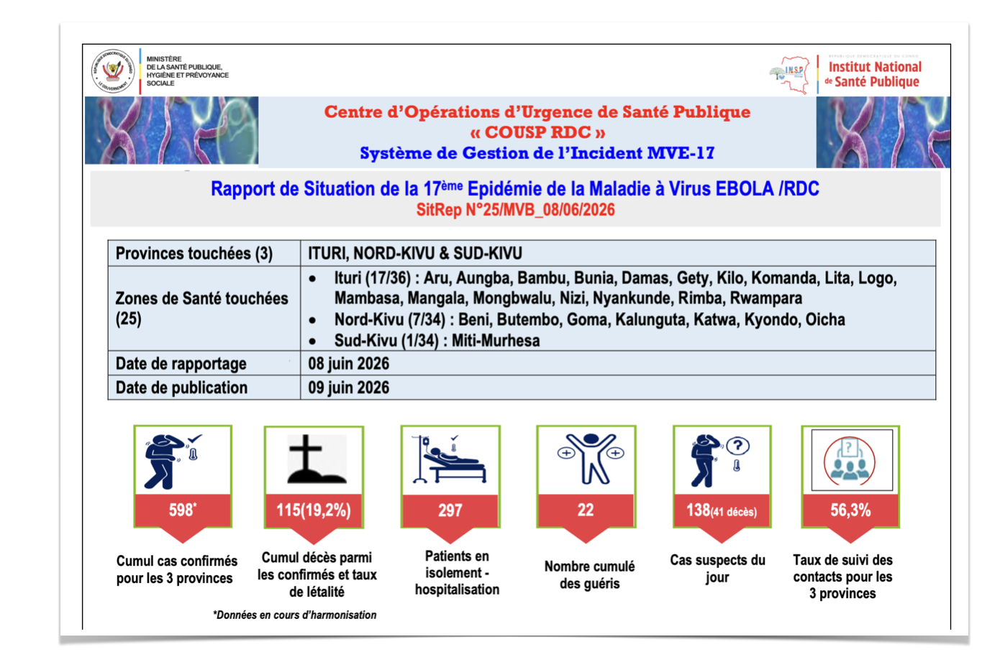
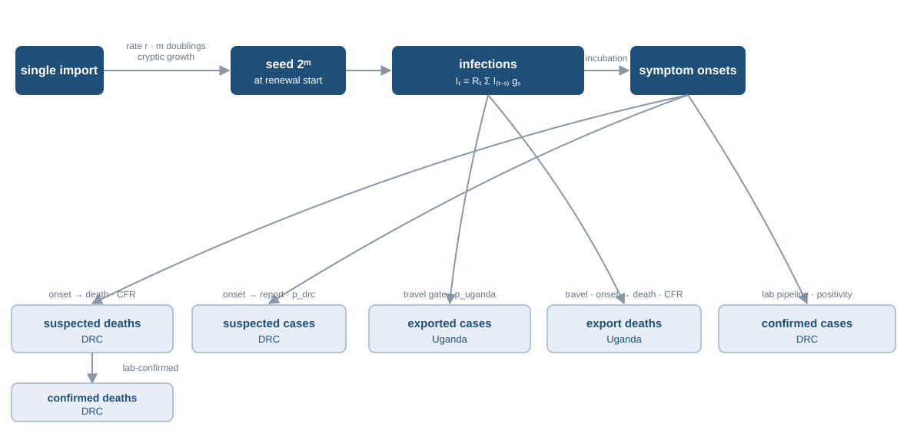
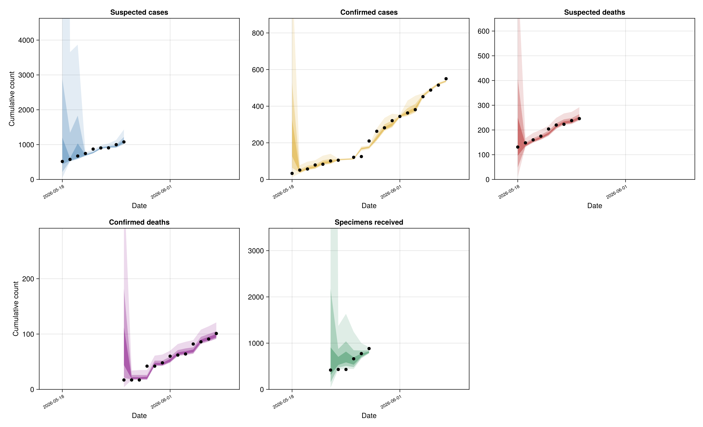
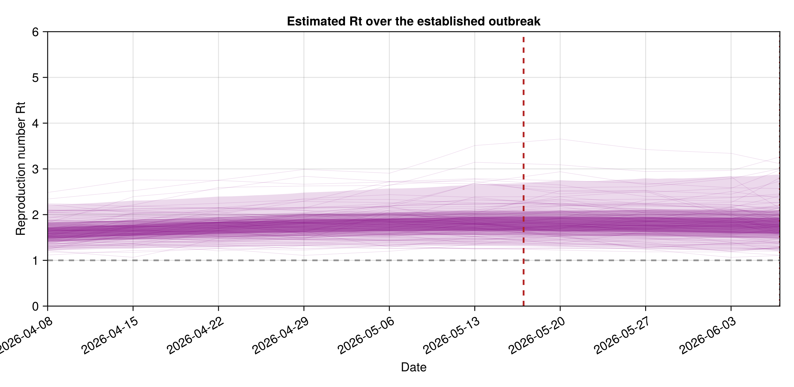
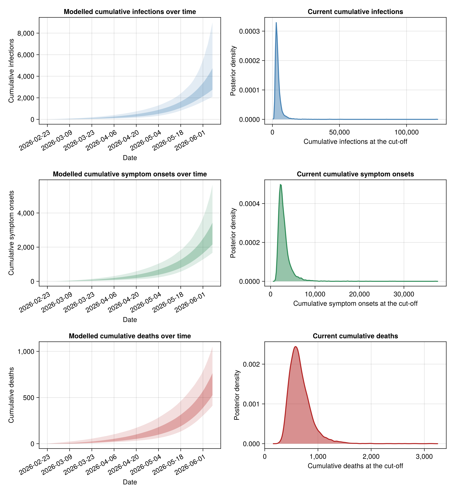
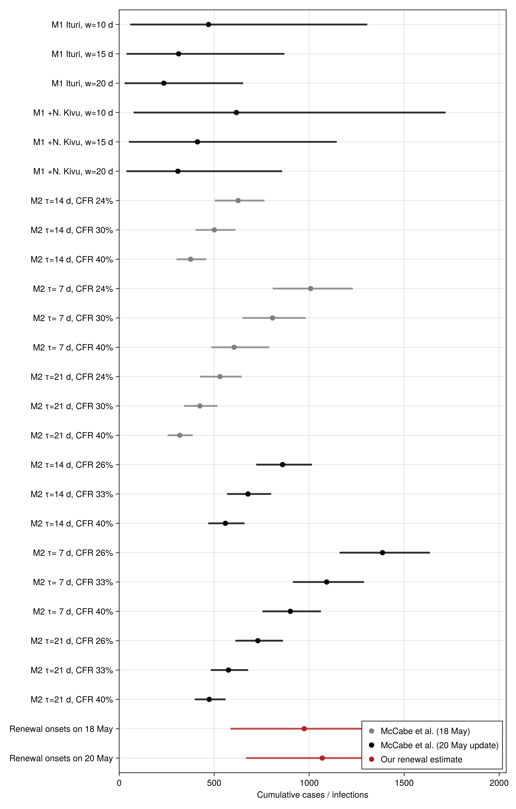
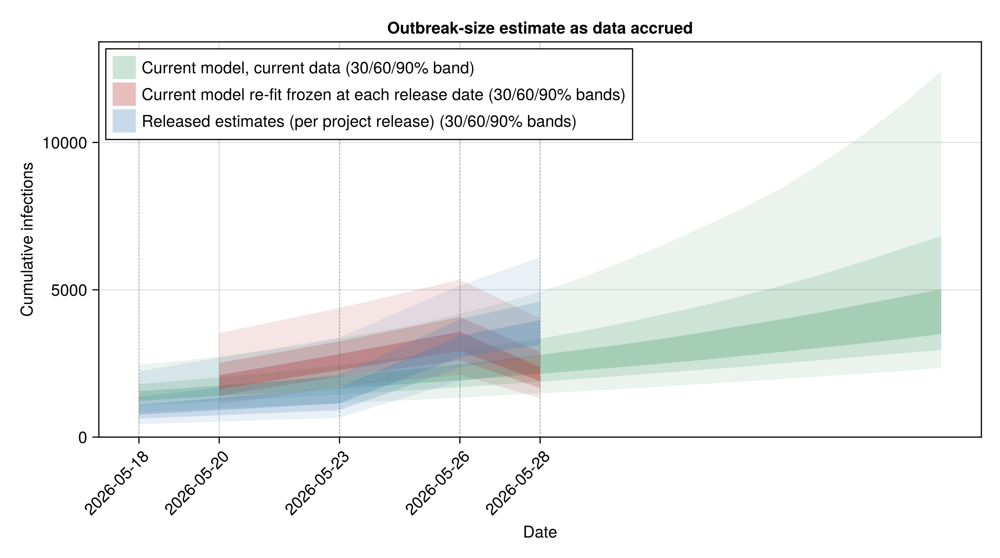
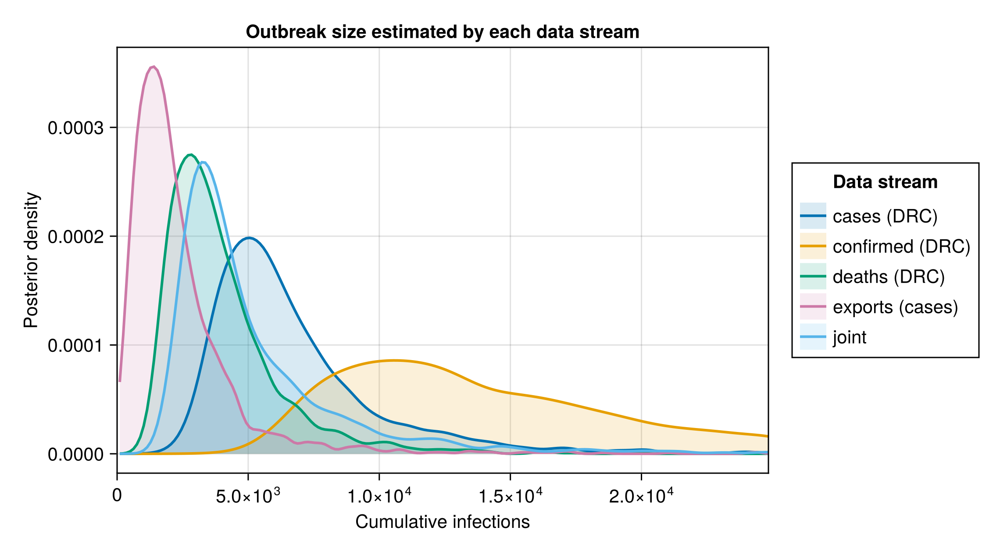

## Daily SitReps

<https://insp.cd/category/actualites/>

. . .

What can we learn from the SitReps about transmission dynamics?

##

An external view aiming to support interpretation of the data provided by INSP and DRC authorities.

## Model schematic

{fig-alt="Generative process from import through cryptic growth and renewal to the observed streams"}

Initial model inspired by [McCabe et al., 2026](https://www.imperial.ac.uk/mrc-global-infectious-disease-analysis/research-themes/preparedness-and-response-to-emerging-threats/report-ebola-18-05-2026/).

Delay estimates from [2012 Isiro outbreak](https://epiforecasts.io/bdbv-linelist-analysis/dev/)

## The data

| stream | value used | as of |
|---|---|---|
| exported cases (Uganda) | 3 (dated 11, 16, 23 May) | 23 May |
| export deaths | 1 (dated 14 May) | 14 May |
| suspected cases (DRC) | 1 077 | 26 May |
| suspected deaths (DRC) | 246 | 26 May |
| confirmed cases (DRC) | 550 | 7 June |
| confirmed deaths (DRC) | 101 | 7 June |
| specimens analysed | 755 | 28 May |
| genetic TMRCA | 25 March | bound on age |

Counts come from INSP situation reports (DRC). Suspected cases and deaths include non-BVD, which the model aims to account for.

## Fit to the data

{fig-alt="Posterior predictive check: modelled cumulative counts against observed, by stream"}

## Transmission dynamics

{fig-alt="Reproduction number over the established outbreak"}

Doubling time 13–20 d, but very uncertain (90% 6–52) — Rₜ 1.6–1.9 (90% 1.2–2.8)

## Current size

{fig-alt="Cumulative infections, onsets and deaths over time with cut-off densities"}

Estimated true burden 2,900–3,800 infections (90% 2,000 – 7,400)

## Consistency with McCabe et al. {.center}

{fig-alt="Comparison with McCabe et al., matched in time"}

## Comparison to earlier versions

{fig-alt="Comparison with earlier versions of our report"}

## Reconciling different data streams

{fig-alt="Comparison of estimates from different data streams vs. joint"}

## Limitations

- Based on a few weeks of data for an outbreak that started
- Several priors (delays, incubation, CFR, ascertainment) are weakly informed or imported from other outbreaks/contexts (e.g. 2012 Isiro)
- Aggregated model for the national level
- An external view of the SitRep data
- Work in progress; model and analysis drafted with an LLM under human oversight

## Acknowledgements & links

With thanks to INSP and the DRC response teams, clinicians and surveillance staff whose situation reports make this work possible.

- Data from: <https://insp.cd/category/actualites/>
- Report and code at: <https://epiforecasts.io/BVDOutbreakSize> (updated regularly)

Slides at

<https://epiforecasts.io/slides/bdbv_collaboratory_20260610.html>
